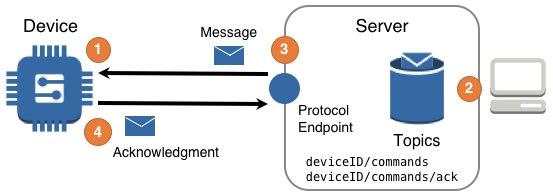


<!--more-->

## Challenge
IoT solutions are expected to interact with devices in such a way that the solution, or people using the solution, may reliably ask devices to perform an action. Furthermore, this interaction must occur across intermittent networks, often using devices with limited resources. 

## Solution
IoT Solutions use the Command design to ask devices to perform an action and ensure reliable interactions by leveraging a simple concept: no requested action is deemed successful unless it is acknowledged as successful. 

The Command design shown in the following diagram can deliver this functionality.

    
### Diagram Steps

1. A [device]() configures itself to communicate with a protocol endpoint so that Command messages can be sent and received.
2. A component of the solution publishes a [command message]() targeted at one or more devices.
3. The server uses the protocol endpoint to send the Command message to each previously configured device.
4. Upon completion of the Command's requested action, the device publishes a Command completion message to the Server via the protocol endpoint. 

## Considerations
It is important to note that the Command design is not "telemetry in reverse". Instead the Command design addresses the challenge inherent for a solution that needs to reliably trigger actions on a device operating in a remote location.

When implementing the Command design, consider the following questions:

#### Is there a state needed in the acknowledgement?
- i.e. `SUCCESS|FAIL|<PROGRESS_CODE>` – `needs a prescriptive answer`

#### Does a specific command require human-authorization?

- `needs detail - maybe SWF-like?`

#### Q: Does a command ever need to be rolled back?

- `needs detail`

#### Q: `..need more considerations..`

## Example

Example showing receipt of a message, execution of an action, and acknowledgement of the action
`..mention something about use of QoS 1 or higher for MQTT for Command..`

    <Written scenarios>
