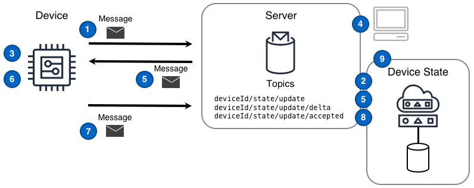


<!--more-->

## Challenge
IoT solutions are expected to interact with devices to perform and track device state changes. There are two ways this challenge manifests. First, even when experiencing intermittent network connectivity the solution needs the device to perform an action that changes the state of a device, and second the device needs the solution to reflect a state change which has occurred on the device.

It is pivotal in all Command and Control scenarios to know the state of a device and to be able to verify state changes.  

## Solution
IoT solutions that leverage the Device State Replica design are able to manage device-related state changes in a reliable, scalable, and straightforward fashion. 

The Device State Replica design describes how to replicate a device's current state, desired future state, and the difference between current and desired states. The Device State Replica design is similar to [Command]() in that both use [message]()s as triggers for actions and acknowledgement messages when actions are complete. However, the Device State Replica design goes farther than the Command design, by taking a prescriptive approach to both the management of device-related state and how the state and changes are communicated. Using the Device State Replica design allows solutions to know and verify device states and state changes.

### Component-to-device State Replica

An IoT solution should leverage the following design when a *component* of the IoT solution is the source of the desired state change and that change should be replicated in a device.

### Component-to-device Diagram Steps

1. A device reports **initial device state** by publishing that state as a [message]() to the `state/deviceID/update` [topic]().
2. The Device State Replica tracking this device reads the message from the `state/deviceID/update` topic and records the device state in a persistent data store.
3. A device subscribes to the delta messaging topic `state/deviceID/update/delta` upon which device-related state change messages will arrive.
4. A component of the solution publishes a desired state message to the topic `state/deviceID/update`and the Device State Replica tracking this device records the desired device state in a persistent data store.
5. The Device State Replica publishes a delta message to the topic `state/deviceID/update/delta` and the server sends the message to the device.
6. A device receives the delta message and performs the desired state changes.
7. A device publishes a message reflecting the new state to the update topic `state/deviceID/update` and the Device State Replica tracking this device records the new state in a persistent data store.
8. The Device State Replica publishes a message to the `state/deviceID/update/accepted` topic.
9. A component of the solution can now request the updated and current state form the Device State Replica.

### Device-to-component State Replica

An IoT solution should leverage the following design when the *device* is the source of the state change that should be communicated to components of the IoT solution.

### Device-to-component Diagram Steps
1. A device reports **initial device state** by publishing that state as a message to the update topic `state/deviceID/update`.
2. A component subscribes to the delta messaging topic `state/deviceID/update/delta` upon which device-related state change messages will arrive.
3. A device detects that its own state has changed and reports a new state value to the update topic `state/deviceID/update`.
4. The Device State Replica tracking this device records the desired device state in a persistent data store.
5. The Device State Replica publishes a delta message to the topic `state/deviceID/update/delta` and the server sends the message to the subscribed component.
6. A component receives the delta message and uses the changed value as necessary.  

## Considerations
When implementing this design, consider the following questions:

#### How can a component simply get the current state of a Device State Replica?
Using a pub/sub style of interaction a component can listen to the `state/deviceID/get/accepted` and `.../get/rejected` topics and then post a message to the `state/deviceID/get` topic. The Device State Replica would then respond with the state on the `.../get/accepted` topic. If the Device State Replica exposes a REST API, a component can execute a GET against the `state/deviceID/get` topic and expect a direct response. 

#### How does a Device know what changed while offline?
The first action a device should take when connecting or re-establishing a connection is to obtain the current desired state and compare that to it's last known state. Ideally the server tracking the Device State Replica can calculate the delta automatically and so a connecting Device would subscribe to `state/deviceID/update/delta` and can then act on any changes that occurred while in an offline state.

## Example
    <tbd written scenario>