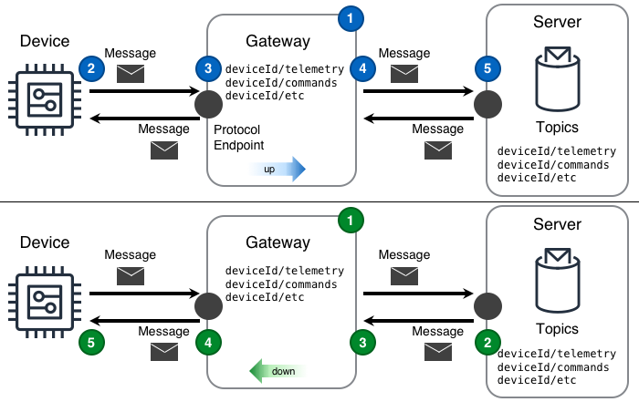


<!--more-->

## Challenge
[Endpoint]()s in an IoT solution are often not capable enough to connect directly to the internet nor are they operating on networks with direct access to the internet. Even with these constraints, obtaining data from and interacting with endpoints requires a mechanism of connectivity. 

## Solution
IoT solutions use the Gateway design to overcome the common constraints experienced by endpoints. In doing so a gateway enables reliable and secure communication with otherwise inaccessible endpoints. 

The Gateway design shown in the following diagram can deliver this functionality. In the diagram, the Server resides on a cloud. The Gateway resides on a network the Device can access. 

([PPTx](atlas-gateway.pptx))

Both designs in the above diagram expose a gateway endpoint using the same type of protocol endpoint as the server. In both the *up* and *down* gateway diagrams, the gateway is connected to the server.  

#### Up gateway
1. the "up" gateway design is configured to mirror "upward" messages; in the diagram, messages arriving from the device with the `deviceID/telemetry` topic will be mirrored up to the server using the same topic.
2. The device publishes a message containing the measurement via a transport protocol to the local protocol endpoint exposed by the gateway. 
3. The gateway receives the message
4. The gateway publishes the message to the server on the same topic as the received message.
   1. if the gateway is unsuccessful sending the message to the server the message is processed using an upward message approach
5. The server receives the message

#### Down gateway
1. the "down" gateway is configured to listen to the server and mirror "downward" messages; in the diagram, messages arriving from the server with the `deviceID/commands` topic will be mirrored down to the device listening for messages with the same topic.
2. The server publishes a message to the gateway via the transport protocol's endpoint
3. The gateway receives the message
4. The gateway publishes the message to the device listening on the gateway endpoint on the same topic as the received message 
   1. if the gateway is unsuccessful sending the message to the device the message is processed using a downward message approach
5. The device receives the message

## Considerations

When implementing this design, consider the following questions:

#### Why should the Gateway explicitly mirror only certain topics in a certain direction?
`needs answer`

#### How should the Gateway process data when the network to the Device is unavailable?
The simple answer is, the Gateway needs a *downward message approach* used to save the messages on the gateway until they can be reported to the device.  
Unfortunately the simple answer belies the reality, which is more complex. A key thing to determine is the right [approach](#what-approach-should-be-used-when-storing-messages-for-later-delivery) to take with the downward messages when the network is absent.  

#### How should the Gateway process data when the network to the Server is unavailable?
The simple answer is, the Gateway needs a *upward message approach* used to save the messages on the gateway until they can be reported to the server.  
Unfortunately the simple answer belies the reality, which is more complex. A key thing to determine is the right [approach](#what-approach-should-be-used-when-storing-messages-for-later-delivery) to take with the upward messages when the network is absent.  

#### What approach should be used when storing messages for later delivery? 
Generally, local storage and processing of messages on the gateway will follow a First-In-First-Out (aka. **FIFO**) approach. That being said, the answer *might* be different depending upon the data actually contained in the message. In this case determining how the gateway's logging approach influences the actual reported data can help avoid future solution issues.  

The general categories of approaches to consider are: **FIFO**, **Culling**, and **Aggregate** as shown in the following diagram.

**FIFO** – This [approach](https://en.wikipedia.org/wiki/FIFO_(computing_and_electronics)) is usually straightforward to implement and useful in a wide variety of situations. In the message processing diagram this approach’s data arrives from the left and exits to the right when the allocated local storage is full. Examples of data include: operations measurements and general-purpose telemetry. 

**Culling** – This approach is useful for retaining absolute point values at a loss of curve detail. In the message processing diagram this approach’s data arrives from the left. Once local storage has been filled beyond a *culling point*, some sweeper logic then removes every other (or every `N`th) sample. Examples of data include: [kW](https://en.wikipedia.org/wiki/Watt#Kilowatt), [Amperage](https://en.wikipedia.org/wiki/Amperage), [Voltage](https://en.wikipedia.org/wiki/Voltage), etc.  

**Aggregate** – This [approach](https://en.wikipedia.org/wiki/Aggregate_function) is useful when the detailed shape of the curve is not as important as the minimum, maximum, average, and sum values over a period of time. In the message processing diagram this approach's data arrives from the left. Once local storage has filled beyond an *aggregate point* some sweeper logic performs aggregation on the stored values. Examples of data include: [kWh](https://en.wikipedia.org/wiki/Kilowatt_hour), [insolation](https://en.wikipedia.org/wiki/insolation), [flow](https://en.wikipedia.org/wiki/Flow_measurement), [CPU time](https://en.wikipedia.org/wiki/CPU_time), [temperature](https://en.wikipedia.org/wiki/Temperature), [wind speed](https://en.wikipedia.org/wiki/Wind_speed), etc.

## Example
    <tbd written scenario>