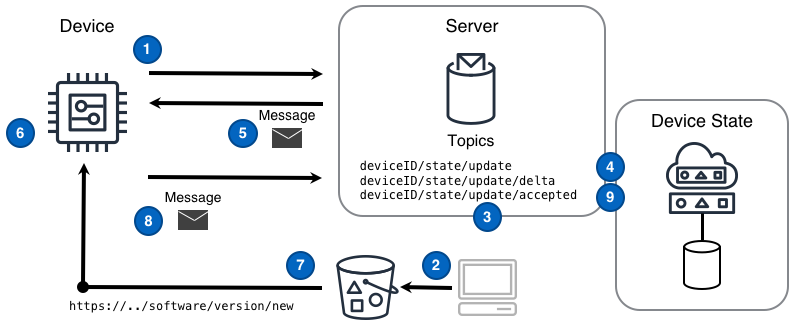


<!--more-->

## Challenge
IoT solutions are required to provide a mechanism for devices to update their own software. Supporting software updates without human intervention is both critical for scaling solutions to millions of devices and for delivering a great customer experience. However, achieving a full update of large sets of devices in a secure, scalable, and reliable fashion requires a storage solution that can scale to meet device load, a resilient command mechanism, and a way of tracking the state of the the entire fleet of devices. 

## Solution
IoT solutions that leverage the [Command]() and [Device State Replica]() designs alongside a globally available and scalable storage solution are able to meet all the challenges inherent in updating the software of devices in a large fleet. 

The Software Update pattern shown in the following diagram can deliver this functionality. 

### Diagram Steps
1. A device **subscribes** to the delta messaging topic `deviceId/state/update/delta` upon which device-related state change messages will arrive.
2. An application obtains the new software distribution and places that into a storage solution accessible to production devices. 
3. An application identifies a device that should receive the new software and publishes a *desired state* message to the device's topic `deviceID/state/update`. The *desired state* message contains a software update URL different form the device's current software version URL.
4. The device state replica tracking this device records the desired device state in a persistent data store and publishes a delta message to the topic `deviceId/state/update/delta` that is sent to the device.
5. The device receives a delta message that acts as the 'software update' command. Specifically, this message conveys the difference between the current software version or URL and the new URL
6. The device obtains the new software update URL from the delta message.
7. The device downloads the new software and applies the software locally.
8. The device **publishes** an acknowledgement message reflecting the software version the device is now using to the update topic `deviceID/state/update` and a device state replica tracking this device records the new state in a persistent data store. 
9. The device state replica publishes a message to the `deviceId/state/update/accepted` topic.

## Considerations

#### How does the targeted device and only that device obtain the software update from the given URL?  
`One-time use` URLs and/or `device obtains server token first and then gets URL using that token` 

## Example
Example showing a targeted device receiving and executing an "upgrade thyself" Command. Specifically, the device will obtain new firmware, perform an upgrade on itself, and confirm success.

    <tbd written scenario>