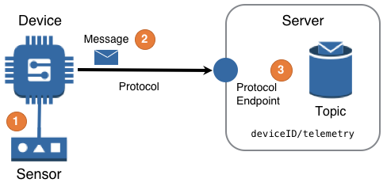


<!--more-->

{}
**TODO:** Revise Considerations to allow CoAP, MQTT, and AMQP transport protocols to fit conceptually.
{}

## Challenge
IoT solutions need to reliably and securely receive data measured in a remote environment by different devices, potentially using different protocols. Additionally, once the measured data is received, the solution needs to process and route the sensed data for use by components of the solution. 

## Solution
IoT solutions use the Telemetry design to ensure the delivery of sensed data across intermittent networks by supporting adept communication protocols, to provide scalable reception of data at different reporting frequencies and volumes, and to route data for use by other components.

An IoT solution should implement the Telemetry design shown in the following diagram to deliver this functionality.

 

([PPTx](atlas-telemetry.pptx))

### Diagram Steps

1. The device obtains a measurement from a sensor operating in an environment remote from the IoT solution. 
2. The device publishes a message containing the measurement via a transport protocol to a protocol endpoint made available from the IoT solution. 
3. The protocol endpoint may then apply rules messages in order to perform fine-grained routing upon some or all of the message's measurement data to send it to another component of the solution. 

## Considerations
The **Telemetry** design is commonly engaged when a project has the requirement to "stream data from a device". Furthermore, when implementing an IoT solution, the word *telemetry* is often used both as a way of describing the above design diagram *and* a shorthand description for the entire collection of challenges inherent in sensing and sending data from a remote location into a larger solution.

When implementing the Telemetry design, consider the following questions:

#### What is the desired *sense-to-insight* or *sense-to-action* processing latency of telemetry messages in the IoT solution?
IoT solutions with processing latency requirements at the level of **&micro;-seconds or milliseconds** should perform that processing on the device itself or possibly on a device [gateway]() connected to the device. 
IoT solutions with processing latency requirements at the level of **Seconds**, **Minutes**, or even **Hours** should perform that processing on the cloud by default. In general processing of messages in "seconds" through "low minutes", should be performed directly `needs detail` 
  Then processing telemetry from "low minutes" through "hours" should be performed in an asynchronous fashion `needs detail`

#### Are there lessons learned that make telemetry data easier to process in an IoT solution?
**Solution Unique Device IDs** – Each device in a solution should have a *solution unique* ID. Although this ID does not need to be truly globally unique each device should have an ID that is and will forever be unique within the IoT solution. By embracing solution unique device IDs, the IoT solution will be better able to process and route the sensed data for use by components within the solution.  
**Early Time-stamping** – The earlier sensed data obtains discrete timestamps in an IoT solution, the earlier more nuanced processing and analysis of that sensed data can occur.  
**Closed Window Calculations** - A device's *last reported* timestamp could determine if/when an aggregation window is able to be considered **closed**. Any closed window calculations can then be easily and confidently cached throughout an IoT solution. These cached calculations can dramatically increase performance of the *sense-to-insight* or *sense-to-action* processing latency of the IoT solution.

#### How should "large" messages be handled?
This design defines large messages as *any message larger than the transport protocol supports*, but lets be more specific.
{}
**TODO:** determine common message size boundaries of MQTT, CoAP, and OPC-UA transports 
{}

**Messages primarily less than XXXKB** – `needs a prescriptive answer`  
**Messages primarily between XXXKB to XMB** – `needs a prescriptive answer`  
**Messages above XMB** – `needs a prescriptive answer`  

#### What are the sample vs. reporting frequencies of a device?

**Sample frequency** is the frequency at which sensed data is retrieved, or *sampled* from an attached sensor.  

**Reporting frequency** is the frequency at which sample data stored on the device is sent into the broader IoT solution.
  
Device-based code will either obtain sensed data and queue it for delivery or deliver the sensed data immediately. These two different behaviors are often discussed as the *difference between the sample frequency and the reporting frequency*. When the sample and reporting frequencies are equal and aligned, all sensed data is expected to be delivered immediately. When the two frequencies are different, choosing the correct logging algorithm for the enqueued data must be considered.

Determining the expected values for these two frequencies will help determine the scale and cost of an IoT solution.

#### Does the order of inbound messages need to be maintained?

If **no**, then processing messages from the topic immediately upon arrival should suffice.  
If **yes**, this follow-on question needs an answer, "On how long of a time horizon does your solution require and prefer ordered messages?" If the answer is &#8230;

  - &#8230; *less than a one second horizon* – `needs a prescriptive answer`.
  - &#8230; *greater than a one second horizon* – the IoT Solution should write every record to an [ordered store](). If the IoT solution must possess processing logic that **requires** messages to always be in-order, that logic can now be executed as a reader to the ordered store.

#### What are some of the key drivers of telemetry cost for an IoT solution?

Usually the most common drivers of cost in an IoT solution are the number of devices, the device sample and reporting frequencies, the *sense-to-insight* or *sense-to-action* telemetry processing latency, the [device data density]() and finally the retention duration of [telemetry archiving]()

#### Does each device "actively un-align" its reporting interval with other devices?

A common mistake that has a large impact, occurs when all devices in an IoT solution or fleet are configured with the same reporting frequencies of "every **XX** minutes". To avoid the [constructive interference](http://en.wikipedia.org/w/index.php?title=Constructive_interference) hidden in this simple behavior, a device should start its reporting interval only after it wakes and a random duration has passed. This randomness produces a smoother stream of sensed data flowing into the solution by avoiding the constructive interference behavior that occurs when devices recover from inevitable regional network or other solution-impacting outages.

#### What should a device do when it cannot connect to its default IoT solution endpoint?

**Expected duration** – When a device cannot connect with the default IoT solution endpoint for an expected duration, the device should have a configured behavior for *device message queuing*. Furthermore, any device with the ability to perform device message queueing should consider the same algorithmic trade-offs as a device acting as a device [gateway](). These trade-offs arise when local storage is not enough to store all messages for the expected duration and will impact the sensed data. The common categories of algorithm to consider are: **[FIFO](https://en.wikipedia.org/wiki/FIFO_(computing_and_electronics))**, **Culling**, and **Aggregate**.  

**Disaster-level duration** – When a device cannot connect with the default IoT solution endpoint for a disaster-level duration, then a *regional fail-over* is required. To achieve this, first a device must have a pre-configured fail-over endpoint. Then when a device reorients itself to the fail-over endpoint, and &#8230;

  - &#8230; when the device is **already registered** with the new region and it already has the proper credentials, the device starts sending messages as if the new endpoint is the default.
  - &#8230; when the device is **not registered** with the new region, the device will need to complete a [device bootstrap]() with the new regional endpoint.

#### How do a device's resources influence the approach to the communication of sensed data?

Option: Resource considerations of MQTT – `needs a prescriptive answer`  
Option: Resource considerations of WebSocket – `needs a prescriptive answer`  
Option: Resource constrained devices may require use of a Device Gateway  – `needs a prescriptive answer`

#### How can messages be stored and available for future replay?

This can be accomplished with the [telemetry archiving]() design.

----

## Examples

### Telemetry message creation, delivery, and routing.
A detailed example of the logic involved to gather sensor data and send it through an IoT solution.
  
#### A device samples a sensor and creates a message
Either with code on the device or code operating in a device [gateway](), a device samples a sensor in a fashion similar to the following pseudocode:


device_id = get_device_id()
while should_poll():  # loop until we should no longer poll sensors
    for sensor in list_of_sensors:
        # get timestamp of this sensor reading
        ts = get_timestamp()
        # read the current sensor's value
        value = sensor.read_value()
        # add sensed data to message
        msq = create_message(device_id, sensor.get_id(), ts, value) 
        send_sensor_message(msg)  # send or enqueue message
    # sleep according to the sample frequency before next reading
    sleep(<duration>)


The `create_message` pseudocode function above creates a message based upon the `device_id`, the `sensor_id`, the timestamp `ts`, and the `value` read from the sensor. 

#### Device formats a message
Many existing solutions will have a message format already implemented. However, if the message format is open for discussion, JSON is recommended. Here is an example JSON message format:

 
{
  "version": "2016-04-01",
  "deviceId": "<solution_unique_device_id>",
  "data": [ 
    {
      "sensorId": "<device_sensor_id>",
      "ts": "<utc_timestamp>",
      "value": "<actual_value>"
    }
  ]
}
 

#### Device delivers a message
Once the sensed data is placed in a message, the device publishes the message to the remote protocol endpoint on a reporting frequency.

When reporting messages using the MQTT protocol, messages are sent with topics. Messages sent by a device with the topic `deviceId/telemetry/example` would be similar to the following pseudocode.

# get device ID of the device sending message
device_id = get_device_id()
# get the collection of unsent sensor messages
sensor_data = get_sensor_messages()
# the device's specific topic
topic = device_id + '/telemetry/example'
# loop through and publish all sensed data
while record in sensor_data:  
    mqtt_client.publish(topic, record, quality_of_service)


#### Messages sent to subscribers
Each published messages traverses the network to the protocol endpoint. Once received, the server software makes each message available to interested parties. Parties will often register their interest by subscribing to specific message topics.

In addition to having components in the IoT solution subscribe directly to a messaging topic, some IoT solutions have a rule engine that allows a rule engine to subscribe to inbound messages. Then, on a message-by-message basis, rules in the rule engine can process messages or direct messages to other components in the IoT solution.
