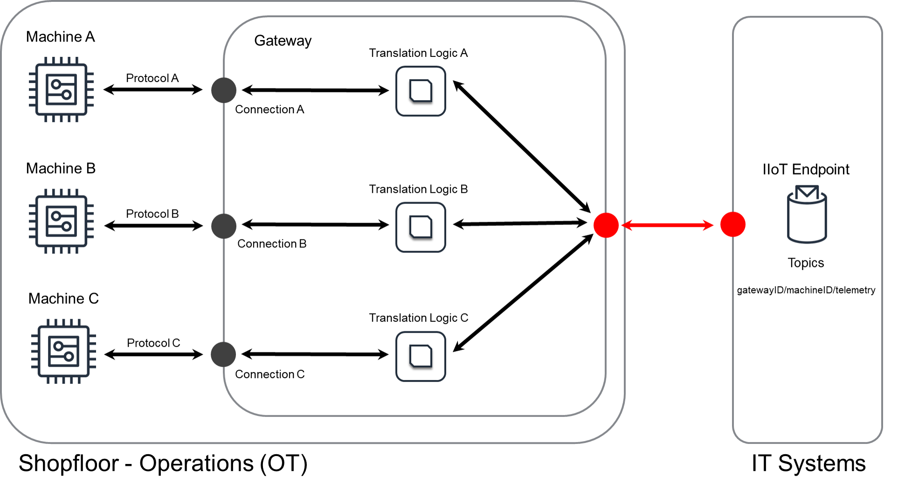


<!--more-->

## Challenge
Industrial machines are often equipped with or consist of sensors and other hardware such as programmable logic controllers ([PLC]()) that are used to monitor or control machine behavior.
As a prerequisite for a large set of [Industry 4.0]() use cases, it is required to access the data of the industrial machines and their components.
There are two main reasons why simply connecting these machines to a network or the internet is not viable:
* **Protocols:** There are many different communication standards for the aforementioned components of industrial machines, e.g., [OPC-UA](), [Modbus](), [CANBus](), [Profibus]().
Some of these standards have not been designed for the use over the internet and some, e.g., serial Modbus, of them are not even based on the [IP-Protocol]().
* **Security:** Connecting an industrial asset directly to the internet is a security risk as some of the aforementioned standards have little or no security features.
For instance, Modbus in its basic version does not have any kind of security mechanism that authenticates a system that reads or writes to the underlying industrial equipment.

The Industrial IoT extraction pattern introduced below solves these challenges.

## Solution
IoT solutions address these challenges by applying the [Gateway]() in combination with edge logic running on the gateway.
The edge logic on the gateway executes the translation of the industrial protocols into a common data format/protocol that can be processed by backend IT systems such as databases, data lakes or webservices.
An example of an architecture for such a solution may be as follows:



The left portion of this architecture represents all parts of the solution that are deployed on the shopfloor or close to the machines whose data needs to be extracted.
This part is commonly called *Shopfloor* in manufacturing or *operational technology (OT)*. 
The right-hand side has an abstract representation of the systems that need to get data from the shopfloor and its machines to generate business value from them, i.e., the *IT systems (IT)*.

In addition to the machines on the shopfloor, one or more gateway components need to be deployed.
The gateway itself contains translation logic that translates between the machine protocol and the common protocol used by the IT systems.
As shown above, this may result in several translation logic components to be deployed inside the gateway depending on the protocols used by the machines.
Examples for such a translation logic for Modbus and OPC-UA are shown below and the steps for building such a translation logic are typically the same.

The gateway component also has a security purpose:
The connections inside the shopfloor can be insecure (black), e.g., because some of the used protocols have no security features, the connections (red) outside the shopfloor that potentially run over the internet have to be secured by state-of-the-art encryption & authentication mechanisms.
This is a trade-off that is typically acceptable, because simply replacing or updating machines using protocols with little or no security features is not possible or economically feasible.
It is generally recommended that the connection from the gateway to the IT systems uses [TLS 1.2]() with [mutual authentication]().
While this requires the gateway to have its own certificate, it ensures the authenticity and integrity of the data during transit between OT and IT.

In the following, we provide some examples for the aforementioned translation component that runs on the gateway.
Note that these examples are not production ready code, but rather serve an education purpose.

#### Example: Translation OPC-UA
For this example, it is assumed that the machine provides an interface conforming to the [OPC-UA standard]().
OPC-UA is a modern, IP-based protocol that has security features like in-transit encryption and authentication using certificates or username/password combinations.
The code below provides exemplary stub-code for accessing an OPC-UA target in Python: 

```python2
[... load some libraries, loggers ...]
# ######## STEP 1: load the library ######## 
from opcua import Client as OPCUAClient
POLLING_FREQUENCY = 5 # seconds

# definition of the data format to be retrieved
OPCUA_VARIABLES = {
	KEY_STATE				:	["Objects", "2:PLC1", "2:MAIN", "DrillState"],
	KEY_PRESSURE			:	["Objects", "2:PLC1", "2:MAIN", "Pressure"],
}

# generate a OPCUA url and create a client with it 
url = opc.tcp://192.168.2.2:4840 # assumes OPC-UA server at 192.168.2.2 on port 4840 on local network
client = OPCUAClient(url) # connect to the machine specified by the URL

# This function will run endlessly and poll the OPC-UA server
def poll_opcua_server():
	while True:
		try:
			# ######## STEP 2: Connect to the data source ######## 
			client.connect()
			rootNode = client.get_root_node()	# get the root node of the OPCUA tree
			# ######## STEP 3: Load the data from the source ######## 
			results = {}
			for name, path in OPCUA_VARIABLES.items():	# payload defines names -> path relations
				results[name] = rootNode.get_child(path).get_data_value()	# get the value from the node identified by path
			# ######## STEP 4: Publish the machine data ######## 
			# publish the result to the IoT endpoint as needed
			logger.info("Publishing the following extraction result: " + str(results))			
		except Exception as e:
			logger.error("Error while accessing OPCUA server: {0}".format(str(e)))
			logger.error("Error type: " + str(type(e)))
		finally:
			client.disconnect()
		time.sleep(POLLING_FREQUENCY)
# execute polling of opcua server
poll_opcua_server()
```

This example uses an open-source library specifically for OPC-UA that is available for Python.
The first line loads this library, more specifically the client class of the library.
The remainder of the script is straightforward:
The clinet class is used to establish a connection, read the result from the data source, i.e., the machine, and then publish the result to the IoT endpoint.
Note that the code required to publish to the IoT endpoint depends on the backend that is used and is therefore omitted here.
Additionally, this code does not use any authentication mechanism to keep the example simple. 
In general, it is recommended to authenticate the translation component. 


#### Example: Translation Modbus
As with the OPC-UA example above, this example assumes that data is accessible through a machine interface, but in this case the interface implements [Modbus]().
Similarly to the previous example, this example tries to access a machine with the IP address `192.168.2.2` on the local network, i.e., this example uses the TCP/IP variant of the Modbus protocol.
The code for a serial interface of Modbus would require a different client, but the remainder of the code would remain unchanged:

```python2
[... load some libraries, loggers ...]
# ######## STEP 1: load the library ######## 
from pymodbus.client.sync import ModbusTcpClient as ModbusClient
POLLING_FREQUENCY = 1 	# second(s)
# Instantiate the client for your modbus slave device. 
mbClient = ModbusClient("192.168.2.2", port=5020)

def poll_measurements(frequency=POLLING_FREQUENCY):
	while True:
		# ######## STEP 2: Connect to the data source ########
		try:
			# connect to modbus slave device
			if not(mbClient.is_socket_open()):
				mbClient.connect()
		except Exception as e:
			time.sleep(1)
			continue
		# ######## STEP 3: Load the data from the source ########
		try:
			# read the holding registers (32 is chosen as a sufficient number of registers to hold the payload)
			readResult = mbClient.read_holding_registers(address=0x0, count=32, unit=1)
		except Exception as e:
			mbClient.close()
			time.sleep(1)
			continue
		# ######## STEP 4: Publish the machine data ######## 
		# publish the result to the IoT endpoint as needed
		logger.info("Publishing the following extraction result: " + str(results))			
		time.sleep(frequency)
poll_measurements()
```
The structure of this Python script is the same as before:
The first step of the script loads an open-source library that will provide easy access to Modbus assets.
Afterwards, the script will connect to the Modbus master and then get the data from the master.

It is important to note that the result from a Modbus master will be more "unstructured" compared to the OPC-UA example above:
The variable `readResult` will contain unstructured binary data that has to be reformatted depending on how the data was written to the bus.
This is a fundamental difference between a modern protocol like OPC-UA and Modbus when it comes to data extraction.

#### Summary
As shown in the above sections, the translation logic on the gateway has a common structure of four steps:

1. Loading of a protocol specific library
1. Establishing the connection to the asset from which data needs to be extracted.
1. Retrieving the desired data from the machine.
1. Optionally processing the data from the machine and then forwarding the data to the IT systems (over the internet).

Depending on the protocol, establishing the connection may require credentials or other authentication secrets that need to be stored securely on the gateway.
In the examples above, open-source libraries for Modbus and OPC-UA have been used, but commercial alternatives exist and can be used as well.

## Considerations

When implementing this design, consider the following questions:

#### Is the gateway component with the internet connection a security risk?
If the pattern is implemented in such a way that the gateway only accepts TLS 1.2 connections from the IoT endpoint and vice versa, this approach does not introduce additional security risks.
Using this approach, the data is encrypted during transit and the "internet-facing" endpoint of the gateway provides only a minimal attack surface that remains secure as long as the certificates are handled securely.

#### Does the schema for the translation logic change if the connection is not IP-based?
In general, the schema does not change.
In the examples above, the IP connection was always defined using an IP address.
For instance, to use a serial connection with Modbus, the corresponding hardware path has to be used instead of the IP address and a client specifically for Modbus over serial connections needs to be loaded instead of the TCP client.

#### Is there a way to delay/batch/aggregate messages on the gateway?
Aggregation or batching of data has not been part of the examples above to keep them concise and short.
The logic shown above can be easily extended with mechanisms that batch results or compute aggregations over them.

#### What happens if the connection of the gateway to the IT systems breaks?
The gateway will not be able to push the data to the IT systems anymore.
To prevent data loss, it is recommended to implement a backup storage mechanism for cases where Step 4 (Publishing data) fails.

#### What is the risk of connecting the machines directly to the internet?
In general, only few of the commonly used protocols for manufacturing/production assets include security mechanisms that can be considered secure.
The reason for this is mostly that security is an evolving field and many of the prototcols have been designed decades ago.
For instance, the first version of Modbus has been published in 1979 at a time when encryption or cyber security were not a priority for the design of a protocol.
Exposing machines with such a protocol to the internet will likely result in data loss or even attacks that manipulate machines in such a way that they become inoperable/dangerous.
Hence, it is not recommended to connect industrial machines directly to the internet and instead use a gateway in between to serve as the "internet-facing" frontend for the shopfloor. 

#### What kind of hardware is used for the gateway in this scenario?
Typically, the gateway runs on industrial PCs or similarly ruggedized hardware.
Consumer electronics or development hardware is feasible as well, but less common due to reliability concerns.
