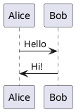

## IoT Atlas Local Development

The IoT Atlas uses the [Hugo](https://gohugo.io/) framework for rendering the website. To ensure that all new or updated content is valid, a series of checks are performed on URL links, internal references, and spell-checking (for U.S. English at present) for common errors.

All of this is automated when a GitHub pull request is accepted. Failures will result in the updates _not_ being applied and corrections required on the pull request.

Following the steps below will ensure that any changes you make can be tested and validated prior to submitted a pull request. If you have any questions, please review and ask questions in the [discussions](https://github.com/aws/iot-atlas/discussions) section of the GitHub repository.

### Pre-requisites

You can develop locally with either:

- **Docker** (recommended for CI parity): Only Docker is required. The `make_hugo.sh` script builds and runs everything in a container.
- **Hugo installed locally**: Install [Hugo Extended](https://gohugo.io/installation/) (v0.163.0+). Then run `hugo server` from the `src/hugo/` directory.

The `make_hugo.sh` script is Linux/macOS (bash) specific. For Microsoft Windows, the commands would need to be reviewed and changed.

### Testing Process

1. Once you are ready to start creating content, open a terminal window and change into the `src/` directory, then start in developer mode which will run Hugo locally in fast render mode.

   ```bash
   cd src/
   ./make_hugo.sh -d
   ```

   Or, if you have Hugo installed locally:

   ```bash
   cd src/hugo/
   hugo server
   ```

1. This starts a local server on port 1313 serving the rendered content. The default URL is `http://localhost:1313` and will show all content including PlantUML diagrams (rendered client-side via the public PlantUML server).
1. Every time you make and save a change, the local server will re-render and trigger your local browser to reload the page. If changes are not reflected, enter `CTRL+C` to stop the process and restart.

Once you have completed development, run `./make_hugo.sh` without any arguments to have it fully generate and validate the content. Once successful, you can commit and perform a pull request.

### PlantUML Diagrams

PlantUML diagrams are written as fenced code blocks with the `plantuml` language identifier:

````markdown

````

Diagrams are rendered client-side using the public PlantUML server. No local Java/PlantUML installation is required.

### FAQ

**I created content and see it in the `src/hugo/public` folder, but when I commit, this isn't being added to my forked repository, why?**

This is by design by including the `/src/hugo/public/*` statement in the main `.gitignore` file.

As the website is statically generated through a build process and synched to an Amazon S3 bucket, there is no need to keep the content locally in the repository. It is only used for local validation of content.

**When adding or changing the weight of an article, the left-side menu is not updating even with a browser refresh. How can I see the new structure?**

Certain changes to content are not reflected with the _fast render_ process. To see these, enter `CTRL+C` to stop the Hugo container process and restart, then refresh the browser.
