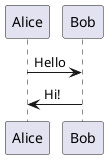

This section provides guidance and resources on how to contribute to the IoT Atlas. It covers:

- Authoring and testing new content
- Guidelines for content creation using Hugo
- Templates for different content types

Following these guidelines helps ensure the consistency of the Atlas from page to page.

## Authoring new content

When creating new content, use the follow guidance:

1. A customized Hugo theme (forked from [hugo-theme-learn](https://github.com/matcornic/hugo-theme-learn)) is the basis for this site. Additional features are listed below and shown in the [templates]() folder, or in the [kitchen sink]() example that demonstrates all features.
1. If creating similar content that already exists, use an existing page as the basis for headings, style, and approach. You can also review the example style templates in this section.
1. Test content changes locally and only submit a [pull request](https://docs.github.com/en/github/collaborating-with-issues-and-pull-requests/about-pull-requests) once the validation passes successfully. Pull requests will not be merged with broken links or invalid Hugo references/code.

Following the steps below will ensure that any content or changes you make can be tested and validated prior to submitted a pull request. If you have any questions, please review and ask questions in the [discussions](https://github.com/aws/iot-atlas/discussions) section of the GitHub repository.

### Fork and Local Testing

You can develop locally with either **Docker** or a **local Hugo install**:

#### Option A: Docker (CI parity)

1. [Fork](https://github.com/aws/iot-atlas/fork) the repository in your GitHub account.
1. Optionally create a branch for your changes.
1. From the `iot-atlas/src` directory, run `./make_hugo.sh -d` to start in local development mode.

{}
The first time will build the Docker container, which takes about 30 seconds. After that, the local `temporary/hugo-ubuntu` image will be reused.
{}

4. Verify you can open locally from the URL [http://localhost:1313/](http://localhost:1313/)

#### Option B: Local Hugo install (faster iteration)

1. Install [Hugo Extended](https://gohugo.io/installation/) (v0.163.0 or later).
1. From the `iot-atlas/src/hugo` directory, run `hugo server`.
1. Open [http://localhost:1313/](http://localhost:1313/)

Both options start a local server on port 1313 serving the rendered content. Every time you make and save a change, the local server will re-render and trigger your local browser to reload the page. If changes are not reflected, enter `CTRL+C` to stop the process and restart.

### Validate Content

Once you are happy with the new content, run `./make_hugo.sh -v` (from `src/`), which will _validate_ all the content is properly formatted, and that if you included any hyperlinks that they are valid. If errors are returned, correct and re-run.

When the message _\*\*\*\*\*\*\*\*\*\* Validation completed successfully,_ is returned, validation is complete.

### Create a Pull Request

From GitHub, use the [pull request process](https://docs.github.com/en/github/collaborating-with-issues-and-pull-requests/about-pull-requests) to create a pull request (PR) to the `aws/iot-atlas` repository. This will start a validation process under the [open pull requests](https://github.com/aws/iot-atlas/pulls?q=is%3Aopen+is%3Apr) again, and provide a message if the PR can be merged. If there are errors (red :x: next to your PR), review the error, correct in _your_ forked repository, then commit the changes.

Once validation has completed, an IoT Atlas maintainer will review and either merge the content, or request changes or ask clarifying questions.

Once merged and content is live, you can delete the forked repository.

## Guidelines for Content Creation

### Code Examples

Code examples should be stored in `static/code/` and included via the `code-include` shortcode. This keeps code in a single location shared across all language translations:

```

```

Parameters:
- **file**: path relative to `static/code/`
- **language**: (optional) auto-detected from file extension
- **title**: (optional) caption above the code block
- **lines**: (optional) line range, e.g. `"10-25"`

### PlantUML Diagrams

Architecture diagrams can be written as PlantUML fenced code blocks:

````markdown

````

Diagrams are rendered client-side via the public PlantUML server. No local Java installation required. AWS architecture icons are available via the [aws-icons-for-plantuml](https://github.com/awslabs/aws-icons-for-plantuml) library.

### Bundle Resources

If there are diagrams or other images related to your content, include and reference those from within the same directory as a [Page Bundle](https://gohugo.io/content-management/page-bundles/). For instance, a new _Pattern_ called _Foo_ would be structured like this:

```
patterns/
  _index.md
  Foo/
    _index.md
    img1.png
    img2.png
```

Referencing images within `patterns/Foo/_index.md` would look like this in markdown:

```markdown
Lorem ipsum dolor sit amet, consectetur adipiscing elit...


sed do eiusmod tempor incididunt ut labore et dolore magna aliqua.
```

### Multilingual Content

The site supports English, Spanish, Chinese, and French. Content for each language lives in:

- `content/en-us/` - English
- `content/es-es/` - Spanish
- `content/zh-cn/` - Chinese
- `content/fr-fr/` - French

Code examples in `static/code/` are shared across all languages. Only the prose (markdown) needs to be translated.
