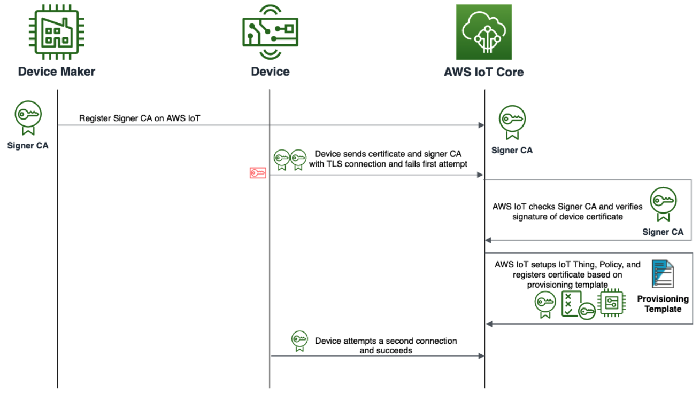

AWS IoT provides options to provision and onboard a large number of devices based
on the capabilities of the device and if the devices have their unique X.509 certificate
and private keys on them before being sold to the end customer.
If the manufacturing chain allows the device maker to provision unique credentials into
the device at manufacturing time or in distribution, device makers can use Just in Time
Provisioning, Just in Time Registration, or Multi-Account Registration. 

{}
Devices that use JITP have certificates and private keys present on the device before
onboarding to AWS IoT. The certificates must be signed with the customer’s designated
CA, and that CA must be registered in AWS IoT. The customer must know which
account the device will connect to before provisioning.
{}

## Setup

Using JITP, the device connects to AWS IoT, and the certificate’s signature is verified
against the registered CA. After verification, a provisioning template registers the Thing,
certificate, and assigns a policy to the device. The device maker is responsible for
registering the signer CA and attaching a provisioning template to the CA.

## Device Logic

When the device connects to AWS IoT Core for the first time, the device certificate, and
the signer CA that is registered with AWS IoT must be sent during the TLS handshake.
The TLS handshake will fail at the first connection. This happens because the certificate
has not been pre-loaded into the AWS IoT account. The device-supplied certificate is
registered and activated in AWS IoT during the provisioning process. The device must
have logic to reconnect to AWS IoT after a short time period. If the provisioning
operation has succeeded, the device will connect to AWS IoT successfully.

