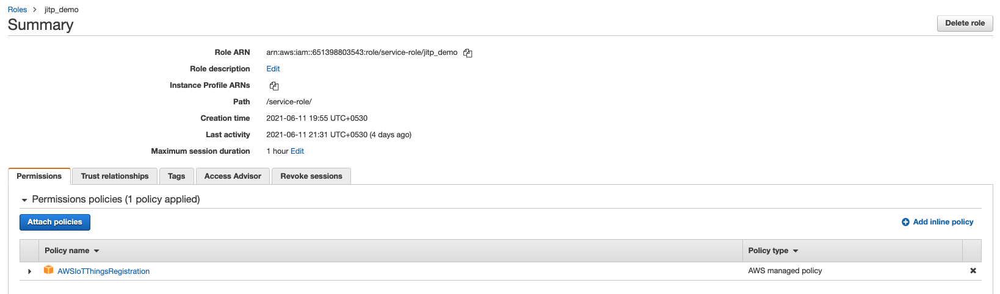
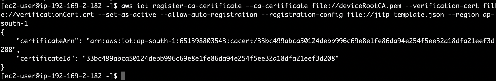

1. Create an IAM role for your AWS IoT Core service and name it JITP_demo. Attach Policy AWSIoTThingsRegistration to this role.

2. Create a JITP template JSON file by running following commands
```json
sudo nano jitp_template.json
```
3. Paste the following JSON and save the file using control + x and y

`Replace <REGION>, <Account_ID> and <ROLE_ARN> with your AWS Region, Account_ID and Role ARN for JITPRole respectively`
```json
{
 "templateBody":"{ \"Parameters\" : { \"AWS::IoT::Certificate::CommonName\" : { \"Type\" : \"String\" },\"AWS::IoT::Certificate::Country\" : { \"Type\" : \"String\" }, \"AWS::IoT::Certificate::Id\" : { \"Type\" : \"String\" }}, \"Resources\" : { \"thing\" : { \"Type\" : \"AWS::IoT::Thing\", \"Properties\" : { \"ThingName\" : {\"Ref\" : \"AWS::IoT::Certificate::CommonName\"}, \"AttributePayload\" : { \"version\" : \"v1\", \"country\" : {\"Ref\" : \"AWS::IoT::Certificate::Country\"}} } }, \"certificate\" : { \"Type\" : \"AWS::IoT::Certificate\", \"Properties\" : { \"CertificateId\": {\"Ref\" : \"AWS::IoT::Certificate::Id\"}, \"Status\" : \"ACTIVE\" } }, \"policy\" : {\"Type\" : \"AWS::IoT::Policy\", \"Properties\" : { \"PolicyDocument\" : \"{ \\\"Version\\\": \\\"2012-10-17\\\", \\\"Statement\\\": [ { \\\"Effect\\\": \\\"Allow\\\", \\\"Action\\\": [ \\\"iot:Connect\\\" ], \\\"Resource\\\": [ \\\"arn:aws:iot:<REGION>:<ACCOUNT_ID>:client\\\/*\\\" ] }, { \\\"Effect\\\": \\\"Allow\\\", \\\"Action\\\": [ \\\"iot:Publish\\\", \\\"iot:Receive\\\" ], \\\"Resource\\\": [ \\\"arn:aws:iot:<REGION>:<ACCOUNT_ID>:topic\\\/*\\\" ] }, { \\\"Effect\\\": \\\"Allow\\\", \\\"Action\\\": [ \\\"iot:Subscribe\\\" ], \\\"Resource\\\": [ \\\"arn:aws:iot:<REGION>:<ACCOUNT_ID>:topicfilter\\\/*\\\" ] } ] }\" } } } }",
 "roleArn":"<ROLE_ARN>"
}
```
4. Run the following register-ca-certificate command to register the device root CA as a CA certificate in AWS IoT Core. Make sure to set correct region at --region flag
```json
aws iot register-ca-certificate --ca-certificate file://deviceRootCA.pem --verification-cert file://verificationCert.crt --set-as-active --allow-auto-registration --registration-config file://jitp_template.json --region ap-south-1
```

## Checkpoint
Adding the parameter --registration-config attaches the JITP template that you created to the CA certificate. The command response will return the ARN of the CA certificate.

