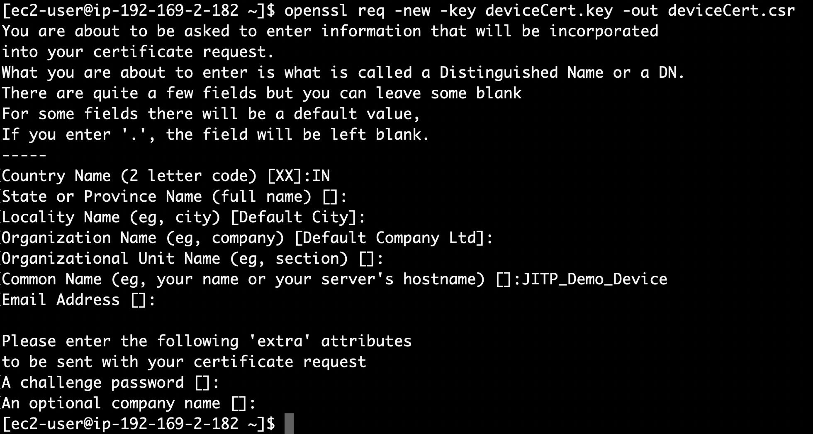
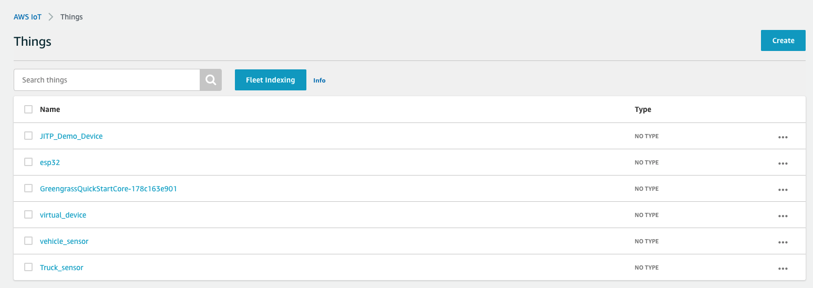

In this step we will create a Device certificate using self-signed root CA and on-board the device using JITP.

1. Download the RootCA1 and save it with the file name AmazonRootCA1.pem.
`Note: The RootCA1 is used for server-side authentication of publish requests to AWS IoT Core. For more information, see CA certificates for server authentication.`

2. Run the following OpenSSL command to create a device private key
```json
wget https://www.amazontrust.com/repository/AmazonRootCA1.pem
openssl genrsa -out deviceCert.key 2048
```

3. Run the following OpenSSL command to create a device CSR
```json
openssl req -new -key deviceCert.key -out deviceCert.csr
```

`Note: The example JITP template requires the ThingName value to equal the certificate’s CommonName value. The template also requires the CountryName value to equal the Country value in the CA certificate. Refer to the following example:`


4. Run the following OpenSSL command to create a device certificate:
```json
openssl x509 -req -in deviceCert.csr -CA deviceRootCA.pem -CAkey deviceRootCA.key -CAcreateserial -out deviceCert.crt -days 365 -sha256
```
5. Run the following command to combine the root CA certificate and device certificate
```json
cat deviceCert.crt deviceRootCA.pem > deviceCertAndCACert.crt
```
6. Now connect to your AWS IoT Core endpoint using deviceCertAndCACert.crt (Device certificate), deviceCert.key (Device key) and AmazonRootCA1.pem (root CA).
Download and setup the python sdk
```json
git clone https://github.com/aws/aws-iot-device-sdk-python.git
cd aws-iot-device-sdk-python
python setup.py install
```

7. Navigate to Samples folder and execute the basicPubSub.
Change the endpoint as per your AWS IoT Core endpoint, also ensure that you state correct paths and names for certificate files.
```json
cd ~/aws-iot-device-sdk-python/samples/basicPubSub/
python basicPubSub.py -e a2x566pxx9rcsu-ats.iot.ap-south-1.amazonaws.com -r ~/AmazonRootCA1.pem -c ~/deviceCertAndCACert.crt -k ~/deviceCert.key -id "JITP_Demo_Device" -t "test" -M "Hello World"
```

8. The First connection will timeout and fail. But JITP will now create a new Thing named JITP_Demo_Device (as per the Common Name set in CSR), register the device certificate and attach the security policy as per the JITP_template.
The subsequent connections should be successful. 

## Checkpoint
Verify that you use correct file names and paths.
Check if the Country Name parameter in certificates is consistent.
Check if you have deviceCertAndCACert.crt and deviceCert.key files generated in this step.
Finally verify if a Thing named JITP_Demo_Device is created in your AWS IoT console.


