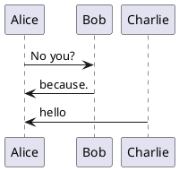

Command and control is the operation of sending a message to a device requesting it to perform some action. Optionally, the device can acknowledge that is has succeeded or failed to complete the action.

## Use Cases

- Interact with a peripheral, actuator, or operation of a device
  - _I want to turn the LED on or off on my device_
  - _I want to remotely restart the device_
- Request device data or state
  - _I want the device to publish the latest log file to a topic_
- Update device operating or saving configuration
  - _I want to increase the current frequency of telemetry emitted on my device_
  - _I want to change my devices saved configuration that will take effect on next restart_

## Reference Architecture

- _AWS IoT Core_ is the MQTT message broker processing messages on behalf of the clients
- _Device_ is the IoT thing to be controlled
- _Application_ is the remote logic that issues commands

1. The _Device_ establishes an MQTT connection to the _AWS IoT Core_ endpoint, and the subscribes to the `device1/req` (request) topic. This is the topic where incoming messages will be received and processed.
1. The _Application_ established an MQTT connection to the _AWS IoT Core_ endpoint, and subscribes to the `device1/resp` (response) topic. This is the topic where the acknowledgement messages from the device will be received.
1. To send a command, the _Application_ publishes a message on the `device1/req` topic, and the device receives the message on its subscription to that topic and take some action.
1. (Optional) Once the command has been processed, the device then publishes the result of the action onto the `device1/resp` topic. The _Application_ receives the response message and resolves the outstanding action.

{}

{}


sequenceDiagram
participant Device
participant Broker
participant Application
Note over Device,Application: Device and Application connect to broker
Device->>Broker: CONNECT and SUB to device1/req
Application->>Broker: CONNECT and SUB to device1/resp
Note over Device,Application: Send command and (optional) response
Application->>Broker: PUB: device1/req - Command message
Broker->>Device: PUB: device1/req - Command message
Device->>Device: Process and run action
Device->>Broker: PUB: device1/resp - Response message
Broker->>Application: PUB: device1/resp - Response message


### Assumptions

This implementation approach assumes the device is connected at all times, subscribed to a topic for incoming commands, and can receive and process the command.

## Implementation

## Considerations

### Lost, Duplicate, or Out-of-Order Messages

### Device Disconnected During Message Delivery
