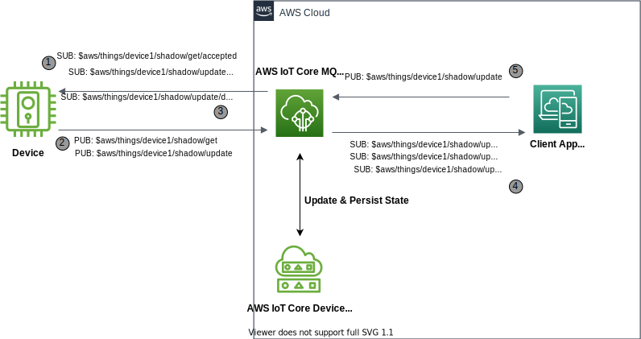
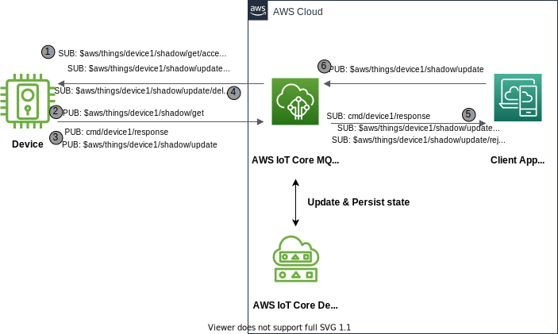

Command and control are the operation of sending a message to a device requesting it to perform some action or to control the device configurations. However, when interaction happen with devices over intermittent networks or when devices deployed in far flung areas or when using devices with limited resources then IoT solution can't expect devices to be always remain connected to central IoT solution to receive commands or configuration updates. Using device shadow IoT applications or services can simulate and control edge devices configuration and actions based on last reported & desired state.

{}
This implementation is designed using [AWS IoT device shadow service](https://docs.aws.amazon.com/iot/latest/developerguide/iot-device-shadows.html) via reserved MQTT shadow topics and focuses on two comparative use case implementation using device shadows.Please refer to the [Designing MQTT Topic for AWS IoT Core](https://docs.aws.amazon.com/whitepapers/latest/designing-mqtt-topics-aws-iot-core/designing-mqtt-topics-aws-iot-core.html), specifically the _Applications on AWS_ section. This white paper provides additional alternative patterns that go beyond the scope of this implementation.
{}

## Use Cases

- Request or update device state configurations
  - _I want to track & control smart home devices from my mobile application_
  - _I want to remotely control household heater by turning them on/off or by setting up desired temperature_ 
- Request device actions based on some commands
  - _I want to remotely unlock door for a family visitor_ 
  - _I want to remotely instruct device to do some action on basis of a command_

## Reference Architecture

Following section talks about architecture considerations for command & control using IoT Core device shadow
 - When requesting update to device state configuration
 - When requesting device actions based on some commands  


{}

# 


- _AWS IoT Core_ is the MQTT message broker processing messages
- _Device_ is the IoT thing to be controlled
- _Application_ is the remote logic that issues commands, update device state configurations and consumes device telemetry data
- _Device Shadow_ is the replica which makes device's state available to applications and other services
- _ShadowTopicPrefix_ is an abbreviated form of the topic which can refer to either a named or an unnamed shadow, referred for `$aws/things/device1/shadow` (classic shadow) in explanation below.

1. The _Device_ establishes an MQTT connection to the _AWS IoT Core_ endpoint, and then subscribes to the reserved [MQTT shadow topics](https://docs.aws.amazon.com/iot/latest/developerguide/reserved-topics.html#reserved-topics-shadow) for get & update shadow event operations. Also, instead of subscribing individually to each reserved shadow topic below, common prefix could be used for generalised subscription like `ShadowTopicPrefix/get/#` , `ShadowTopicPrefix/update/#`

- `ShadowTopicPrefix/get/accepted`
- `ShadowTopicPrefix/get/rejected`
- `ShadowTopicPrefix/update/accepted`
- `ShadowTopicPrefix/update/rejected`
- `ShadowTopicPrefix/update/delta`

2. On successful connect with _AWS IoT Core_ endpoint & on successful subscription to reserved shadow topics, the _Device_ publish request to `ShadowTopicPrefix/get` topic and process latest shadow file received on `ShadowTopicPrefix/get/accepted` subscribed topic. After processing _desired_ state or configuration changes from the shadow file, _Device_ makes publish request to `ShadowTopicPrefix/update` topic with device current state as _reported_ data on shadow file.     
3. (Optional) Once the delta attributes are processed from shadow get request on device initial connect/reconnect, and if device is continued to remain connected then it can further receive delta changes on shadow file from the _Application_  
4. The _Application_ establishes an MQTT connection to the _AWS IoT Core_ endpoint, and then subscribe to the `ShadowTopicPrefix/update/accepted`, `ShadowTopicPrefix/update/rejected` (response) shadow topics to process shadow update data from device end. 
5. For updating device state/configurations, the _Application_ publish message as _desired_ state on `ShadowTopicPrefix/update` reserved topic. 

```plantuml
@startuml
!define AWSPuml https://raw.githubusercontent.com/awslabs/aws-icons-for-plantuml/v7.0/dist
!includeurl AWSPuml/AWSCommon.puml
!includeurl AWSPuml/InternetOfThings/all.puml
!includeurl AWSPuml/General/Client.puml

'Comment out to use default PlantUML sequence formatting
skinparam participant {
    BackgroundColor AWS_BG_COLOR
    BorderColor AWS_BORDER_COLOR
}
'Hide the bottom boxes
hide footbox

participant "<$IoTGeneric>\nDevice" as device
participant "<$IoTShadow>\nShadow" as shadow
participant "<$IoTCore>\nMQTT Broker" as broker
participant "<$Client>\nApplication" as app

== Device connect and subscribe ==
device -> broker : connect(iot_endpoint)
device -> broker : subscribe("$aws/things/device1/shadow/get/accepted")
device -> broker : subscribe("$aws/things/device1/shadow/get/rejected")
device -> broker : subscribe("$aws/things/device1/shadow/update/accepted")
device -> broker : subscribe("$aws/things/device1/shadow/update/rejected")
device -> broker : subscribe("$aws/things/device1/shadow/update/delta")

== Application connect and subscribe ==
app -> broker : connect(iot_endpoint)
app -> broker : subscribe("$aws/things/device1/shadow/update/accepted")
app -> broker : subscribe("$aws/things/device1/shadow/update/rejected")

== App to Device state control & update ==
app -> broker : publish("$aws/things/device1/shadow/update", "desired : {motorStatus: on}")
broker -> shadow : updates shadow for desired state changes from app
device -> broker : On initial connect/reconnect, publish("$aws/things/device1/shadow/get")
broker -> device : Send persisted shadow state, publish("$aws/things/device1/shadow/get/accepted") 
device -> device : Turn motor on
device -> broker : publish("$aws/things/device1/shadow/update", "reported : {motorStatus: on}")
broker -> shadow : updates reported state on shadow file
broker -> app : publish("$aws/things/device1/shadow/update/accepted", "success")
app -> app : reconcile("device1")
rnote over device #FFFFFF: If device persistently connected
app -> broker : publish("$aws/things/device1/shadow/update", "desired : {motorStatus: off}")
broker -> shadow : updates shadow for desired state changes from app
broker -> device : publish("$aws/things/device1/shadow/update/delta", "desired : {motorStatus: off}")
device -> device : Turn motor off
device -> broker : publish("$aws/things/device1/shadow/update", "reported : {motorStatus: off}")
broker -> shadow : updates reported state on shadow file
broker -> app : publish("$aws/things/device1/shadow/update/accepted", "success")
app -> app : reconcile("device1")


@enduml
```


{}
{}




- _AWS IoT Core_ is the MQTT message broker processing messages
- _Device_ is the IoT thing to be controlled
- _Application_ is the remote logic that issues commands, update device state configurations and consumes device telemetry data
- _Device Shadow_ is the replica which makes device's state available to applications and other services
- _ShadowTopicPrefix_ is an abbreviated form of the topic which can refer to either a named or an unnamed shadow, referred for `$aws/things/device1/shadow` (classic shadow) in explanation below.

1. The _Device_ establishes an MQTT connection to the _AWS IoT Core_ endpoint, and then subscribes to the reserved [MQTT shadow topics](https://docs.aws.amazon.com/iot/latest/developerguide/reserved-topics.html#reserved-topics-shadow) for device shadow it supports. Below are the topics from where shadow event messages will be received and processed.Also, instead of subscribing individually to each reserved shadow topic below, common prefix could be used for generalised subscription like `ShadowTopicPrefix/get/#` , `ShadowTopicPrefix/update/#`
- `ShadowTopicPrefix/get/accepted`
- `ShadowTopicPrefix/get/rejected`
- `ShadowTopicPrefix/update/accepted`
- `ShadowTopicPrefix/update/rejected`
- `ShadowTopicPrefix/update/delta`

2. On successful connect with _AWS IOT Core_ endpoint & on successful subscription to reserved shadow topics, the _Device_ publish request to `ShadowTopicPrefix/get` topic and process latest shadow file received on `ShadowTopicPrefix/get/accepted` subscribed topic.
3. After processing _command_ from shadow file, _Device_ makes publish request to `cmd/device1/response` (command action result) topic. Once _command_ action completed, _Device_ makes another publish request to `ShadowTopicPrefix/update` topic with command action completion status under _reported_ state on shadow file.     
4. (Optional) Once the delta changes are processed from shadow get request on device initial connect/reconnect, and if device is continued to remain connected then it can further receive delta changes on shadow file from the _Application_  
5. The _Application_ establishes an MQTT connection to the _AWS IoT Core_ endpoint, and then subscribe to the `ShadowTopicPrefix/update/accepted`,  `ShadowTopicPrefix/update/rejected` (response) shadow topics to process shadow update data from the device end. _Application_ also subscribe to `cmd/device1/response` (response) topic to process command action response.
6. To send a command, the _Application_ publishes a message on the `ShadowTopicPrefix/update` topic by adding command request under _desired_ state data for device. 


```plantuml
@startuml
!define AWSPuml https://raw.githubusercontent.com/awslabs/aws-icons-for-plantuml/v7.0/dist
!includeurl AWSPuml/AWSCommon.puml
!includeurl AWSPuml/InternetOfThings/all.puml
!includeurl AWSPuml/General/Client.puml

'Comment out to use default PlantUML sequence formatting
skinparam participant {
    BackgroundColor AWS_BG_COLOR
    BorderColor AWS_BORDER_COLOR
}
'Hide the bottom boxes
hide footbox

participant "<$IoTGeneric>\nDevice" as device
participant "<$IoTShadow>\nShadow" as shadow
participant "<$IoTCore>\nMQTT Broker" as broker
participant "<$Client>\nApplication" as app

== Device connect and subscribe ==
device -> broker : connect(iot_endpoint)
device -> broker : subscribe("$aws/things/device1/shadow/get/accepted")
device -> broker : subscribe("$aws/things/device1/shadow/get/rejected")
device -> broker : subscribe("$aws/things/device1/shadow/update/accepted")
device -> broker : subscribe("$aws/things/device1/shadow/update/rejected")
device -> broker : subscribe("$aws/things/device1/shadow/update/delta")

== Application connect and subscribe ==
app -> broker : connect(iot_endpoint)
app -> broker : subscribe("$aws/things/device1/shadow/update/accepted")
app -> broker : subscribe("$aws/things/device1/shadow/update/rejected")
app -> broker : subscribe("cmd/device1/response")

== App to Device command control & response ==
app -> broker : publish("$aws/things/device1/shadow/update", "desired : {"command": [{ "do-something":{"payload":"goes here"} }]}")
broker -> shadow : updates shadow for desired command message from app
device -> broker : on initial connect/reconnect, publish("$aws/things/device1/shadow/get")
broker -> device : send persisted shadow state, publish("$aws/things/device1/shadow/get/accepted") 
device -> device : do-something as per command
device -> broker : On completion of command update reported state, publish("$aws/things/device1/shadow/update", "reported : {"command": [{ "do-something":{"payload":"goes here"} }]}")
broker -> shadow : updates reported state on shadow file
broker -> app : publish("$aws/things/device1/shadow/update/accepted", "success")
app -> app : reconcile("device1")
rnote over device #FFFFFF: If device persistently connected
app -> broker : publish("$aws/things/device1/shadow/update", "desired : {"command": [{ "do-something":{"payload":"updated value"} }]}")
broker -> shadow : updates shadow for desired command message from app
broker -> device : publish("$aws/things/device1/shadow/update/delta", "desired : {"command": [{ "do-something":{"payload":"updated value"} }]}"")
device -> device : do-something as per command
device -> broker : On completion of command update reported state, publish("$aws/things/device1/shadow/update", "reported : {"command": [{ "do-something":{"payload":"updated value"} }]}")
broker -> shadow : updates reported state on shadow file
broker -> app : publish("$aws/things/device1/shadow/update/accepted", "success")
app -> app : reconcile("device1")

@enduml
```
{}


### Assumptions

- Used classic shadow instead of named shadow.
- The _Device_ shadow is pre-created before device performs the get request on connect, otherwise shadow should be created first by publishing update with device current state.
- The _Device_ continued to remain connected after initial connect, device waits for updates to the desired state/command, process them, and update local state as reported on device shadow.
- The _Device_ can notify the sending _Application_ that the command was received and processed if needed. All participants successfully receive, forward, and act up the message flows in either direction.


## Implementation

Both the _Application_ and the _Device_ use similar approaches to connecting, sending, and receiving messages. The code samples below are complete for each participant.

{}
The code samples focus on the _command_ design in general. Please refer to the [Getting started with AWS IoT Core](https://docs.aws.amazon.com/iot/latest/developerguide/iot-gs.html) for details on creating things, certificates, and obtaining your endpoint. The code samples below are used to demonstrate the basic capability of the _Command_ pattern.
{}

### Device

The _Device_ code focuses on connecting to _Broker_ and then subscribing to reserved shadow topics to receive commands & configuration changes. Upon receipt of a command, the _Device_ performs some local action and then publishes the outcome (success, failure) of the command back to the _Application_, which then can reconcile the command. The _Device_ will continue to receive and respond to configuration updates or commands or both until stopped.


{}

Please refer to this [shadow sample](https://github.com/aws/aws-iot-device-sdk-python-v2/blob/main/samples/shadow.py) for more details.

- Install SDK from PyPI: `python3 -m pip install awsiotsdk`
- Replace the global variables with valid endpoint, clientId, and credentials
- Start in a separate terminal session before running the _Application_: `python3 client.py`

```python
# client.py - Demonstrates waiting for a command or configuration updates for evaluation & processing

from awscrt import auth, io, mqtt, http
from awsiot import iotshadow
from awsiot import mqtt_connection_builder
from concurrent.futures import Future
import sys
import json
import datetime as datetime
import time as time

###################################################################################################################
# This sample uses the AWS IoT Device Shadow Service to receive commands and also keep a property in sync between device and server. On start-up, the device requests the shadow document to learn the property's initial state and process the attributes and commands passed in desired value of shadow file. The device also subscribes to "delta" events from the server, which are sent when a property's "desired" value differs from its "reported" value. When the device learns of a new desired value, that data is processed on the device and an update is sent to the server with the new "reported" value. In this sample implementation an IOT edge device acting as actuator to switch on/off the motor via shadow attribute. Additionally the device will action on command passed from server application on device shadow file.
###################################################################################################################

# Using globals to simplify sample code

client_id = "REPLACE_WITH_DEVICE_ID"
client_token = "REPLACE_WITH_SECURE_DEVICE_TOKEN"
endpoint = "REPLACE_WITH_YOUR_ENDPOINT_FQDN"
client_certificate = "PATH_TO_CLIENT_CERTIFICATE_FILE"
client_private_key = "PATH_TO_CLIENT_PRIVATE_KEY_FILE"
root_ca = "PATH_TO_ROOT_CA_CERTIFICATE_FILE"
thing_name = "REPLACE_WITH_DEVICE_NAME"

# Dummy state variables to showcase sample program logic and validation. 
# For actual implementation during device connect or reconnect, read this data as a last processed state from device store or via last reported state in shadow file.

DEVICE_MOTOR_STATUS = "off"
SHADOW_FILE_VERSION = 0

# For simplicity this implementation uses single threaded operation, in case of multi-threaded use cases consider utilizing lock. More details here - https://github.com/aws/aws-iot-device-sdk-python-v2/blob/main/samples/shadow.py

# Function for gracefully quitting this sample
def exit(msg_or_exception):
    
    print("Exiting sample:", msg_or_exception)
    future = mqtt_connection.disconnect()
    future.add_done_callback(on_disconnected)
    
def on_disconnected(disconnect_future):
    print("Disconnected.")

# Call-back function to encode a payload into JSON
def json_encode(string):
        return json.dumps(string)

# Call-back to publish message on specific topic
def send(topicname,message):
    mqtt_connection.publish(
                topic=topicname,
                payload=message,
                qos=mqtt.QoS.AT_LEAST_ONCE)
    print("Message published on topic - '{}'.".format(topicname))

def on_get_shadow_accepted(response):
    # type: (iotshadow.GetShadowResponse) -> None
    global SHADOW_FILE_VERSION
    global DEVICE_MOTOR_STATUS
    global thing_name
    global client_token
    processedAttrib = False
    processedCommand = False
    print ("Processing response on GetShadow")
  
    try:
        
        if response is not None:
            if response.client_token != client_token:
                print("Invalid client token passed")
                return
        
        if response.state is not None:
            if response.version is not None and response.version <= SHADOW_FILE_VERSION:
                print("No new data to process, skipping get shadow document processing!")
                return
            
            # Check if any delta changes to process    
            if response.state.delta is not None:
                
                # Update latest shadow file version
                SHADOW_FILE_VERSION = response.version
                #########################################################################
                # Code to push processed shadow file version to device storage goes here
                # store__to_local_storage(SHADOW_FILE_VERSION)
                # We have just updated global variable to simplify code
                #########################################################################
                print("Updated local shadow file version on connect or reconnect")
                
                # Check for any device attribute/configuration changes to process 
                if response.state.delta.get("deviceAttrib") is not None:
                    DEVICE_MOTOR_STATUS = response.state.delta.get("deviceAttrib").get("motorStatus")
                    print("Motor is turned - {}".format(DEVICE_MOTOR_STATUS))
                    processedAttrib = True
                        
                # Check if any command passed for device action
                if response.state.delta.get("command") is not None:
                    
                    #Loop through all the commands for processing 
                    for eachcmd in response.state.delta.get("command"):
                        
                        ####################################################
                        # Command processing code goes here
                        ####################################################
                        if "relay-command" in eachcmd:
                            if eachcmd.get("relay-command").get("ttl") is not None:
                                value_ttl = eachcmd.get("relay-command").get("ttl")
                            
                            # Bypass command execution if lag between system time and time stamp  
                            # on shadow file is beyond command threshold TTL
                            if (int(datetime.datetime.now().timestamp()) - int(response.timestamp.timestamp()) > value_ttl):
                                print("Command validity expired, skipping action")
                                continue
                            else:
                                # Action to perform on device for completing the command
                                
                                print("Executing command action..")
                                
                                # Actual code for command action goes here. For this sample we 
                                # are just relaying the message on specific topic    
                                value_message = eachcmd.get("relay-command").get("message")
                                relay_message = {'msg':value_message,'deviceId': thing_name}
                                value_topic = eachcmd.get("relay-command").get("topic")
                                send(value_topic,json_encode(relay_message))
                                processedCommand = True

                #Payload for Reported state on shadow file
                if processedAttrib and processedCommand:
                    shadowReportedMessage = {"deviceAttrib":{"motorStatus":DEVICE_MOTOR_STATUS},"command":[{"relay-command":{"message":value_message,"topic":value_topic,"ttl":value_ttl}}]}
                elif processedAttrib and not processedCommand:
                    shadowReportedMessage = {"deviceAttrib":{"motorStatus":DEVICE_MOTOR_STATUS}}
                elif processedCommand and not processedAttrib:
                    shadowReportedMessage = {"command":[{"relay-command":{"message":value_message,"topic":value_topic,"ttl":value_ttl}}]}
                    
                if processedAttrib or processedCommand:
                    
                    # Update reported state on device shadow
                    # use a unique token so we can correlate this "request" message to
                    # any "response" messages received on the /accepted and /rejected topics
                    token = client_token
                    request = iotshadow.UpdateShadowRequest(
                                thing_name=thing_name,
                                state=iotshadow.ShadowState(
                                    reported = shadowReportedMessage
                                ),
                                client_token=token,
                            )
                
                    future = shadow_client.publish_update_shadow(request, mqtt.QoS.AT_LEAST_ONCE)
                    future.add_done_callback(on_publish_update_shadow)
                    print ("Device shadow updated during get accepted")
                    return
          
        print("Get response has no state for processing")
        return

    except Exception as e:
        exit(e)

def on_get_shadow_rejected(error):
    # type: (iotshadow.ErrorResponse) -> None
    try:
        
        if error.code == 404:
            print("Thing has no shadow document. Consider creating shadow first")
        else:
            exit("Get request was rejected. code:{} message:'{}'".format(
                error.code, error.message))

    except Exception as e:
        exit(e)

def on_shadow_delta_updated(delta):
    # type: (iotshadow.ShadowDeltaUpdatedEvent) -> None
    global SHADOW_FILE_VERSION
    global DEVICE_MOTOR_STATUS
    global thing_name
    global client_token
    processedAttrib = False
    processedCommand = False
    print("Processing delta response from device shadow")
    
    try:
        if delta.state is not None:
            if delta.version is not None and delta.version <= SHADOW_FILE_VERSION:
                print("No new data to process, skipping delta shadow document processing!")
                return
            
            # Update latest shadow file version
            SHADOW_FILE_VERSION = delta.version
            ##################################################################################
            # Code to push currently processed shadow file version to device storage goes here
            # store__to_local_storage(SHADOW_FILE_VERSION)
            # We have just updated global variable to simplify code
            ##################################################################################
            print("Updated local shadow file version for delta updates")
            
            # Check for any device attribute/configuration changes to process 
            if delta.state.get("deviceAttrib") is not None:
                DEVICE_MOTOR_STATUS = delta.state.get("deviceAttrib").get("motorStatus")
                print("Motor is turned - {}".format(DEVICE_MOTOR_STATUS))
                processedAttrib = True
                    
            # Check if any command passed for device action.
            # Command array enables processing of multiple commands
            if delta.state.get("command") is not None:
                
                #Loop through all the commands for processing 
                for eachcmd in delta.state.get("command"):
                    
                    ###########################################################
                    # Command processing code goes here.
                    # we are just relaying message back on topic for simplicity
                    ###########################################################
                    if "relay-command" in eachcmd:
                        if eachcmd.get("relay-command").get("ttl") is not None:
                            value_ttl = eachcmd.get("relay-command").get("ttl")
                        
                        # Bypass command execution if lag between system time and 
                        # time stamp on shadow file is beyond command threshold TTL
                        if (int(datetime.datetime.now().timestamp()) - int(delta.timestamp.timestamp()) > value_ttl):
                            print("Command validity expired, skipping action")
                            continue
                        else:
                            # Action to perform on device for completing the command
                            
                            print("Executing command action..")
                            
                            value_message = eachcmd.get("relay-command").get("message")
                            relay_message = {'msg':value_message,'deviceId': thing_name}
                            value_topic = eachcmd.get("relay-command").get("topic")
                            send(value_topic,json_encode(relay_message))
                            processedCommand = True
    
            #Payload for Reported state on shadow file
            if processedAttrib and processedCommand:
                shadowReportedMessage = {"deviceAttrib":{"motorStatus":DEVICE_MOTOR_STATUS},"command":[{"relay-command":{"message":value_message,"topic":value_topic,"ttl":value_ttl}}]}
            elif processedAttrib and not processedCommand:
                shadowReportedMessage = {"deviceAttrib":{"motorStatus":DEVICE_MOTOR_STATUS}}
            elif processedCommand and not processedAttrib:
                shadowReportedMessage = {"command":[{"relay-command":{"message":value_message,"topic":value_topic,"ttl":value_ttl}}]}
                
            if processedAttrib or processedCommand:
                
                ## Update device shadow reported state
                # use a unique token so we can correlate this "request" message to
                # any "response" messages received on the /accepted and /rejected topics
                token = client_token
                request = iotshadow.UpdateShadowRequest(
                            thing_name=thing_name,
                            state=iotshadow.ShadowState(
                                reported = shadowReportedMessage
                            ),
                            client_token=token,
                        )
            
                future = shadow_client.publish_update_shadow(request, mqtt.QoS.AT_LEAST_ONCE)
                future.add_done_callback(on_publish_update_shadow)
                print ("Device shadow updated during get accepted")
                return
         
        else:
            print("Delta response has no state changes")
            return
            
    except Exception as e:
        exit(e)

def on_publish_update_shadow(future):
    #type: (Future) -> None
    try:
        future.result()
        print("Update request published.")
    except Exception as e:
        print("Failed to publish update request.")
        exit(e)

def on_update_shadow_accepted(response):
    # type: (iotshadow.UpdateShadowResponse) -> None
    try:
       
       print("Shadow update acepted - {}".format(response))

    except Exception as e:
        exit(e)

def on_update_shadow_rejected(error):
    # type: (iotshadow.ErrorResponse) -> None
    try:
       
        exit("Update request was rejected. code:{} message:'{}'".format(
            error.code, error.message))

    except Exception as e:
        exit(e)


if __name__ == '__main__':
    
    io.init_logging(getattr(io.LogLevel, "Info"), "stderr")


    # Create SDK based resources
    event_loop_group = io.EventLoopGroup(1)
    host_resolver = io.DefaultHostResolver(event_loop_group)
    client_bootstrap = io.ClientBootstrap(event_loop_group, host_resolver)

    # Create native MQTT connection from credentials on path (filesystem)
    mqtt_connection = mqtt_connection_builder.mtls_from_path(
        endpoint=endpoint,
        cert_filepath=client_certificate,
        pri_key_filepath=client_private_key,
        client_bootstrap=client_bootstrap,
        ca_filepath=root_ca,
        client_id=client_id,
        clean_session=True,
        keep_alive_secs=30,
    )

    print("Connecting to {} with client ID '{}'...".format(
        endpoint, client_id))

    connected_future = mqtt_connection.connect()

    shadow_client = iotshadow.IotShadowClient(mqtt_connection)

    # Wait for connection to be fully established.
    # Note that it's not necessary to wait, commands issued to the
    # mqtt_connection before its fully connected will simply be queued.
    # But this sample waits here so it's obvious when a connection
    # fails or succeeds.
    connected_future.result()
    print("Connected!")

    try:
        # Subscribe to necessary topics.
        # Note that is **is** important to wait for "accepted/rejected" subscriptions
        # to succeed before publishing the corresponding "request".
        print("Subscribing to Update responses...")
        update_accepted_subscribed_future, _ = shadow_client.subscribe_to_update_shadow_accepted(
            request=iotshadow.UpdateShadowSubscriptionRequest(thing_name=thing_name),
            qos=mqtt.QoS.AT_LEAST_ONCE,
            callback=on_update_shadow_accepted)

        update_rejected_subscribed_future, _ = shadow_client.subscribe_to_update_shadow_rejected(
            request=iotshadow.UpdateShadowSubscriptionRequest(thing_name=thing_name),
            qos=mqtt.QoS.AT_LEAST_ONCE,
            callback=on_update_shadow_rejected)

        # Wait for subscriptions to succeed
        update_accepted_subscribed_future.result()
        update_rejected_subscribed_future.result()

        print("Subscribing to Get responses...")
        get_accepted_subscribed_future, _ = shadow_client.subscribe_to_get_shadow_accepted(
            request=iotshadow.GetShadowSubscriptionRequest(thing_name=thing_name),
            qos=mqtt.QoS.AT_LEAST_ONCE,
            callback=on_get_shadow_accepted)

        get_rejected_subscribed_future, _ = shadow_client.subscribe_to_get_shadow_rejected(
            request=iotshadow.GetShadowSubscriptionRequest(thing_name=thing_name),
            qos=mqtt.QoS.AT_LEAST_ONCE,
            callback=on_get_shadow_rejected)

        # Wait for subscriptions to succeed
        get_accepted_subscribed_future.result()
        get_rejected_subscribed_future.result()

        print("Subscribing to Delta events...")
        delta_subscribed_future, _ = shadow_client.subscribe_to_shadow_delta_updated_events(
            request=iotshadow.ShadowDeltaUpdatedSubscriptionRequest(thing_name=thing_name),
            qos=mqtt.QoS.AT_LEAST_ONCE,
            callback=on_shadow_delta_updated)

        # Wait for subscription to succeed
        delta_subscribed_future.result()


        # Issue request for shadow's current state.
        # The response will be received by the on_get_accepted() callback
        print("Requesting current shadow state...")

        # use a unique token so we can correlate this "request" message to
        # any "response" messages received on the /accepted and /rejected topics
        token = client_token

        publish_get_future = shadow_client.publish_get_shadow(
            request=iotshadow.GetShadowRequest(thing_name=thing_name, client_token=token),
            qos=mqtt.QoS.AT_LEAST_ONCE)
     
        # Ensure that publish succeeds
        publish_get_future.result()

    except Exception as e:
        exit(e)

    # Wait timer to receive delta events when device remain connected after initial connect/reconnect   
    try:
        while True:
            time.sleep(1)
    except KeyboardInterrupt:
        # Disconnect
        print("Disconnecting...")
        disconnect_future = mqtt_connection.disconnect()
        disconnect_future.result()
        print("Disconnected!")

```
- Update shadow request document 
```json

{
  "state": {
    "desired": {
      "deviceAttrib" :{
      		"motorStatus" : "on"
      },
      "command":[{
      		"relay-command":{
                "message": "Message sent as part of command action",
      		    "topic":"cmd/device1/response",
      		    "ttl":300
              }
      }]
    },
    "reported": {
      "deviceData" :{
      		"motorStatus" : "off"
      }
    }
  },
  "clientToken":"myapp123"
}

```

{}


### Application

The _Application_ code connects to the Broker and subscribes to the _Device_'s response topic as well as reserved MQTT topics for device shadow. This implementation uses AWS CLI to demonstrate how an app can interact with a shadow.

- To get the current state of the shadow using the AWS CLI. From the command line, enter this command.

```cmd

aws iot-data get-thing-shadow --thing-name REPLACE_WITH_DEVICE_NAME  /dev/stdout

```

- To update a shadow from an app

```cmd


aws iot-data update-thing-shadow --thing-name REPACE_WITH_DEVICE_NAME \
    --cli-binary-format raw-in-base64-out \
    --payload '{"state":{"desired":{"deviceAttrib":{"motorStatus":"on"},"command":[{"relay-command":{"message":"Message to relay back","topic":"relay-command/response","ttl":300}}]}},"clientToken":"myapp123"}' /dev/stdout

```

Application can process reported state from device using response received on `get\accepted` topic, while processing shadow update event response on `update/accepted` topic. Reference implementation for full application side code can be tweaked using device implementation above.

## Considerations

This implementation covers the basics of a command-and-control pattern. It does not cover certain aspects that may arise in production use.

#### Choosing to use named or unnamed shadows
The Device Shadow service supports named and unnamed, classic shadows, as have been used in the past. A thing object can have multiple named shadows, and no more than one unnamed, classic shadow. A thing object can have both named and unnamed shadows at the same time; however, the API used to access each is slightly different, so it might be more efficient to decide which type of shadow would work best for your solution and use that type only. For more information about the API to access the shadows, see [Shadow topics](https://docs.aws.amazon.com/iot/latest/developerguide/reserved-topics.html#reserved-topics-shadow).

#### Message Versioning and Order
There is no guarantee that messages from the AWS IoT service are received in order. This can result in old state updates being received by the device. However, the device can ignore previous state updates by leveraging the version number within each message and skip processing old versions.

#### Detecting Device is Connected
Last Will and Testament (LWT) is a feature of MQTT that AWS IoT Core supports. It is a message that the MQTT client configures to be sent to an MQTT topic when the device gets disconnected. This can be leveraged to set a property of the device shadow, such as a connected property. This allows other apps and services to know the connected state of the device. See [Detecting a device is connected](https://docs.aws.amazon.com/iot/latest/developerguide/device-shadow-comms-app.html) for more detail.

#### Message Size
Many IoT devices have limited bandwidth available to them which requires communication to be optimized. One way to mitigate the issue is to trim down MQTT messages and publish them to another topic for consumption by the device. For example, a rule can be setup to take messages from the shadow/update topic, trim them, and publish to shadow/trimmed/update topic for the device to subscribe to. See [Rules for AWS IoT](https://docs.aws.amazon.com/iot/latest/developerguide/iot-rules.html) for more detail.

Another consideration with size is AWS IoT Device Shadow size limit of 8KB. This size limit applies to the overall message document, which includes both the desired and actual state. So, if there enough changes to the desired state, the supported shadow size of accepted values can effectively be reduced to 4KB.

#### Tracking command progress
Each command should have a solution unique type and each command message should contain a globally unique message ID. The command message’s ID allows the solution to track the status of distinct commands and the command type enables the diagnoses any potential issues across categories of commands over time. The messages should be idempotent and not allow for being missed or duplicated without knowledge of the device and requestor.

#### Do some commands in the solution run significantly longer than the norm?
When some commands run longer than the norm, a simple SUCCESS or FAILURE command completion message will not suffice. Instead, the solution should leverage at least three command states: SUCCESS, FAILURE, and RUNNING. RUNNING should be returned by the device on an expected interval until the command’s completion. By using a RUNNING state reported on an expected interval, a solution can determine when a long-running command actually fails quietly.

#### Application Integration
This example demonstrated how a device and application can interact with the AWS IoT Device Shadow service. However, the service also supports a REST API which may integrate better with certain applications. For example, a mobile application that already interacts with other REST APIs would be a good candidate for using the Device Shadow REST API. See [Device Shadow REST API](https://docs.aws.amazon.com/iot/latest/developerguide/device-shadow-rest-api.html) for more detail.

Also consider how Rules for AWS IoT could be leveraged for your application. For example, you could leverage rules to push a notification to an application or run some custom logic before delivering the data to the mobile application. Using rules can make integrating with your application easier or bring additional features to your users. See [Rules for AWS IoT](https://docs.aws.amazon.com/iot/latest/developerguide/iot-rules.html) for more detail.