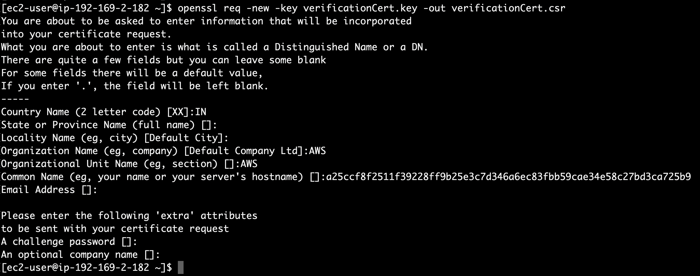
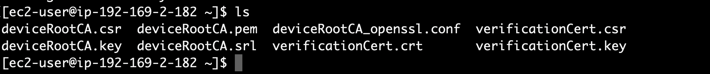

To set up a JITP environment with AWS IoT Core, first register your CA with AWS IoT Core, then attach a provisioning template to your CA. In this step we will create a self-signed root CA and register it with AWS IoT Core.
1. Ensure that you have OpenSSL installed. 
2. Run the following OpenSSL command to create a device root CA private key
```json
openssl genrsa -out deviceRootCA.key 2048
```
3. Create a custom OpenSSL.conf file by running following command
```json
sudo nano deviceRootCA_openssl.conf
```
4. Copy and Paste the following configuration and save the .conf file by pressing control + X and type Y to save.
```json
[ req ]
distinguished_name       = Distinguished_Name
extensions               = v3_ca
req_extensions           = v3_ca

[ v3_ca ]
basicConstraints         = CA:TRUE

[ Distinguished_Name ]
countryName              = Country Name (2 letter code)
countryName_default      = IN
countryName_min          = 2
countryName_max          = 2
organizationName         = Organization Name (eg, company)
organizationName_default = AWS
```
5. You can then run the following Linux command to confirm that the OpenSSL.conf file was created
```json
cat deviceRootCA_openssl.conf
```
4. Run the following OpenSSL command to create a device root CA certificate signing request (CSR)
```json
openssl req -new -sha256 -key deviceRootCA.key -nodes -out deviceRootCA.csr -config deviceRootCA_openssl.conf
```
5. Run the following OpenSSL command to create a device root CA certificate using the CSR generated
```json
openssl x509 -req -days 365 -extfile deviceRootCA_openssl.conf -extensions v3_ca -in deviceRootCA.csr -signkey deviceRootCA.key -out deviceRootCA.pem
```
6. Run the following AWS CLI command to get the registration code for the AWS Region that you want to use JITP in. Make sure to change region to your region of choice.
```json
aws iot get-registration-code --region ap-south-1
```
`Note: Make sure you have IAM role attached (if using EC2 to run these commands) or AWS Credentials configured with necessary permissions to get the registration code.`
`Save the registration code for next step.`

7. Run the following OpenSSL command to create a verification key
```json
openssl genrsa -out verificationCert.key 2048
```
8. Run the following OpenSSL command to create a verification certificate CSR
```json
openssl req -new -key verificationCert.key -out verificationCert.csr
```

`Note: Enter the Registration Code in the Common Name field. For example: Common Name (server FQDN or YOUR name) []: xxxxxxxx8a33da. Leave the other fields blank.`

9. Run the following OpenSSL command to create the verification certificate:
```json
openssl x509 -req -in verificationCert.csr -CA deviceRootCA.pem -CAkey deviceRootCA.key -CAcreateserial -out verificationCert.crt -days 500 -sha256
```

`Note: The registration code of your root CA’s Region is required for the verification certificate to be certified by AWS IoT Core.`

## Checkpoint
