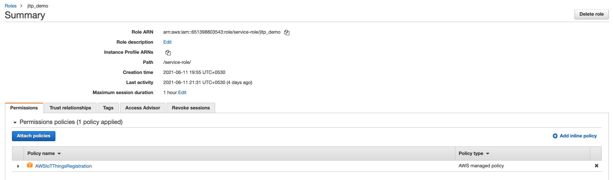

AWS IoT provides options to provision and onboard a large number of devices based
on the capabilities of the device and if the devices have their unique X.509 certificate
and private keys on them before being sold to the end customer.
If the manufacturing chain allows the device maker to provision unique credentials into
the device at manufacturing time or in distribution, device makers can use Just in Time
Provisioning, Just in Time Registration, or Multi-Account Registration. 

{}
Devices that use JITP have certificates and private keys present on the device before
onboarding to AWS IoT. Certificate authority (CA) is an entity that issues digital certificates. The device certificates saved on your devices must be signed with your designated CA, and that CA must be registered in AWS IoT. 
{}

## Introduction

Using JITP, the device connects to AWS IoT, and the certificate’s signature is verified
against the registered CA. After verification, a provisioning template registers the Thing,
certificate, and assigns a policy to the device. A provisioning template is a JSON document that uses parameters to describe the resources your device must use to interact with AWS IoT. 
When the device connects to AWS IoT Core for the first time, the device certificate, and
the signer CA that is registered with AWS IoT must be sent during the TLS handshake.
The TLS handshake will fail at the first connection. This happens because the certificate
has not been pre-loaded into the AWS IoT account. The device-supplied certificate is
registered and activated in AWS IoT during the provisioning process. The device must
have logic to reconnect to AWS IoT after a short time period. If the provisioning
operation has succeeded, the device will connect to AWS IoT successfully.


## Prerequisites
1. Ensure that you have OpenSSL installed. 
2. AWS CLI installed
3. IAM role attached (if using EC2 to run these commands) or AWS Credentials configured with necessary permissions to get the registration code.
4. Python 3
5. Experience on OpenSSL will help though not a must

## Register Certificate Authority with AWS IoT Core

To set up a JITP environment with AWS IoT Core, first register your CA (Certificate Authority) with AWS IoT Core then attach a provisioning template to your CA. 
In this step we will create a self-signed root CA and register it with AWS IoT Core. Root certificate is a public key certificate that identifies a certificate authority (CA).
1. Run the following OpenSSL command to create a device root CA private key. This generates a new RSA private key and saves to file deviceRootCA.key.
```json
openssl genrsa -out deviceRootCA.key 2048
```
2. Create a custom OpenSSL.conf file by running following command. This defines the parameters like country name, organization name, name of certificate etc, necessary to create a CA.
```json
sudo nano deviceRootCA_openssl.conf
```
3. Copy and Paste the following configuration and save the .conf file by pressing control + X and type Y to save.
```json
[ req ]
distinguished_name       = Distinguished_Name
extensions               = v3_ca
req_extensions           = v3_ca

[ v3_ca ]
basicConstraints         = CA:TRUE

[ Distinguished_Name ]
countryName              = Country Name (2 letter code)
countryName_default      = IN
countryName_min          = 2
countryName_max          = 2
organizationName         = Organization Name (eg, company)
organizationName_default = AWS
```

4. Create a device root CA certificate signing request (CSR). 
```json
openssl req -new -sha256 -key deviceRootCA.key -nodes -out deviceRootCA.csr -config deviceRootCA_openssl.conf
```
5. Create a device root CA certificate using the CSR generated
```json
openssl x509 -req -days 365 -extfile deviceRootCA_openssl.conf -extensions v3_ca -in deviceRootCA.csr -signkey deviceRootCA.key -out deviceRootCA.pem
```
6. Run the following AWS CLI command to get the registration code for the AWS Region that you want to use JITP in. Make sure to change region to your region of choice. Copy this registration code in a seperate text file as this is required for next step.
```json
aws iot get-registration-code --region ap-south-1
```

7. Run the following OpenSSL command to create a verification key
```json
openssl genrsa -out verificationCert.key 2048
```
8. Run the following OpenSSL command to create a verification certificate CSR
```json
openssl req -new -key verificationCert.key -out verificationCert.csr
```
Enter the Registration Code in the Common Name field. For example: Common Name (server FQDN or YOUR name) []: xxxxxxxx8a33da. Leave the other fields blank.

9. Run the following OpenSSL command to create the verification certificate:
```json
openssl x509 -req -in verificationCert.csr -CA deviceRootCA.pem -CAkey deviceRootCA.key -CAcreateserial -out verificationCert.crt -days 500 -sha256
```

---
## Create and register a provisioning template
---
A provisioning template is a JSON document that uses parameters to describe the resources your device must use to interact with AWS IoT. IoT Core will use this template to register a new device with certificate signed by a registered CA.

1. Create an IAM role for your AWS IoT Core service and name it JITP_demo. Attach Policy AWSIoTThingsRegistration to this role.

2. Create a JITP template JSON file by running following commands
```json
sudo nano jitp_template.json
```
3. Paste the following serialized JSON and save the file using control + X and type Y

`Replace <REGION>, <Account_ID> and <ROLE_ARN> with your AWS Region, Account_ID and Role ARN for JITPRole respectively`
```json
{
 "templateBody":"{ \"Parameters\" : { \"AWS::IoT::Certificate::CommonName\" : { \"Type\" : \"String\" },\"AWS::IoT::Certificate::Country\" : { \"Type\" : \"String\" }, \"AWS::IoT::Certificate::Id\" : { \"Type\" : \"String\" }}, \"Resources\" : { \"thing\" : { \"Type\" : \"AWS::IoT::Thing\", \"Properties\" : { \"ThingName\" : {\"Ref\" : \"AWS::IoT::Certificate::CommonName\"}, \"AttributePayload\" : { \"version\" : \"v1\", \"country\" : {\"Ref\" : \"AWS::IoT::Certificate::Country\"}} } }, \"certificate\" : { \"Type\" : \"AWS::IoT::Certificate\", \"Properties\" : { \"CertificateId\": {\"Ref\" : \"AWS::IoT::Certificate::Id\"}, \"Status\" : \"ACTIVE\" } }, \"policy\" : {\"Type\" : \"AWS::IoT::Policy\", \"Properties\" : { \"PolicyDocument\" : \"{ \\\"Version\\\": \\\"2012-10-17\\\", \\\"Statement\\\": [ { \\\"Effect\\\": \\\"Allow\\\", \\\"Action\\\": [ \\\"iot:Connect\\\" ], \\\"Resource\\\": [ \\\"arn:aws:iot:<REGION>:<ACCOUNT_ID>:client\\\/*\\\" ] }, { \\\"Effect\\\": \\\"Allow\\\", \\\"Action\\\": [ \\\"iot:Publish\\\", \\\"iot:Receive\\\" ], \\\"Resource\\\": [ \\\"arn:aws:iot:<REGION>:<ACCOUNT_ID>:topic\\\/*\\\" ] }, { \\\"Effect\\\": \\\"Allow\\\", \\\"Action\\\": [ \\\"iot:Subscribe\\\" ], \\\"Resource\\\": [ \\\"arn:aws:iot:<REGION>:<ACCOUNT_ID>:topicfilter\\\/*\\\" ] } ] }\" } } } }",
 "roleArn":"<ROLE_ARN>"
}
```
4. Run the following register-ca-certificate command to register the device root CA as a CA certificate in AWS IoT Core. Make sure to set correct region at --region flag
```json
aws iot register-ca-certificate --ca-certificate file://deviceRootCA.pem --verification-cert file://verificationCert.crt --set-as-active --allow-auto-registration --registration-config file://jitp_template.json --region ap-south-1
```

---
## Perform JITP
---
In this step we will create a Device certificate using self-signed root CA and on-board the device using JITP.

1. Download the RootCA1 and save it with the file name AmazonRootCA1.pem. The RootCA1 is used for server-side authentication of publish requests to AWS IoT Core. Also create a device private key.

```json
wget https://www.amazontrust.com/repository/AmazonRootCA1.pem
openssl genrsa -out deviceCert.key 2048
```

3. Run the following OpenSSL command to create a device CSR. The example JITP template requires the ThingName value to equal the certificate’s CommonName value. The template also requires the CountryName value to equal the Country value in the CA certificate. Refer to the following example:


```json
openssl req -new -key deviceCert.key -out deviceCert.csr
```

4. Run the following OpenSSL command to create a device certificate:
```json
openssl x509 -req -in deviceCert.csr -CA deviceRootCA.pem -CAkey deviceRootCA.key -CAcreateserial -out deviceCert.crt -days 365 -sha256
```
5. Run the following command to combine the root CA certificate and device certificate
```json
cat deviceCert.crt deviceRootCA.pem > deviceCertAndCACert.crt
```
6. Now connect to your AWS IoT Core endpoint using deviceCertAndCACert.crt (Device certificate), deviceCert.key (Device key) and AmazonRootCA1.pem (root CA).
Download and setup the python sdk
```json
git clone https://github.com/aws/aws-iot-device-sdk-python-v2
cd aws-iot-device-sdk-python-v2
sudo python3 setup.py install
```

7. Navigate to Samples folder and execute the basicPubSub.
Change the endpoint as per your AWS IoT Core endpoint, also ensure that you state correct paths and names for certificate files.
```json
cd ~/aws-iot-device-sdk-python-v2/samples/
python3 pubsub.py --endpoint a2weqbsmnrxkaf-ats.iot.ap-south-1.amazonaws.com --root-ca ~/AmazonRootCA1.pem --cert ~/deviceCertAndCACert.crt --key ~/deviceCert.key --client-id "JITP_Demo_Device" --topic "test" --message "Hello World"
```

8. The First connection will timeout and fail. But JITP will now create a new Thing named JITP_Demo_Device (as per the Common Name set in CSR), register the device certificate and attach the security policy as per the JITP_template.
The subsequent connections should be successful. 
