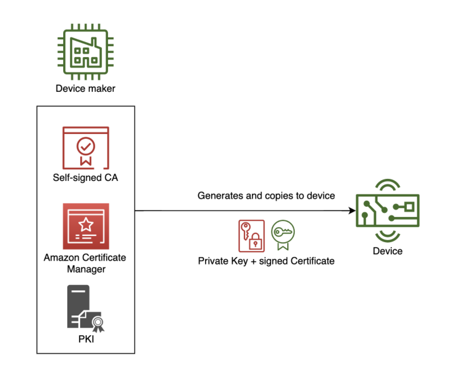

In an IoT deployment, security is often the number one concern from both device
customers and device manufacturers. To protect and encrypt data in transit from an IoT
device to AWS IoT Core, AWS IoT Core supports TLS-based mutual authentication
using X.509 certificates. AWS IoT provides options to provision and onboard a large number of devices based
on the capabilities of the device and if the devices have their unique X.509 certificate
and private keys on them before being sold to the end customer.
If the manufacturing chain allows the device maker to provision unique credentials into
the device at manufacturing time, device makers can use Just in Time
Provisioning. 

To use JITP, devices should have certificates and private keys present on the device before onboarding to AWS IoT. Certificate authority (CA) is an entity that issues digital certificates. The device certificates saved on your devices must be signed with your designated CA, and that CA must be registered in AWS IoT. 
{}
To use JITP you have to maintain your PKI infrastructure, this can also be done using managed service like Amazon Certificate Manager. The manufacturing facility should have capability to create a private key, CA signed certificate and store the key-certificate pair on the device memory.
{}

## Use cases
Just-in-time provisioning (JITP) is the recommended approach when the manufacturing chain allows the device maker to provision unique credentials into the device at manufacturing time. To implement JITP the manufacturing chain has to be trusted and should have the capability to create a device certificate signed by a self-managed CA. You can have your devices provisioned when they first attempt to connect to AWS IoT with just-in-time provisioning (JITP). 

Example use cases where JITP should be used are:

1. When device originates from an original device manufacturer and you have the ability to include unique key material.
2. When maintaining public key infrastructure (PKI) is feasible.
3. There is a trust channel between your PKI and the manufacturing facility.

## Reference architecture


The details of this flow are as follows:
1. Private key and signed certificate pair is created using PKI. PKI can be self-managed or using a managed service like Amazon ACM. 
2. This pair is securely copied and stored on the device memory. 
3. Using JITP, the device connects to AWS IoT, and the certificate’s signature is verified
against the registered CA. After verification, a provisioning template registers the Thing,
certificate, and assigns a policy to the device. A provisioning template is a JSON document that uses parameters to describe the resources your device must use to interact with AWS IoT. 
4. When the device connects to AWS IoT Core for the first time, the device certificate, and
the signer CA that is registered with AWS IoT must be sent during the TLS handshake.
5. The TLS handshake will fail at the first connection. This happens because the certificate
has not been pre-loaded into the AWS IoT account. 
6. The device-supplied certificate is
registered and activated in AWS IoT during the provisioning process. 
7. The device must
have logic to reconnect to AWS IoT after a short time period. 
8. If the provisioning
operation has succeeded, the device will connect to AWS IoT successfully.

Below diagram describes end-to-end just-in-time provisioning flow:


## Implementation
To use JITP you need to have control over your Certificate Authority. This can be either done by self-managed root CA or using ACM Private CA. ACM Private CA enables creation of private certificate authority (CA) hierarchies, including root and subordinate CAs, without the investment and maintenance costs of operating an on-premises CA. Your private CAs can issue end-entity X.509 certificates useful in scenarios including:

1. Creating encrypted TLS communication channels
2. Authenticating users, computers, API endpoints, and IoT devices
3. Cryptographically signing code
4. Implementing Online Certificate Status Protocol (OCSP) for obtaining certificate revocation status

ACM Private CA operations can be accessed from the AWS Management Console, using the ACM Private CA API, or using the AWS CLI.

#### Register Certificate Authority with AWS IoT Core

To set up a JITP environment with AWS IoT Core, first register your CA (Certificate Authority) with AWS IoT Core.
You can either [register a self-managed CA](https://docs.aws.amazon.com/iot/latest/developerguide/register-CA-cert.html) or [register ACM managed private CA](https://iot-device-management.workshop.aws/en/provisioning-options/bring-your-own-ca.html) with AWS IoT.

---
#### Create and register a provisioning template
---
A [provisioning template](https://docs.aws.amazon.com/iot/latest/developerguide/provision-template.html) is a JSON document that uses parameters to describe the resources your device must use to interact with AWS IoT. IoT Core will use this template to register a new device with certificate signed by a registered CA.

1. Create an IAM role for your AWS IoT Core service and name it JITP_demo. Attach Policy AWSIoTThingsRegistration to this role.

2. Create a JITP template JSON file by running following commands
```json
sudo nano jitp_template.json
```
3. Paste the following serialized JSON and save the file using control + X and type Y

`Replace <REGION>, <Account_ID> and <ROLE_ARN> with your AWS Region, Account_ID and Role ARN for JITPRole respectively`
```json
{
 "templateBody":"{ \"Parameters\" : { \"AWS::IoT::Certificate::CommonName\" : { \"Type\" : \"String\" },\"AWS::IoT::Certificate::Country\" : { \"Type\" : \"String\" }, \"AWS::IoT::Certificate::Id\" : { \"Type\" : \"String\" }}, \"Resources\" : { \"thing\" : { \"Type\" : \"AWS::IoT::Thing\", \"Properties\" : { \"ThingName\" : {\"Ref\" : \"AWS::IoT::Certificate::CommonName\"}, \"AttributePayload\" : { \"version\" : \"v1\", \"country\" : {\"Ref\" : \"AWS::IoT::Certificate::Country\"}} } }, \"certificate\" : { \"Type\" : \"AWS::IoT::Certificate\", \"Properties\" : { \"CertificateId\": {\"Ref\" : \"AWS::IoT::Certificate::Id\"}, \"Status\" : \"ACTIVE\" } }, \"policy\" : {\"Type\" : \"AWS::IoT::Policy\", \"Properties\" : { \"PolicyDocument\" : \"{ \\\"Version\\\": \\\"2012-10-17\\\", \\\"Statement\\\": [ { \\\"Effect\\\": \\\"Allow\\\", \\\"Action\\\": [ \\\"iot:Connect\\\" ], \\\"Resource\\\": [ \\\"arn:aws:iot:<REGION>:<ACCOUNT_ID>:client\\\/*\\\" ] }, { \\\"Effect\\\": \\\"Allow\\\", \\\"Action\\\": [ \\\"iot:Publish\\\", \\\"iot:Receive\\\" ], \\\"Resource\\\": [ \\\"arn:aws:iot:<REGION>:<ACCOUNT_ID>:topic\\\/*\\\" ] }, { \\\"Effect\\\": \\\"Allow\\\", \\\"Action\\\": [ \\\"iot:Subscribe\\\" ], \\\"Resource\\\": [ \\\"arn:aws:iot:<REGION>:<ACCOUNT_ID>:topicfilter\\\/*\\\" ] } ] }\" } } } }",
 "roleArn":"<ROLE_ARN>"
}
```
4. Run the following register-ca-certificate command to register the device root CA as a CA certificate in AWS IoT Core. Make sure to set correct region at --region flag
```json
aws iot register-ca-certificate --ca-certificate file://deviceRootCA.pem --verification-cert file://verificationCert.crt --set-as-active --allow-auto-registration --registration-config file://jitp_template.json --region ap-south-1
```

---
#### Perform JITP
---
Now we have to create a Device certificate using self-signed root CA and on-board the device using JITP. If you have configured ACM or other PKI use your respective PKI to create a CSR and sign device certificate and skip to step 6.

1. Download the RootCA1 and save it with the file name AmazonRootCA1.pem. The RootCA1 is used for server-side authentication of publish requests to AWS IoT Core. Also create a device private key.

```json
wget https://www.amazontrust.com/repository/AmazonRootCA1.pem
openssl genrsa -out deviceCert.key 2048
```

3. Run the following OpenSSL command to create a device CSR. The example JITP template requires the ThingName value to equal the certificate’s CommonName value. The template also requires the CountryName value to equal the Country value in the CA certificate. Refer to the following example:


```json
openssl req -new -key deviceCert.key -out deviceCert.csr
```

4. Run the following OpenSSL command to create a device certificate:
```json
openssl x509 -req -in deviceCert.csr -CA deviceRootCA.pem -CAkey deviceRootCA.key -CAcreateserial -out deviceCert.crt -days 365 -sha256
```
5. Run the following command to combine the root CA certificate and device certificate
```json
cat deviceCert.crt deviceRootCA.pem > deviceCertAndCACert.crt
```
6. Now connect to your AWS IoT Core endpoint using deviceCertAndCACert.crt (Device certificate), deviceCert.key (Device key) and AmazonRootCA1.pem (root CA).
Download and setup the python sdk
```json
git clone https://github.com/aws/aws-iot-device-sdk-python-v2
cd aws-iot-device-sdk-python-v2
sudo python3 setup.py install
```

7. Navigate to Samples folder and execute the basicPubSub.
Change the endpoint as per your AWS IoT Core endpoint, also ensure that you state correct paths and names for certificate files.
```json
cd ~/aws-iot-device-sdk-python-v2/samples/
python3 pubsub.py --endpoint a2weqbsmnrxkaf-ats.iot.ap-south-1.amazonaws.com --root-ca ~/AmazonRootCA1.pem --cert ~/deviceCertAndCACert.crt --key ~/deviceCert.key --client-id "JITP_Demo_Device" --topic "test" --message "Hello World"
```

8. The First connection will timeout and fail. But JITP will now create a new Thing named JITP_Demo_Device (as per the Common Name set in CSR), register the device certificate and attach the security policy as per the JITP_template.
The subsequent connections should be successful. 

## Considerations
This implementation covers the basics of device onboarding using Just-in-time Provisioning. It does not cover certain aspects that may arise in production use.

