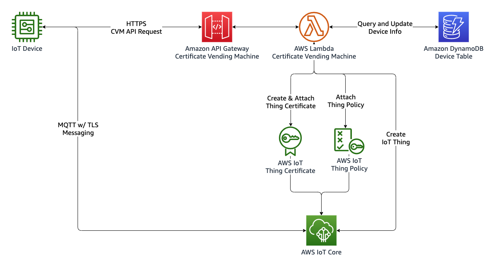
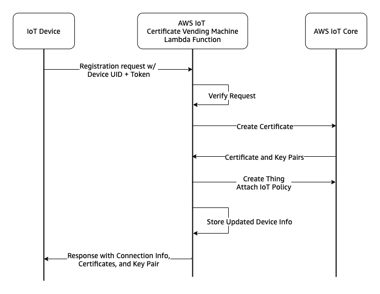

Certificate Vending Machine is a device registration pattern applied when devices don't have unique certificates during manufacturing and share the same firmware. Using a Certificate Vending Machine API endpoint (CVM, in short) devices are registered by logic on the cloud with the device's claim of a unique identifier and a calculated hash with it. This unique identifier can be any serial number, MAC address, or IMEI. This exposed public API points to a cloud application that validates the incoming request and performs required operations to generate and attach certificates to the device. 

{}
This implementation focuses on the use of an AWS Lambda + Amazon DynamoDB + Amazon API Gateway combination to validate, register, and keep track of the devices and device registration process. The device invokes the API when it's the first time connected to the internet. Then, AWS Lambda checks the identity and validity of the certificate request with the help of data stored about the device on DynamoDB. There are many device provisioning and registration options available for different types of manufacturing and distribution circumstances. Check [device bootstrap section of IoT Atlas](..) to explore other device provisioning and registration methods.
{}

{}
Another method can be [bootstrapping the device with a trusted user](../fleet\_provisioning\_trusted\_user/) when devices don't have unique certificates and a trusted user is available with a mobile app that can relay the certificates to the device.
{}


## Use Cases

Certificate Vending Machine approach for device registration can be a preferred method under the following conditions:

- Devices don't have unique certificates during manufacturing and share the same firmware.
- Devices can state their unique identifiers such as serial number, product ID, IMEI, or Mac ID.
- When the manufacturing chain is not trusted or 3rd party stakeholders are involved in the device's life cycle.
- Fine-grained validations or 3rd party service calls are needed to be run during the registration.
- IoT device needs to interact with an authenticated secure API endpoint to perform its registration.

## Reference Architecture

The architecture of the CVM system is as follows:



The following steps are involved during registration of an IoT thing with certificate vending machine method:

1.  Device sends a registration request with a payload contains its unique identifier and registration token to the Amazon API Gateway endpoint.
2.  Amazon API Gateway service checks the request and invokes the CVM Lambda function.
3.  CVM lambda function verifies the registration request by querying the Amazon DynamoDB table.
4.  CVM lambda function applies the registration process by creating an IoT thing certificate, attaching the predefined IoT policy to the certificate, creating an IoT thing and attaching the certificate to the IoT thing.
5.  CVM lambda function updates device state info in the corresponding DynamoDB record.
6.  CVM lambda function prepares a JSON response payload with certificates and IoT Core endpoint information.
7.  Device receives the certificates and IoT Core endpoint information thus completes the registration process.
8.  Device initiates the MQTT w/ TLS connection with its own certificates and client ID.

The basic representation of this flow can be represented as follows:



## Authentication

Devices will use the public API endpoint to trigger its registration process. This request will contain it's unique identifier and registration token. The unique identifier will be used to build the thing's name. Registration token is a calculated hash value to be stored on the DynamoDB table. The token will be calculated by the device using the same hashing algorithm. Thus, CVM API compares the registration token which the device is provided with the one calculated previously and stored on the DynamoDB table. Since all devices share the same firmware, this token can be calculated by a combination of a "salt" and the device's unique identifier. This salt is a secret string which makes `SHA256()` less predictible by the making input string longer. This secret salt string will be placed into your firmware. Since it's a sensitive material of your device connectivity flow, you need to take care of the security of it. Read more on **Considerations** section below.

We can summarise the process as follows:

1. Device manufacturer inserts a record to the DynamoDB table as: `device_uid=DEVICE001, device_token=SHA256("YOUR_SECRET_SALT//DEVICE001")` _You can calculate this SHA256 hash with your favorite programming language, or using online SHA256 calculators._
2. Device manufacturer places the salt string into the firmware for hashing.
3. During runtime, firmware combines salt string and device's unique identifier to calculate the hash.
4. Then, firmware sends a request with it's unique identifier and calculated registration token to initiate the registration process.
5. Device will receive an HTTP response to the request. The response contains the thing name which will be used as client ID, certificates, and AWS IoT Core MQTT endpoint. Device should save this information in it's non-volatile memory.


## Implementation

This implementation guide shows step-by-step instructions of the architecture shown above. You need to have AWS CLI installed on your workstation.

### 1. Create an IoT Policy

This IoT policy will be attached to every device provisioned by certificate vending machine. Following reference policy can be used as an example to restrict each device to its own topic.

Save following file as `iot-policy.json`.

```json
{
  "Version": "2012-10-17",
  "Statement": [
    {
      "Effect": "Allow",
      "Action": [
        "iot:Connect"
      ],
      "Resource": [
        "*"
      ],
      "Condition": {
        "Bool": {
          "iot:Connection.Thing.IsAttached": [
            "true"
          ]
        }
      }
    },
    {
      "Effect": "Allow",
      "Action": [
        "iot:Subscribe"
      ],
      "Resource": [
        "arn:aws:iot:*:*:topicfilter/comm/${iot:Connection.Thing.ThingName}"
      ]
    },
    {
      "Effect": "Allow",
      "Action": [
        "iot:Receive",
        "iot:Publish"
      ],
      "Resource": [
        "arn:aws:iot:*:*:topic/comm/${iot:Connection.Thing.ThingName}"
      ]
    }
  ]
}

```

Run following command to create `iot-policy.json` as an IoT Policy named `SingleDevicePolicy`.

```bash
aws iot create-policy \
    --policy-name SingleDevicePolicy \     
    --policy-document file://iot-policy.json
```

### 2\. Create the DynamoDB table to store device information.

```
aws dynamodb create-table \
    --table-name DeviceProvisioningInfoDB \
    --attribute-definitions AttributeName=device_uid,AttributeType=S \
    --key-schema AttributeName=device_uid,KeyType=HASH \
    --provisioned-throughput ReadCapacityUnits=5,WriteCapacityUnits=5
```


### 3\. Deploy a Lambda Function which performs the registration logic.

Save the following file as `lambda_function.py`

```python
import json
import os
from datetime import datetime
import boto3
from botocore.exceptions import ClientError
import urllib.request

def lambda_handler(event, context):
    dynamodb_client = boto3.resource('dynamodb', region_name=os.environ['region'])
    iot_client = boto3.client('iot', region_name=os.environ['region'])

    try:
        device_uid = event['device_uid']
        device_token = event['device_token']
    except Exception:
        return prepare_result(event, "ERROR", 500, {"message": "Missing input data"})
        
    print("Device registration request for {}".format(device_uid))
    
    dynamodb_table = dynamodb_client.Table(os.environ['device_dynamodb_table'])
    
    try:
        device_info = dynamodb_table.query(
            KeyConditionExpression="device_uid = :a",
            ExpressionAttributeValues={
                ":a": device_uid
            }
        )
    except ClientError:
        return prepare_result(event, "ERROR", 500, {"message": "Device database access error"})
        
    if len(device_info['Items']) <= 0:
        return prepare_result(event, "ERROR", 404, {"message": "Device not found"})
    else:
        if device_info['Items'][0]['is_registered'] == 1:
            return prepare_result(event, "ERROR", 500, {"message": "Device is already registered"})
        if device_info['Items'][0]['is_enabled'] == 0:
            return prepare_result(event, "ERROR", 500, {"message": "Device isn't enabled"})
        if device_info['Items'][0]['device_token'] != device_token:
            return prepare_result(event, "ERROR", 500, {"message": "Device token is not valid"})

    print("Database checks passed for {}, the next is create_keys_and_certificate()".format(device_uid))
    
    certificate = iot_client.create_keys_and_certificate(setAsActive=True)
    if not certificate:
        return prepare_result(event, "ERROR", 500, {"message": "Unable to create device certificates"})

    print("Database checks passed for {}, the next is attach_policy()".format(device_uid))
    
    try:
        iot_client.attach_policy(policyName=os.environ['iot_policy_name'], target=certificate['certificateArn'])
    except:
        return prepare_result(event, "ERROR", 500, {"message": "Unable to attach policy to the certificate"})

    try:
        time_registered = datetime.now().isoformat()
        attribute_payload = {
            "attributes": {
                'device_uid': device_uid,
                'registered_via': "iot-core-cvm",
                'registered_on': time_registered
            },
            "merge": True
        }
        
        thing_name = os.environ['thing_name_format'].replace("%DEVICE_UID%", "{}").format(device_uid)
        thing = iot_client.create_thing(thingName=thing_name, attributePayload=attribute_payload)
    except:
        return prepare_result(event, "ERROR", 500, {"message": "Unable to create thing"})
        
    try:
        iot_client.attach_thing_principal(principal=certificate['certificateArn'], thingName=thing_name)
    except:
        return prepare_result(event, "ERROR", 500, {"message": "Unable to attach certificate to the device"})


    root_certificate_request = urllib.request.urlopen(os.environ['iot_root_ca_url'])
    if root_certificate_request.getcode() != 200:
        return prepare_result(event, "ERROR", 500, {"message": "Unable to download root CA"})
    
    root_certificate = root_certificate_request.read()
    
    try:
        device_info_update = dynamodb_table.update_item(
            Key={"device_uid": device_uid},
            UpdateExpression="set iot_core_thing_name = :t, iot_core_registered_on = :o, is_registered = :r ",
            ExpressionAttributeValues={
                ":t": thing_name,
                ":o": time_registered,
                ":r": 1
            },
            ReturnValues="UPDATED_NEW"
        )
    except ClientError:
        return prepare_result(event, "ERROR", 500, {"message": "Database error during device record update"})
        
    if 'Attributes' not in device_info_update:
        return prepare_result(event, "ERROR", 500, {"message": "Device info couldnt updated."})
    
    try:
        iot_core_endpoint = iot_client.describe_endpoint(
            endpointType='iot:Data-ATS'
        )
    except:
        return prepare_result(event, "ERROR", 500, {"message": "Error while getting IoT Core endpoint"})
        
    if not "endpointAddress" in iot_core_endpoint:
        return prepare_result(event, "ERROR", 500, {"message": "Invalid IoT Core endpoint response"})

    payload = {
        "endpoint": iot_core_endpoint["endpointAddress"],
        "thing_name": thing_name,
        "certificates": {
            "device_certificate": certificate['certificatePem'],
            "root_ca": root_certificate
        },
        "keyPair": {
            "publicKey": certificate['keyPair']['PublicKey'],
            "privateKey": certificate['keyPair']['PrivateKey']
        }
    }

    return prepare_result(event, "SUCCESS", 200, payload)


def prepare_result(event, result_type, status_code=200, payload=None):

    result = {
        'statusCode': status_code,
        'status':result_type
    }
    
    if payload:
        result["payload"] = payload
    
    print("Invocation for EVENT='{}', finished with STATUS='{}', STATUS_CODE='{}'".format(
            json.dumps(event), 
            result_type, 
            status_code)
        )
    
    return result

```

Run following command to prepare lambda function deployment package.

```bash
zip function.zip lambda_handler.py
```


Save the following file as `trust-policy.json`. This trust policy allows the Lambda function to assume role to perform allowed operations. 
```json
{
  "Version": "2012-10-17",
  "Statement": [
    {
      "Effect": "Allow",
      "Principal": {
        "Service": "lambda.amazonaws.com"
      },
      "Action": "sts:AssumeRole"
    }
  ]
}
```

Run following command to create a role named `IoTCVMLambdaInvokeRole` with `trust-policy.json` file.
```bash
aws iam create-role --role-name IoTCVMLambdaInvokeRole --assume-role-policy-document file://trust-policy.json
```

Take a note of `"Arn"` value which is the ARN of newly created role in the response.

```
"Arn": "arn:aws:iam::...",
```

Run following command to assign `AWSLambdaBasicExecutionRole` role to the newly created role.

```bash
aws iam attach-role-policy --role-name IoTCVMLambdaInvokeRole --policy-arn arn:aws:iam::aws:policy/service-role/AWSLambdaBasicExecutionRole
```

Save following file as `lambda-policy.json`. This IAM policy will allow lambda function to perform following restricted IoT and DynamoDB actions.
```json
{
    "Version": "2012-10-17",
    "Statement": [
        {
            "Sid": "AllowIoTActions",
            "Effect": "Allow",
            "Action": [
                "iot:CreateKeysAndCertificate",
                "iot:AttachPolicy",
                "iot:CreateThing",
                "iot:AttachThingPrincipal",
                "iot:DescribeEndpoint"
            ],
            "Resource": "*"
        },
        {
            "Sid": "AllowDeviceTableAccess",
            "Effect": "Allow",
            "Action": [
                "dynamodb:Query",
                "dynamodb:UpdateItem"
            ],
            "Resource": [
                "arn:aws:dynamodb:*:*:table/DeviceProvisioningInfoDB"
            ]
        }
    ]
}
```

Run following command to assign `lambda-policy.json` policy to the role.

```bash
aws iam put-role-policy --role-name IoTCVMLambdaInvokeRole --policy-name IoTCVMLambdaAccess --policy-document file://lambda-policy.json
```

After setting required permissions to the lambda function, deploy the `IoTCertificateVendingMachineFn` lambda function by running following command. Replace `<REGION>` with your region, e.g. `us-west-2`.
This call also sets environment varilables to the lambda function. You can change them before running command or you can see and modify them on AWS Lambda console.

```bash
aws lambda create-function --function-name IoTCertificateVendingMachineFn \
--zip-file fileb://function.zip \
--handler lambda_function.lambda_handler \
--runtime python3.9 \
--role <ARN_OF_IoTCVMLambdaInvokeRole> \
--environment Variables="{ \
    device_dynamodb_table=DeviceProvisioningInfoDB, \
    iot_root_ca_url=https://www.amazontrust.com/repository/AmazonRootCA1.pem, \
    region=<REGION>, \
    thing_name_format=thing_%DEVICE_UID% \
    iot_policy_name=SingleDevicePolicy \
}"
```

After deployment of the lambda function, configure it to be triggered by Amazon API Gateway.

### 4\. Configure API Gateway to trigger Lambda function


In this section, you create an API Gateway REST API (`IoTCVMApi`) with one resource (`Registration`) and one method (`POST`). You associate the POST method with your Lambda function. Then, you deploy the API.

When your API method receives an HTTP request, API Gateway invokes your Lambda function.

**To create the API**

1.  Open the  [API Gateway console](https://console.aws.amazon.com/apigateway).
2.  Choose  **Create API**.
3.  In the  **REST API**  box, choose  **Build**.
4.  Under  **Create new API**, choose  **New API**.
5.  Under  **Settings**, do the following:
    1.  For  **API name**, enter  `IoTCVMApi`.
    2.  For  **Endpoint Type**, choose  **Regional**.
6.  Choose  **Create API**.


**Create the resource**

1.  In the  **Resources**  tree of your API, make sure that the root (`/`) level is highlighted. Then, choose  **Actions**,  **Create Resource**.
2.  Under  **New child resource**, do the following:
    1.  For  **Resource Name**, enter  `Registration`.
    2.  Keep  **Resource Path**  set to  `/registration`.
3.  Choose  **Create Resource**.

**Create the POST method on the resource**

1.  In the  **Resources**  tree of your API, make sure that  `/registration`  is highlighted. Then, choose  **Actions**,  **Create Method**.
2.  In the small dropdown menu that appears under  `/registration`, choose  `POST`, and then choose the check mark icon.
3.  In the method's  **Setup**  pane, do the following:
    1.  For  **Integration type**, choose  **Lambda Function**.
    2.  For  **Lambda Region**, choose the same AWS Region as your Lambda function.
    3.  For  **Lambda Function**, enter the name of your function (`IoTCertificateVendingMachineFn`).
    4.  Select  **Use Default Timeout**.
    5.  Choose  **Save**.
4.  In the  **Add Permission to Lambda Function**  dialog box, choose  **OK**.

**Deploy the API**

1.  In the  **Resources**  navigation pane, choose  **Actions**.
2.  From the  **Actions**  drop-down menu, choose  **Deploy API**.
3.  In the  **Deploy API**  dialog, choose an entry from the  **Deployment stage**  dropdown list.
4.  Choose  **\[New Stage\]**, enter a name in  **Stage name** as `prod`.
5.  Choose  **Deploy**  to deploy the API to the specified stage with default stage settings.
6.  Copy and save the API invoke URL. This URL is the IoT CVM API endpoint.

## Testing and simulation of a device behaviour

Let's assume `device_uid=DEVICE001` and calculate it's SHA256 hash using python on the shell console. Copy the calculated hash.

```bash
python3 <<< 'import hashlib; print(hashlib.sha256(b"DEVICE001//YOURSECRETSALTHERE").hexdigest())'
 
$ d20085ec140486cc01d0cade40e71a9f056fa2cadb2c4f78c883a3db5b5ec72e
```

Add the record to DynamoDB table. As initial state, set `is_enabled=0` to demonstrate the error behaviour. Place your calculated device token to `<DEVICE_TOKEN>`.

```bash
aws dynamodb put-item \
    --table-name DeviceProvisioningInfoDB  \
    --item \
        '{"device_uid": {"S": "DEVICE001"}, "device_token": {"S": "<DEVICE_TOKEN>"}, "is_enabled": {"N": "0"}, "is_registered": {"N": "0"}}'

```

Get the record to check if the record is created. On this step, you can also start using [DynamoDB Console](https://console.aws.amazon.com/dynamodb/home) to see and modify the data.

```bash
aws dynamodb get-item \
    --table-name DeviceProvisioningInfoDB  \
   --key '{"device_uid": {"S": "DEVICE001"}}'
```

Replace `API_ENDPOINT` with your API Gateway endpoint and perform a device registration API call as acting like your device's firmware.

```bash
curl -d '{"device_uid":"DEVICE001", "device_token":"<DEVICE_TOKEN>"}' -H "Content-Type: application/json" -X POST https://<API_ENDPOINT>/registration

{"statusCode": 500, "status": "ERROR", "payload": {"message": "Device isn't enabled"}}%
```

You'll see the response that device is not enabled to register.

If you encounter any other error, you can navigate to [Amazon CloudWatch Logs console](https://console.aws.amazon.com/cloudwatch/home#logsV2:log-groups) to see executation logs of the lambda function.

After seeing the error reponse, change the DynamoDB record as `is_enabled=1` to allow registration.

```bash
aws dynamodb update-item \
    --table-name DeviceProvisioningInfoDB  \
   --key '{"device_uid": {"S": "DEVICE001"}}' \
   --attribute-updates '{"is_enabled": {"Action":"PUT", "Value": {"N": "1"}}}' \
   --return-values UPDATED_NEW
```

Run the same registration query again.

```bash
curl -d '{"device_uid":"DEVICE001", "device_token":"d2008..."}' -H "Content-Type: application/json" -X POST https://API_ENDPOINT/registration

{"statusCode": 200, "status": "SUCCESS", "payload": {...}}
```

You registered the device. The response contains the connection info and certificates. This response is only available once so make sure that you saved the HTTP reponse. Later requests will reponded as _device is already registered._

Check the DynamoDB to see device's updated info.

```bash
aws dynamodb get-item \
    --table-name DeviceProvisioningInfoDB  \
   --key '{"device_uid": {"S": "DEVICE001"}}'
```

Device is registered to AWS IoT Core using certificate vending machine method. You can navigate to [AWS IoT Core Console](https://console.aws.amazon.com/iot/home) to see the newly created IoT thing and its attached resources.

## Considerations

This implementation covers the basics of an IoT certificate vending machine method. It does not cover certain aspects that may arise in production use.

### Security and Authentication
If your IoT devices exposed to the internet instead of an intranet, your API should be deployed as a public API endpoint. This will allow any internet-connected network to connect your API but also it exposes your API endpoint to possible attacks. To protect your API Gateway endpoint, use [Security in Amazon API Gateway
](https://docs.aws.amazon.com/apigateway/latest/developerguide/security.html) documentation to enable features like API rate limiting or IP address based restrictions with AWS WAF.

This implementation depends on a single unique identifier of a device. If your device unique identifiers are sequential or easy-to-estimate, you need to consider the leakage of your device token calculation formula and hash string. Thus, you may need to implement secondary unique identifier to mitigate the replay or increment attacks. In this situation, device should claim it's first unique ID, matching second unique ID, and matching calculated hash as example `device_token=SHA256("YOUR_SECRET_SALT//DEVICE_UID_1+DEVICE_UID_2")` to be registered.

Your `device_token` is calculated by hashing functions using your secret salt string. You need to implement some extra layers to increase the protection of registration logic and protect your sensitive material. 
- If your device's computing environment provides hardware based encryption blocks, or read protected memory blocks, you can leverage these features to reduce the possible attack surface. Almost all of modern MCU's provide these feature sets out of the box, otherwise you may need to include a TPM (Trusted Platform Module) component to your harware design.
- You can use different secrets salts for different batches/series of devices. Thus, only one batch/series of devices use the same secret. This reduces the blast radius of a possible attack.

### Service Quotas
This implementation uses an AWS Lambda function to make AWS IoT Core API calls. You need to identify possible batch registration events and estimated throughput of IoT API calls to avoid hitting service limits and quotas.

### Logging and Monitoring of Device Registration

Implement a logging and monitoring mechanism for critical steps and KPI's regarding your device registration use-case to build a registration dashboard. This monitoring strategy can include the following:

- CloudWatch log insights of the CVM lambda function
- Lambda function invocation metrics
- IoT Service CloudWatch metrics
- IoT Core service logs
- IoT Core service events

### API Response Times, Errors and Retries

Your IoT device's registration implementation should be aware of the CVM API response times and possible error codes. In case of an error, it should trigger retries or reporting scenarios within a well-defined flow.

CVM API response time depends on possible Lambda cold starts, IoT Core API calls run in the lambda function and your other custom logic in the function.

Some possible application-level error catches are implemented in the lambda function as examples. But they may differ according to your use case.

# Multi Region Strategy
This implementation shows to provision IoT resources on a single defined region. Also, the device database on Amazon DynamoDB and Amazon API Gateway endpoint are deployed on a single region. If your use-case requires creation of IoT resources in different regions, you can implement additional logic in the Lambda function and call API's in different regions to create resources. If your use-case requires complete isolation of resources in different regions or a multi-region fault tolerancy, you can deploy CVM solution to multiple resources. You can leverage multi-region features of services used, e.g. **global tables** feature of Amazon DynamoDB which provides fully managed, multi-region, and multi-active database, replicates automatically across your choice of AWS Regions.