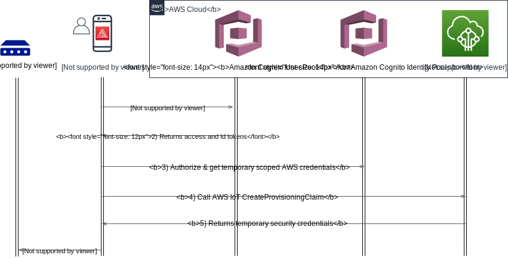

AWS IoT provides an application programming interface (API) that allows mobile/web applications to generate temporary certificates and private keys. The device leaves the manufacturing facility with no unique credentials, and only [Trusted Users]() are able to provision the device with its unique credentials.

An installer uses the application and authenticates with AWS. Using the Trusted User APIs, the installer receives a temporary X.509 certificate and private key that is valid for five minutes. Using the application, the credentials are delivered to the device. The device connects to AWS IoT and exchanges the temporary credentials for a unique X.509 certificate signed with the AWS CA and a private key. During this workflow, the AWS resources including Thing name, Policy, and Certificate are set up in the AWS Account.

{}
Device makers that use the Trusted User flow must develop and maintain a mobile/web application that exercises the Trusted User APIs.
{}
{}
Devices must have the ability to accept temporary credentials over a secure connection such as Bluetooth Low Energy, WiFi, or USB. Devices must implement the logic necessary to publish and subscribe to Fleet Provisioning MQTT topics, accept the permanent credentials, and write the credentials to secure storage.
{}


## Use Cases

Fleet Provisioning by Trusted User is the recommended approach when a high degree of security is needed, when the manufacturing chain is not trusted, or it is not possible to provision devices in the manufacturing chain due to technical limitations, cost, or application specific limitations. Using this approach, the credentials are never exposed to the manufacturing supply chain.

## Reference Architecture


The details of this flow are as follows:
1. Client authenticates against a user pool.
2. The user pool assigns 3 JWT tokens (Id, Access, and Refresh) to the client.
3. The Id JWT is passed to the identity pool and a role is chosen via the JWT claims. The user then receives IAM temporary credentials with privileges that are based on the IAM role that was mapped to the group that user belongs to.
4. The user can then make CreateProvisioningClaim call to AWS IoT Core for a specific provisioning template
5. AWS IoT Core response with temporary certificate and key pair
6. The user provisions the temporary certificate and key pair to the device, and initiate fleet provisioning with bootstrap certificate

At this point, the device have valid certificate to authenticate with AWS IoT MQTT gatwaye.


## Implementation

To experiment quickly, you can test this pattern out by using [AWS Amplify](https://aws.amazon.com/amplify/) and [Amazon Cognito](https://aws.amazon.com/cognito/).
AWS Amplify is a set of tools and services that can be used together or on their own, to help front-end web and mobile developers build scalable full stack applications, powered by AWS.
Amazon Cognito lets you add user sign-up, sign-in, and access control to your web and mobile apps quickly and easily. Amazon Cognito scales to millions of users and supports sign-in with social identity providers, such as Apple, Facebook, Google, and Amazon, and enterprise identity providers via SAML 2.0 and OpenID Connect. 

### AWS Amplify
The open-source Amplify Framework provides the following products to build fullstack iOS, Android, Flutter, Web, and React Native apps:

- [Amplify CLI](https://docs.amplify.aws/cli/) - Configure all the services needed to power your backend through a simple command line interface.
- [Amplify Libraries](https://docs.amplify.aws/lib/) - Use case-centric client libraries to integrate your app code with a backend using declarative interfaces.
- [Amplify UI Components](https://docs.amplify.aws/ui/) - UI libraries for React, React Native, Angular, Ionic and Vue.

The Amplify Console is an AWS service that provides a git-based workflow for continuous deployment & hosting of fullstack web apps. Cloud resources created by the Amplify CLI are also visible in the Amplify Console.

#### Application Authentication & Authorization
The Amplify Framework uses Amazon Cognito as the main authentication provider. Amazon Cognito is a robust user directory service that handles user registration, authentication, account recovery & other operations.

Running simple Amplify CLI command ```amplify add auth``` will add Amazon Cognito resources required by the application to your Amplify project.
```
amplify add auth

? Do you want to use the default authentication and security configuration? Default configuration
? How do you want users to be able to sign in? Username
? Do you want to configure advanced settings?  No, I am done.
```
Once added, you can leverage [Cognito User Pool](https://docs.aws.amazon.com/cognito/latest/developerguide/cognito-user-identity-pools.html) to manage your users directory.
However, authenticating a user is not enough. Users have to be authorized if they wish to access AWS services. For this purpose, use
[Cognito Identity Pool](https://docs.aws.amazon.com/cognito/latest/developerguide/cognito-identity.html). With an identity pool, you can obtain temporary, limited-privilege AWS credentials to access other AWS services.

Amplify [Auth](https://aws-amplify.github.io/amplify-js/api/classes/authclass.html) class provides authentication steps, and 
have over 30 methods including signUp, signIn, forgotPassword, and signOut that allow you full control over all aspects of the user authentication flow.

#### Adding authentication flow
Creating login flow in your application can be quite difficult and time consuming to get right. Luckily Amplify Framework has an authentication UI component we can use that will provide the entire authentication flow for us,
including Sign-Up, and Sign-In.

In this example, we use the Amplify React UI library and the ```withAuthenticator``` component to quickly get up and running with a real-world authentication flow.
Check [here](https://docs.amplify.aws/ui/q/framework/react/) to learn more about Amplify Authentication UI components and capabilities.

The ```withAuthenticator``` is a higher-order component (HoC) that wraps ```AmplifyAuthenticator```. You'll also notice the ```AmplifySignOut``` component. This is an optional component if you'd like to render a sign out button.

```javascript
import logo from './logo.svg';
import './App.css';
import { withAuthenticator, AmplifySignOut } from '@aws-amplify/ui-react'
import { Auth } from 'aws-amplify';

var AWS = require('aws-sdk');
AWS.config.update({region: 'us-east-1'});

// This function is called when user clicks Create Provisioning Claim button
async function CreateProvisioningClaim() {
  try {
    // Call AWS IoT Core with the user current credentials
    // Cognito identity pool authRole should be added appropriate permissions to access AWS IoT API
    Auth.currentCredentials()
      .then(credentials => {
        const iot = new AWS.Iot({
          apiVersion: '2015-05-28',
          credentials: Auth.essentialCredentials(credentials)
        });

        // Set the name of Fleet provisioning template
        var params = {
          templateName: 'PROVISIONING TEMPLATE NAME'
        };
        
        // Call AWS IoT API
        iot.createProvisioningClaim(params, function(err, data) {
          if (err) console.log(err, err.stack); // an error occurred
          else     console.log(data);           // successful response
        });
      });
  } catch (error) {
    // error handling.
    alert(error);
  }
}

function App() {
  return (
    <div className="App">
      <header className="App-header">
        
        <div>
          <input type="button" value="Create Provisioning Claim" onClick={CreateProvisioningClaim} />
        </div>
        <p>
          Edit <code>src/App.js</code> and save to reload.
        </p>
        <p>
          <AmplifySignOut />
        </p>
        <a
          className="App-link"
          href="https://reactjs.org"
          target="_blank"
          rel="noopener noreferrer"
        >
          Learn React
        </a>
      </header>
    </div>
  );
}

export default withAuthenticator(App);
```

Above code will result this landing page for unauthenticated users:


Once user is sign-in they will redirected to below page. Notice the "Create Provisioning Claim" button. Clicking the button will
invoke ```CreateProvisioningClaim``` function asking AWS IoT Core to generate temporary claim for the given Fleet provisioning template.


{}
Make sure to add Cognito Identity Pool ```authRole``` IAM role the appropriate policy granting it access to AWS IoT ```createProvisioningClaim``` action.
This ```authRole``` IAM role is assumed by the user when he wish to access AWS services. Above code handles it by calling ```Auth.currentCredentials()```
{}

### AWS IoT Fleet Provisioning template
A [provisioning template](https://docs.aws.amazon.com/iot/latest/developerguide/provision-template.html) is a JSON document that uses parameters to describe the resources your device must use to interact with AWS IoT.
When configuring Fleet Provisioning template you have an option to configure [Pre Provisioning Hook](https://docs.aws.amazon.com/iot/latest/developerguide/pre-provisioning-hook.html).
Pre Provisioning Hook is a Lambda function to validate parameters passed from the device before allowing the device to be provisioned.

Hiding inside above React code is the input parameter ```templateName``` given to the ```createProvisioningClaim``` AWS IoT API call. The parameter
references AWS IoT Fleet Provisioning template resource.
This binds the temporary provisioned claim with the template. When device connects using the temporary claim, AWS IoT invokes the bounded template provisioning workflow.

Below is a simple template example. When the device triggers the provisioning process it can pass inputs to be injected as parameters into the template.
```
{
    "Parameters" : {
        "ThingName" : {"Type" : "String" }
    },
    "Resources" : {
        "thing" : {
            "Type" : "AWS::IoT::Thing",
            "Properties" : {
                "ThingName" : {"Ref" : "ThingName"}
            }
        },  
        "certificate" : {
            "Type" : "AWS::IoT::Certificate",
            "Properties" : {
                "CertificateId": {"Ref": "AWS::IoT::Certificate::Id"},
                "Status" : "ACTIVE"      
            }
        },
        "policy" : {
            "Type" : "AWS::IoT::Policy",
            "Properties" : {
                "PolicyName": "iot policy name"
            }
        }
    }
}
```

## Considerations

This implementation covers the basics of Amplify and React code. It does not cover certain aspects that may arise in production use.
