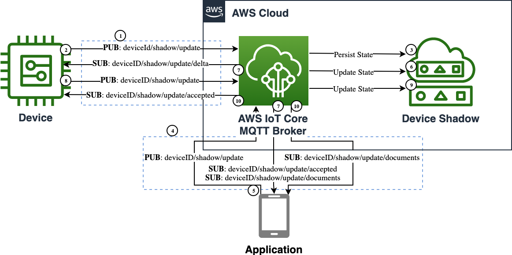

_Device Shadow_ is a service of AWS IoT Core. Shadows can make a device's state available via MQTT topics whether the device is connected or not. This allows Apps and Services to interact with the device state at any time.

## Use Cases

- Update device state when the device is not connected
  - _I want to turn my vehicle lights off_
  - _I want to set my coffee maker to turn on in the morning_
  - _I want to set the temperature alarm for my pump_
- View last known device state when the device is not connected
  - _I want to check if my vehicle is locked_
  - _I want to check when my coffee finished brewing_
  - _I want to view my pump's temperature_
- Update a fleet of devices' configurations
  - _I want to set the temperature limit for all of my coffee makers_

## Reference Architecture



- _AWS IoT Core_ is the MQTT message broker processing messages on behalf of the clients
- _Device_ is the IoT thing which has its state replicated
- _Device Shadow_ is the IoT service that de-conflicts, stores, and processes state
- _Application_ is the remote logic that updates the desired state

1. The _Device_ establishes an MQTT connection to the _AWS IoT Core_ endpoint, and then subscribes to the `deviceId/shadow/update/delta`, `deviceId/shadow/update/accepted`, and `deviceId/shadow/update/rejected` topics to receive shadow state change updates.
1. The _Device_ publishes its initial state to the `deviceID/shadow/update` topic. This is the topic where current and desired state updates are received.
1. The _AWS IoT Core_ broker writes the device state to the _Device Shadow_ persistent store.
1. The _Application_ establishes an MQTT connection to the _AWS IoT Core_ endpoint, and then subscribes to the `deviceId/shadow/update/documents`, `deviceId/shadow/update/accepted`, and `deviceId/shadow/update/rejected` topics to receive shadow state change updates.
1. The _Application_ publishes the desired state to the `deviceID/shadow/update` topic.
1. The _AWS IoT Core_ broker  updates the _Device Shadow_ persistent state.
1. The _AWS IoT Core_ broker publishes an acknowledgment message to the `deviceId/shadow/update/accepted` topic, delta state message to the `deviceId/shadow/update/delta` topic, and document message to the `deviceId/shadow/update/documents` topic.
1. The _Device_ receives the delta message, performs the desired state changes, and publishes to the `deviceId/shadow/update` topic an acknowledgment message reflecting the new state.
1. The _AWS IoT Core_ broker  updates the _Device Shadow_ persistent state.
1. The _AWS IoT Core_ broker publishes an acknowledgment message to the `deviceId/shadow/update/accepted` topic and document message to the `deviceId/shadow/update/documents` topic.
{}

```plantuml
@startuml
!define AWSPuml https://raw.githubusercontent.com/awslabs/aws-icons-for-plantuml/v7.0/dist
!includeurl AWSPuml/AWSCommon.puml
!includeurl AWSPuml/InternetOfThings/all.puml
!includeurl AWSPuml/General/Client.puml

'Comment out to use default PlantUML sequence formatting
skinparam participant {
    BackgroundColor AWS_BG_COLOR
    BorderColor AWS_BORDER_COLOR
}
'Hide the bottom boxes
hide footbox

participant "<$IoTGeneric>\nDevice" as device
participant "<$IoTCore>\nMQTT Broker" as broker
participant "<$IoTShadow>\nDevice Shadow" as shadow
participant "<$Client>\nApplication" as app

== Device Shadow Connection ==
device -> broker : connect(iot_endpoint)
device -> broker : subscribe("deviceID/shadow/update/accepted")
device -> broker : subscribe("deviceID/shadow/update/rejected")
device -> broker : subscribe("deviceID/shadow/update/delta")
device -> broker : publish("deviceID/shadow/update", state:{reported:{lights:on,doors:locked}})
broker -> shadow : update_shadow(state:{reported:{lights:on,doors:locked}})
rnote over shadow #FFFFFF: reported:{lights:on,doors:locked}
app -> broker : connect(iot_endpoint)
app -> broker : subscribe("deviceID/shadow/update/accepted")
app -> broker : subscribe("deviceID/shadow/update/rejected")
app -> broker : subscribe("deviceID/shadow/update/documents")

== App to Device Updates ==
app -> broker : publish("deviceID/shadow/update", state:{desired:{lights:off}})
broker -> shadow : update_shadow(state:{desired:{lights:off}})
rnote over shadow #FFFFFF: desired:{lights:off}, reported:{lights:on,doors:locked}
broker -> app : publish("deviceID/shadow/update/accepted", state:{desired:{lights:off}})
broker -> app : publish("deviceID/shadow/update/documents", state:{desired:{lights:off}, reported:{lights:on,doors:locked}})
broker -> device : publish("deviceID/shadow/update/delta", state:{lights:off})
device -> device : Turn off lights
device -> broker : publish("deviceID/shadow/update", state:{reported:{lights:off,doors:locked}})
broker -> shadow : update_shadow(state:{reported:{lights:off,doors:locked}})
rnote over shadow #FFFFFF: desired:{lights:off}, reported:{lights:off,doors:locked}
broker -> device : publish("deviceID/shadow/update/accepted", state:{reported:{lights:off,doors:locked}})
broker -> app : publish("deviceID/shadow/update/documents", state:{desired:{lights:off}, reported:{lights:off,doors:locked}})

== Device to App Updates ==
device -> device : Turn on lights
device -> broker : publish("deviceID/shadow/update", state:{desired:{lights:on},reported:{lights:on}})
broker -> shadow : update_shadow(state:{desired:{lights:on},reported:{lights:on}})
rnote over shadow #FFFFFF: desired:{lights:on}, reported:{lights:on,doors:locked}
broker -> device : publish("deviceID/shadow/update/accepted", state:{desired:{lights:on},reported:{lights:on}})
broker -> app : publish("deviceID/shadow/update/documents", state:{desired:{lights:on}, reported:{lights:on,doors:locked}})
@enduml
```

{}

### Assumptions

The _application_ code assumes that the _device_ has already connected to AWS IoT Core and created its _device shadow_. The _application_ and _device_ can be stopped and started while interacting with the _device shadow_ once the _device_ has made its first connection.

## Implementation

Both the _Application_ and the _Device_ use similar approaches to interacting with the device shadow. The code samples below are complete for each participant.

{}
The code samples focus on the _Device State Replica_ design in general. Please refer to the [Getting started with AWS IoT Core](https://docs.aws.amazon.com/iot/latest/developerguide/iot-gs.html) for details on creating things, certificates, and obtaining your endpoint. The code samples below are used to demonstrate the basic capability of the _Device State Replica_ pattern.
{}

### Device

The _Device_ code focuses on connecting to _Broker_ and then subscribing to _device shadow_ MQTT topics. At first connection the _device_ will initialize its shadow state with the _device shadow_. The _device_ will wait for updates to the desired state, process them, and send reported state back to the _device shadow_. The _device_ can also update its own desired state and update the _device shadow_.


{}
Please refer to this [shadow sample](https://github.com/aws/aws-iot-device-sdk-python-v2/blob/main/samples/shadow.py) for more details.

- Install SDK from PyPI: `python3 -m pip install awsiotsdk`
- Replace the global variables with valid endpoint, clientId, and credentials
- Start in a separate terminal session before running the _Application_: `python3 device.py`

```python
# Copyright Amazon.com, Inc. or its affiliates. All Rights Reserved.
# SPDX-License-Identifier: Apache-2.0.

import argparse
from awscrt import auth, io, mqtt, http
from awsiot import iotshadow
from awsiot import mqtt_connection_builder
from concurrent.futures import Future
import sys
import threading
import traceback
import json
from uuid import uuid4

# This sample uses the AWS IoT Device Shadow Service to keep a set of properties
# in sync between the device and server. Imagine a set of vehicle controls that 
# may be changed through an app, or set by a local user.

io.init_logging(getattr(io.LogLevel, "Info"), "stderr")

# Using globals to simplify sample code
thing_name = "shadow_test"
client_id = "shadow_test-device"
endpoint = "REPLACE_WITH_YOUR_ENDPOINT_FQDN"
client_certificate = "PATH_TO_CLIENT_CERTIFICATE_FILE"
client_private_key = "PATH_TO_CLIENT_PRIVATE_KEY_FILE"
root_ca = "PATH_TO_ROOT_CA_CERTIFICATE_FILE"

is_sample_done = threading.Event()

mqtt_connection = None
shadow_client = None
shadow_property = ""

SHADOW_VALUE_DEFAULT = {"light":"on","locked":True,"power":11.9}

class LockedData:
    def __init__(self):
        self.lock = threading.Lock()
        self.shadow_value = None
        self.disconnect_called = False
        self.request_tokens = set()

locked_data = LockedData()

# Callback's are the main method to asynchronously process MQTT events
# using the device SDKs.

# Function for gracefully quitting this sample
def exit(msg_or_exception):
    if isinstance(msg_or_exception, Exception):
        print("Exiting sample due to exception.")
        traceback.print_exception(msg_or_exception.__class__, msg_or_exception, sys.exc_info()[2])
    else:
        print("Exiting sample:", msg_or_exception)

    with locked_data.lock:
        if not locked_data.disconnect_called:
            print("Disconnecting...")
            locked_data.disconnect_called = True
            future = mqtt_connection.disconnect()
            future.add_done_callback(on_disconnected)

# Callback for mqtt disconnect
def on_disconnected(disconnect_future):
    print("Disconnected.")

    # Signal that sample is finished
    is_sample_done.set()

# Callback for receiving a message from the update accepted topic
def on_get_shadow_accepted(response):
    try:
        with locked_data.lock:
            # check that this is a response to a request from this session
            try:
                locked_data.request_tokens.remove(response.client_token)
            except KeyError:
                print("Ignoring get_shadow_accepted message due to unexpected token.")
                print("""Enter desired value ex:{"light":"off"}: """) 
                return

            print("Finished getting initial shadow state.")
            if locked_data.shadow_value is not None:
                print("  Ignoring initial query because a delta event has already been received.")
                return

        if response.state:
            if response.state.delta:
                value = response.state.delta
                if value:
                    print("  Shadow contains delta value '{}'.".format(value))
                    change_shadow_value(value, update_desired=False)
                    return

            if response.state.reported:
                value = response.state.reported
                if value:
                    print("  Shadow contains reported value '{}'.".format(value))
                    set_local_shadow_value(response.state.reported)
                    return

        print("  Shadow document lacks '{}' property. Setting defaults")
        change_shadow_value(SHADOW_VALUE_DEFAULT)
        return

    except Exception as e:
        exit(e)

# Callback for receiving a message from the update rejected topic
def on_get_shadow_rejected(error):
    try:
        # check that this is a response to a request from this session
        with locked_data.lock:
            try:
                locked_data.request_tokens.remove(error.client_token)
            except KeyError:
                print("Ignoring get_shadow_rejected message due to unexpected token.")
                return

        if error.code == 404:
            print("Thing has no shadow document. Creating with defaults...")
            change_shadow_value(SHADOW_VALUE_DEFAULT)
        else:
            exit("Get request was rejected. code:{} message:'{}'".format(
                error.code, error.message))

    except Exception as e:
        exit(e)

# Callback for receiving a message from the delta updated topic
def on_shadow_delta_updated(delta):
    try:
        print("Received shadow delta event.")
        if delta.state:
            print("  Delta reports that desired value is '{}'. Changing local value...".format(delta.state))
            change_shadow_value(delta.state, update_desired=False)
        else:
            print("  Delta did not report a change")

    except Exception as e:
        exit(e)

# Callback for after the shadow update is published
def on_publish_update_shadow(future):
    try:
        future.result()
        print("Update request published.")
    except Exception as e:
        print("Failed to publish update request.")
        exit(e)

# Callback for if the shadow update is accepted
def on_update_shadow_accepted(response):
    try:
        # check that this is a response to a request from this session
        with locked_data.lock:
            try:
                locked_data.request_tokens.remove(response.client_token)
            except KeyError:
                print("Ignoring update_shadow_accepted message due to unexpected token.")
                return

        try:
            print("Finished updating reported shadow value to '{}'.".format(response.state.reported))
            print("""Enter desired value ex:{"light":"off"}: """)
        except:
            exit("Updated shadow is missing the target property.")

    except Exception as e:
        exit(e)

# Callback for if the shadow update is rejected
def on_update_shadow_rejected(error):
    try:
        # check that this is a response to a request from this session
        with locked_data.lock:
            try:
                locked_data.request_tokens.remove(error.client_token)
            except KeyError:
                print("Ignoring update_shadow_rejected message due to unexpected token.")
                return

        exit("Update request was rejected. code:{} message:'{}'".format(
            error.code, error.message))

    except Exception as e:
        exit(e)

#Sets state to the reported value
def set_local_shadow_value(reported_value):
    with locked_data.lock:
        locked_data.shadow_value = reported_value
    print("""Enter desired value ex:{"light":"off"}: """)

#Change the shadow state and send an update
def change_shadow_value(value, update_desired=True):
    with locked_data.lock:
        if locked_data.shadow_value is None:
            locked_data.shadow_value = {}
            
        for key in value.keys():
            if value[key]:
                locked_data.shadow_value[key] = value[key]
            else:
                locked_data.shadow_value.pop(key, None)
            
        print("Changed local shadow value to '{}'.".format(locked_data.shadow_value))
        
        print("Updating reported shadow value")

        # use a unique token so we can correlate this "request" message to
        # any "response" messages received on the /accepted and /rejected topics
        token = str(uuid4())

        if update_desired == True:
            request = iotshadow.UpdateShadowRequest(
                thing_name=thing_name,
                state=iotshadow.ShadowState(
                    reported=value,
                    desired=value
                ),
                client_token=token,
            )
        else:
            request = iotshadow.UpdateShadowRequest(
                thing_name=thing_name,
                state=iotshadow.ShadowState(
                    reported=value
                ),
                client_token=token,
            )
        future = shadow_client.publish_update_shadow(request, mqtt.QoS.AT_LEAST_ONCE)

        locked_data.request_tokens.add(token)

        future.add_done_callback(on_publish_update_shadow)

#Thread to wait for and handle user input
def user_input_thread_fn():
    while True:
        try:
            # Read user input
            new_value = input()

            # If user wants to quit sample, then quit.
            # Otherwise change the shadow value.
            if new_value in ['exit', 'quit']:
                exit("User has quit")
                break
            else:
                change_shadow_value(json.loads(new_value))

        except Exception as e:
            print("Exception on input thread.")
            exit(e)
            break

if __name__ == '__main__':
    # Spin up resources
    event_loop_group = io.EventLoopGroup(1)
    host_resolver = io.DefaultHostResolver(event_loop_group)
    client_bootstrap = io.ClientBootstrap(event_loop_group, host_resolver)

    # Create native MQTT connection from credentials on path (filesystem)
    mqtt_connection = mqtt_connection_builder.mtls_from_path(
        endpoint=endpoint,
        cert_filepath=client_certificate,
        pri_key_filepath=client_private_key,
        client_bootstrap=client_bootstrap,
        ca_filepath=root_ca,
        client_id=client_id,
        clean_session=True,
        keep_alive_secs=30)

    print("Connecting to {} with client ID '{}'...".format(
        endpoint, thing_name))

    connected_future = mqtt_connection.connect()

    shadow_client = iotshadow.IotShadowClient(mqtt_connection)

    # Wait for connection to be fully established.
    # Note that it's not necessary to wait, commands issued to the
    # mqtt_connection before its fully connected will simply be queued.
    # But this sample waits here so it's obvious when a connection
    # fails or succeeds.
    connected_future.result()
    print("Connected!")

    try:
        # Subscribe to necessary topics.
        # Note that is **is** important to wait for "accepted/rejected" subscriptions
        # to succeed before publishing the corresponding "request".
        print("Subscribing to Update responses...")
        update_accepted_subscribed_future, _ = shadow_client.subscribe_to_update_shadow_accepted(
            request=iotshadow.UpdateShadowSubscriptionRequest(thing_name=thing_name),
            qos=mqtt.QoS.AT_LEAST_ONCE,
            callback=on_update_shadow_accepted)

        update_rejected_subscribed_future, _ = shadow_client.subscribe_to_update_shadow_rejected(
            request=iotshadow.UpdateShadowSubscriptionRequest(thing_name=thing_name),
            qos=mqtt.QoS.AT_LEAST_ONCE,
            callback=on_update_shadow_rejected)

        # Wait for subscriptions to succeed
        update_accepted_subscribed_future.result()
        update_rejected_subscribed_future.result()

        print("Subscribing to Get responses...")
        get_accepted_subscribed_future, _ = shadow_client.subscribe_to_get_shadow_accepted(
            request=iotshadow.GetShadowSubscriptionRequest(thing_name=thing_name),
            qos=mqtt.QoS.AT_LEAST_ONCE,
            callback=on_get_shadow_accepted)

        get_rejected_subscribed_future, _ = shadow_client.subscribe_to_get_shadow_rejected(
            request=iotshadow.GetShadowSubscriptionRequest(thing_name=thing_name),
            qos=mqtt.QoS.AT_LEAST_ONCE,
            callback=on_get_shadow_rejected)

        # Wait for subscriptions to succeed
        get_accepted_subscribed_future.result()
        get_rejected_subscribed_future.result()

        print("Subscribing to Delta events...")
        delta_subscribed_future, _ = shadow_client.subscribe_to_shadow_delta_updated_events(
            request=iotshadow.ShadowDeltaUpdatedSubscriptionRequest(thing_name=thing_name),
            qos=mqtt.QoS.AT_LEAST_ONCE,
            callback=on_shadow_delta_updated)

        # Wait for subscription to succeed
        delta_subscribed_future.result()

        # The rest of the sample runs asynchronously.

        # Issue request for shadow's current state.
        # The response will be received by the on_get_accepted() callback
        print("Requesting current shadow state...")

        with locked_data.lock:
            # use a unique token so we can correlate this "request" message to
            # any "response" messages received on the /accepted and /rejected topics
            token = str(uuid4())

            publish_get_future = shadow_client.publish_get_shadow(
                request=iotshadow.GetShadowRequest(thing_name=thing_name, client_token=token),
                qos=mqtt.QoS.AT_LEAST_ONCE)

            locked_data.request_tokens.add(token)

        # Ensure that publish succeeds
        publish_get_future.result()

        # Launch thread to handle user input.
        # A "daemon" thread won't prevent the program from shutting down.
        print("Launching thread to read user input...")
        user_input_thread = threading.Thread(target=user_input_thread_fn, name='user_input_thread')
        user_input_thread.daemon = True
        user_input_thread.start()

    except Exception as e:
        exit(e)

    # Wait for the sample to finish (user types 'quit', or an error occurs)
    is_sample_done.wait()
```

{}


### Application

The _application_ code connects to the Broker and subscribes to the _device_'s shadow topics. Once connected it will receive and store the _device shadow_'s reported state. The _application_ waits for a JSON state input and will update the _device shadow_ with the new desired state.

{}
The _application_ code only writes to the desired state while the _device_ code can write to both the desired and reported states.
{}


{}

Please refer to this [shadow sample](https://github.com/aws/aws-iot-device-sdk-python-v2/blob/main/samples/shadow.py) for more details.

- Install SDK from PyPI: `python3 -m pip install awsiotsdk`
- Replace the global variables with valid endpoint, clientId, and credentials
- Start in a separate terminal session after the _Device_ code is running: `python3 application.py`

```python
# Copyright Amazon.com, Inc. or its affiliates. All Rights Reserved.
# SPDX-License-Identifier: Apache-2.0.

import argparse
from awscrt import auth, io, mqtt, http
from awsiot import iotshadow
from awsiot import mqtt_connection_builder
from concurrent.futures import Future
import sys
import threading
import traceback
import json
from uuid import uuid4

# This sample uses the AWS IoT Device Shadow Service to keep a set of properties
# in sync between the device and server. Imagine a set of vehicle controls that 
# may be changed through an app, or set by a local user.

io.init_logging(getattr(io.LogLevel, "Info"), "stderr")

# Using globals to simplify sample code
thing_name = "shadow_test"
client_id = "shadow_test_app"
endpoint = "REPLACE_WITH_YOUR_ENDPOINT_FQDN"
client_certificate = "PATH_TO_CLIENT_CERTIFICATE_FILE"
client_private_key = "PATH_TO_CLIENT_PRIVATE_KEY_FILE"
root_ca = "PATH_TO_ROOT_CA_CERTIFICATE_FILE"

is_sample_done = threading.Event()

mqtt_connection = None
shadow_client = None
shadow_property = ""

class LockedData:
    def __init__(self):
        self.lock = threading.Lock()
        self.shadow_value = None
        self.disconnect_called = False
        self.request_tokens = set()

locked_data = LockedData()

# Callback's are the main method to asynchronously process MQTT events
# using the device SDKs.

# Function for gracefully quitting this sample
def exit(msg_or_exception):
    if isinstance(msg_or_exception, Exception):
        print("Exiting sample due to exception.")
        traceback.print_exception(msg_or_exception.__class__, msg_or_exception, sys.exc_info()[2])
    else:
        print("Exiting sample:", msg_or_exception)

    with locked_data.lock:
        if not locked_data.disconnect_called:
            print("Disconnecting...")
            locked_data.disconnect_called = True
            future = mqtt_connection.disconnect()
            future.add_done_callback(on_disconnected)

# Callback for mqtt disconnect
def on_disconnected(disconnect_future):
    print("Disconnected.")

    # Signal that sample is finished
    is_sample_done.set()

# Callback for receiving a message from the update accepted topic
def on_get_shadow_accepted(response):
    try:
        with locked_data.lock:
            # check that this is a response to a request from this session
            try:
                locked_data.request_tokens.remove(response.client_token)
            except KeyError:
                print("Ignoring get_shadow_accepted message due to unexpected token.")
                return

        if response.state:
            if response.state.delta:
                value = response.state.delta
                if value:
                    print("  Shadow contains delta value '{}'.".format(value))
                    update_local_shadow_value(value)
                    return
            # We only want to update the App's local state if device has
            # updated its reported state. There would be no delta in this case.
            elif response.state.reported:
                value = response.state.reported
                if value:
                    print("  Shadow contains reported value '{}'.".format(value))
                    set_local_shadow_value(value)
                    return

        return

    except Exception as e:
        exit(e)

# Callback for receiving a message from the update rejected topic
def on_get_shadow_rejected(error):
    try:
        # check that this is a response to a request from this session
        with locked_data.lock:
            try:
                locked_data.request_tokens.remove(error.client_token)
            except KeyError:
                print("Ignoring get_shadow_rejected message due to unexpected token.")
                return

        if error.code == 404:
            print("Thing has no shadow document.")
        else:
            exit("Get request was rejected. code:{} message:'{}'".format(
                error.code, error.message))

    except Exception as e:
        exit(e)

# Callback for after the shadow update is published
def on_publish_update_shadow(future):
    try:
        future.result()
        print("Update request published.")
    except Exception as e:
        print("Failed to publish update request.")
        exit(e)

# Callback for if the shadow update is accepted
def on_update_shadow_accepted(response):
    try:
        # check that this is a response to a request from this session
        with locked_data.lock:
            try:
                locked_data.request_tokens.remove(response.client_token)
            except KeyError:
                print("Ignoring update_shadow_accepted message due to unexpected token.")
                print("""Enter desired value ex:{"light":"off"}: """) 
                return

        try:
            print("Finished updating desired shadow value to '{}'.".format(response.state.desired))
        except:
            exit("Updated shadow is missing the target property.")

    except Exception as e:
        exit(e)

# Callback for if the shadow update is rejected
def on_update_shadow_rejected(error):
    try:
        # check that this is a response to a request from this session
        with locked_data.lock:
            try:
                locked_data.request_tokens.remove(error.client_token)
            except KeyError:
                print("Ignoring update_shadow_rejected message due to unexpected token.")
                return

        exit("Update request was rejected. code:{} message:'{}'".format(
            error.code, error.message))

    except Exception as e:
        exit(e)
        
# Callback for if the shadow updated
def on_update_shadow_documents(response):
    try:
        print("Received shadow document update")
        set_local_shadow_value(response.current.state.reported)
        return

    except Exception as e:
        exit(e)

#Set the local value
def set_local_shadow_value(value):
    with locked_data.lock:
        locked_data.shadow_value = value
            
        print("Changed local shadow value to '{}'.".format(locked_data.shadow_value))
    print("""Enter desired value ex:{"light":"off"}: """) 

#Update the local shadow state
def update_local_shadow_value(value):
    with locked_data.lock:
        for key in value.keys():
            locked_data.shadow_value[key] = value[key]
            
        print("Changed local shadow value to '{}'.".format(locked_data.shadow_value))

#Change the shadow state and send an update
def change_shadow_value(value):
    with locked_data.lock:
        for key in value.keys():
            if value[key]:
                locked_data.shadow_value[key] = value[key]
            else:
                locked_data.shadow_value.pop(key, None)
            
        print("Changed local shadow value to '{}'.".format(locked_data.shadow_value))
        
        print("Updating desired shadow value")

        # use a unique token so we can correlate this "request" message to
        # any "response" messages received on the /accepted and /rejected topics
        token = str(uuid4())

        #Request to update the shadow with changed values only
        request = iotshadow.UpdateShadowRequest(
            thing_name=thing_name,
            state=iotshadow.ShadowState(
                desired=value
            ),
            client_token=token,
        )
        future = shadow_client.publish_update_shadow(request, mqtt.QoS.AT_LEAST_ONCE)

        locked_data.request_tokens.add(token)

        future.add_done_callback(on_publish_update_shadow)

#Request the current shadow value
def request_shadow_value():
    # use a unique token so we can correlate this "request" message to
    # any "response" messages received on the /accepted and /rejected topics
    token = str(uuid4())

    publish_get_future = shadow_client.publish_get_shadow(
        request=iotshadow.GetShadowRequest(thing_name=thing_name, client_token=token),
        qos=mqtt.QoS.AT_LEAST_ONCE)

    locked_data.request_tokens.add(token)
        
    return publish_get_future

#Thread to wait for and handle user input
def user_input_thread_fn():
    while True:
        try:
            # Read user input
            new_value = input()

            # If user wants to quit sample, then quit.
            # Otherwise change the shadow value.
            if new_value in ['exit', 'quit']:
                exit("User has quit")
                break
            else:
                change_shadow_value(json.loads(new_value))

        except Exception as e:
            print("Exception on input thread.")
            exit(e)
            break

if __name__ == '__main__':
    # Spin up resources
    event_loop_group = io.EventLoopGroup(1)
    host_resolver = io.DefaultHostResolver(event_loop_group)
    client_bootstrap = io.ClientBootstrap(event_loop_group, host_resolver)

    # Create native MQTT connection from credentials on path (filesystem)
    mqtt_connection = mqtt_connection_builder.mtls_from_path(
        endpoint=endpoint,
        cert_filepath=client_certificate,
        pri_key_filepath=client_private_key,
        client_bootstrap=client_bootstrap,
        ca_filepath=root_ca,
        client_id=client_id,
        clean_session=True,
        keep_alive_secs=30)

    print("Connecting to {} with client ID '{}'...".format(
        endpoint, thing_name))

    connected_future = mqtt_connection.connect()

    shadow_client = iotshadow.IotShadowClient(mqtt_connection)

    # Wait for connection to be fully established.
    # Note that it's not necessary to wait, commands issued to the
    # mqtt_connection before its fully connected will simply be queued.
    # But this sample waits here so it's obvious when a connection
    # fails or succeeds.
    connected_future.result()
    print("Connected!")

    try:
        # Subscribe to necessary topics.
        # Note that is **is** important to wait for "accepted/rejected" subscriptions
        # to succeed before publishing the corresponding "request".
        print("Subscribing to Update responses...")
        update_accepted_subscribed_future, _ = shadow_client.subscribe_to_update_shadow_accepted(
            request=iotshadow.UpdateShadowSubscriptionRequest(thing_name=thing_name),
            qos=mqtt.QoS.AT_LEAST_ONCE,
            callback=on_update_shadow_accepted)

        update_rejected_subscribed_future, _ = shadow_client.subscribe_to_update_shadow_rejected(
            request=iotshadow.UpdateShadowSubscriptionRequest(thing_name=thing_name),
            qos=mqtt.QoS.AT_LEAST_ONCE,
            callback=on_update_shadow_rejected)
            
        update_rejected_subscribed_future, _ = shadow_client.subscribe_to_shadow_updated_events(
            request=iotshadow.UpdateShadowSubscriptionRequest(thing_name=thing_name),
            qos=mqtt.QoS.AT_LEAST_ONCE,
            callback=on_update_shadow_documents)

        # Wait for subscriptions to succeed
        update_accepted_subscribed_future.result()
        update_rejected_subscribed_future.result()

        print("Subscribing to Get responses...")
        get_accepted_subscribed_future, _ = shadow_client.subscribe_to_get_shadow_accepted(
            request=iotshadow.GetShadowSubscriptionRequest(thing_name=thing_name),
            qos=mqtt.QoS.AT_LEAST_ONCE,
            callback=on_get_shadow_accepted)

        get_rejected_subscribed_future, _ = shadow_client.subscribe_to_get_shadow_rejected(
            request=iotshadow.GetShadowSubscriptionRequest(thing_name=thing_name),
            qos=mqtt.QoS.AT_LEAST_ONCE,
            callback=on_get_shadow_rejected)

        # Wait for subscriptions to succeed
        get_accepted_subscribed_future.result()
        get_rejected_subscribed_future.result()

        # The rest of the sample runs asynchronously.

        # Issue request for shadow's current state.
        # The response will be received by the on_get_accepted() callback
        print("Requesting current shadow state...")
        with locked_data.lock:
            publish_get_future = request_shadow_value()
        # Ensure that publish succeeds
        publish_get_future.result()

        # Launch thread to handle user input.
        # A "daemon" thread won't prevent the program from shutting down.
        print("Launching thread to read user input...")
        user_input_thread = threading.Thread(target=user_input_thread_fn, name='user_input_thread')
        user_input_thread.daemon = True
        user_input_thread.start()

    except Exception as e:
        exit(e)

    # Wait for the sample to finish (user types 'quit', or an error occurs)
    is_sample_done.wait()
```

{}


## Considerations

This implementation covers the basics of a _device state replica_ pattern. It does not cover certain aspects that may arise in production use.

### Detecting Device is Connected

Last Will and Testament (LWT) is a feature of MQTT that AWS IoT Core supports. It is a message that the MQTT client configures to be sent to an MQTT topic when the device gets disconnected. This can be leveraged to set a property of the _device shadow_, such as a _connected_ property. This allows other apps and services to know the connected state of the device. See [Detecting a device is connected](https://docs.aws.amazon.com/iot/latest/developerguide/device-shadow-comms-app.html#thing-connection) for more detail.

### Message Versioning and Order

There is no guarantee that messages from the AWS IoT service are received in order. This can result in old state updates being received by the device. However, the device can ignore previous state updates by leveraging the version number within each message and skip processing old versions.

### Message Size

Many IoT devices have limited bandwidth available to them which requires communication to be optimized. One way to mitigate the issue is to trim down MQTT messages and publish them to another topic for consumption by the device. For example, a rule can be setup to take messages from the shadow/update topic, trim them, and publish to shadow/trimmed/update topic for the device to subscribe to. See [Rules for AWS IoT](https://docs.aws.amazon.com/iot/latest/developerguide/iot-rules.html) for more detail.

Another consideration with size is AWS IoT Device Shadow size limit of 8KB. This size limit applies to the overall message document, which includes both the desired and actual state. So, if there enough changes to the desired state and can effectively reduce the supported shadow size down to 4KB.

### Application Integration

This example demonstrated how a device and application can interact with the AWS IoT Device Shadow service. However, the service also supports a REST API which may integrate better with certain applications. For example, a mobile application that already interacts with other REST APIs would be a good candidate for using the Device Shadow REST API. See [Device Shadow REST API](https://docs.aws.amazon.com/iot/latest/developerguide/device-shadow-rest-api.html) for more detail.

Also consider how Rules for AWS IoT could be leveraged for your application. For example, you could leverage rules to push a notification to an application or run some custom logic before delivering the data to the mobile application. Using rules can make integrating with your application easier or bring additional features to your users. See [Rules for AWS IoT](https://docs.aws.amazon.com/iot/latest/developerguide/iot-rules.html) for more detail.
