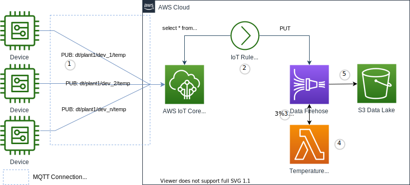

Fan-in is a many-to-one communication pattern for consuming data from many devices through a single data processing channel. 

{}
This implementation focuses on the use of Kinesis Firehose recieving data from an IoT Rule Action from many devices, transforming that data in a Lambda function, then delivering that transformed data to an S3 bucket for inclusion in a Data Lake. Please refer to the [MQTT Communication Patterns](https://docs.aws.amazon.com/whitepapers/latest/designing-mqtt-topics-aws-iot-core/mqtt-communication-patterns.html), specifically the _Fan-in_ section. This white paper provides alternative topic patterns that go beyond the scope of this implementation. You can also refer to a customer case study for a real word example here: https://www.youtube.com/watch?v=BkinvmBRFHY
{}


## Use Cases

- Filter data
  - _I want to remove all values that occur during a certain time frame_
- Transform data values into a ready to use format
  - _I want to convert all Celcius temperature readings to Fahrenheit_
  - _I want to reformat sensor data into a standard format_
- Aggregate data
  - _I want to take aggregate values from groupings of devices before storage_
- Enrich device data with data from other data stores
  - _I want to add device metadata from our device model stored in a database_


## Reference Architecture



- _Devices_ are the IoT things transmitting telemetry
- _AWS IoT Core_ is the MQTT message broker processing messages on behalf of the clients
- _IoT Rule_ is the actions taken on the message
- _Kinesis_ is the Data Firehose stream for processing and delivering messages to a storage sink
- _Lambda_ runs your code to act on the incoming messages and modify them prior to storage
- _S3_ is the Data Lake where data will land for storage and further analysis or ETL processing


1. _Devices_ establish an MQTT connection to the _AWS IoT Core endpoint_, and then publish message to the dt/plant1/dev_n/temp (data telemetry) topic. This is a location and device specific topic to deliver telemetry messages for a given device or sensor.
1. The _IoT Rule_ subscribes to a wildcard topic dt/plant1/*/temp to consolidate messages across devices for the plant and put those messages onto a Kinesis Data Firehose Stream
1. The Kinesis Data Firehose Stream aggregates messages into arrays of events and notifies a Lambda function passing the event array along for processing
1. The Lambda function performs the desired action on the events returning them to the Kinesis Data Firehose Stream along with modifications to the data and a notification of successful processing for the event
1. The Kinesis Data Firehose Stream finally delivers messages to the S3 bucket for later analysis and processing. Kinesis Data Firehose Stream can optionally convert this data from JSON into a compressed Snappy format like Apache Parquet as well as create timestamp folders for Athena partitioning.

{}

```plantuml
@startuml
!define AWSPuml https://raw.githubusercontent.com/awslabs/aws-icons-for-plantuml/v7.0/dist
!includeurl AWSPuml/AWSCommon.puml
!includeurl AWSPuml/InternetOfThings/all.puml
!includeurl AWSPuml/Analytics/Kinesis.puml
!includeurl AWSPuml/Storage/SimpleStorageServiceS3.puml
!includeurl AWSPuml/Compute/Lambda.puml

'Comment out to use default PlantUML sequence formatting
skinparam participant {
    BackgroundColor AWS_BG_COLOR
    BorderColor AWS_BORDER_COLOR
}
'Hide the bottom boxes
hide footbox

participant "<$IoTGeneric>\nDevices" as devices
participant "<$IoTCore>\nMQTT Broker" as broker
participant "<$IoTRule>\nRule" as rule
participant "<$Kinesis>\nStream" as stream
participant "<$Lambda>\nLambda" as lambda
participant "<$SimpleStorageServiceS3>\nS3 Bucket" as bucket

== Publish, Transform and store ==
devices -> broker : connect(iot_endpoint)
devices -> broker : publish("dt/plant1/dev_1/temp")
devices -> broker : publish("dt/plant1/dev_2/temp")
devices -> broker : publish("dt/plant1/dev_n/temp")
broker <- rule : connect(iot_endpoint)
broker <- rule : subscribe("dt/plant1/*/temp")
rule -> stream : put_record(event)
stream -> lambda: handle(events)
stream <- lambda: response
stream -> bucket: put_object(events)


@enduml
```

{}

### Assumptions

This implementation approach assumes all _Devices_ are not connected at all times, publish to a single topic telemetry. **blah blah blah**.

## Implementation

You can test this pattern out by publishing messages with the [MQTT test client](https://us-west-2.console.aws.amazon.com/iot/home?#/test) in the AWS IoT console or using the [IoT Device Simulator](https://aws.amazon.com/solutions/implementations/iot-device-simulator/). In a real world implementation you'll configure multiple devices as things so they can communicate with your IoT core endpoint. 

{}
The code samples focus on the _fan-in_ design in general. Please refer to the [Getting started with AWS IoT Core](https://docs.aws.amazon.com/iot/latest/developerguide/iot-gs.html) for details on creating things, certificates, obtaining your endpoint, and publishing telemetry to your endpoint. The configuration and code samples below are used to demonstrate the basic capability of the _Fan-in_ pattern.
{}

### Devices

Once connected devices will transmit telemetry data to device plant and device specific MQTT topics. The below example demonstrates MQTT topics and payloads for device 1 and 2 in plant 1. Your actual implementation might have thosands of devices. In the MQTT test client use the below topic names and message payloads to simulate the device traffic we will fan-in. You can also subscribe to each topic to view the messages as you publish them.


{}

MQTT Topic name for the temperature of Device 1 in Plant 1. 
```text
dt/plant1/dev_1/temp
```
Temperature in celcious telementry JSON payload for Device 1 in Plant 1. 
```json 
{
    "timestamp": 1601048303,
    "sensorId": 17,
    "deviceSerial": "sd89w7e82349",
    "sensorData": [
        {
        "sensorName": "Temperature celcious",
        "sensorValue": 34.2211224
        }
    ]
}
```
MQTT Topic name for the temperature of Device 2 in Plant 1. 
```text
dt/plant1/dev_2/temp
```
Temperature in Farenhight telementry JSON payload for Device 2 in Plant 1. 
```json
{
    "timestamp": 1601048303,
    "sensorId": 4,
    "deviceSerial": "324l5;k;a3",
    "sensorData": [
        {
        "sensorName": "Temperature Fahrenheit",
        "sensorValue": 120.3806
        }
    ]
}
```

{}


### AWS Lambda for Transforming Telemetry Data

In the AWS Lambda console create a new Lambda function. You can use the code below or if authoring your own fucntion get started the Blueprint `kinesis-firehose-process-record-python`

1. Name your function `fan-in_device_temperature_converter`
1. For Execution role choose `Create a new role with basic Lambda permissions`
1. Click Create Function
1. Switch from the Code view to the Configuration and click `Edit` on the General Configuration
1. change the timeout to 3 minutes and 0 seconds the click `Save` (Kinesis Data Firehose requires at least 1 minute for a Lambda transformer) 


{}

```python
import base64
import json

print('Loading function')


def lambda_handler(event, context):
    output = []

    for record in event['records']:
        print(record['recordId'])
        payload = json.loads(base64.b64decode(record['data']).decode('utf-8'))

        transformedPayload = {}
        transformedPayload['deviceSerial'] = payload['deviceSerial']
        transformedPayload['timestamp'] = payload['timestamp']
        
        for data in payload['sensorData']:

            if data['sensorName'] == 'Temperature celcious':
                transformedPayload['temperature'] = (data['sensorValue'] * 9/5) + 32  
            else:
                transformedPayload['temperature'] = data['sensorValue']

        output_record = {
            'recordId': record['recordId'],
            'result': 'Ok',
            'data': base64.b64encode(json.dumps(transformedPayload).encode('utf-8'))
        }
        
        output.append(output_record)

    print('Successfully processed {} records.'.format(len(event['records'])))

    return {'records': output}


```

{}


### Amazon S3 Destination Bucket

Use the AWS Console or the AWS CLI to create a new S3 bucket as a destination for the Kinesis Firehose Delivery Stream to land plant1 device data in. Replace `<AccountId`> with your AWS Account Id.

CLI Command
```text
aws s3 mb s3://fan-in-telemtry-<AccountId>
```

### Kinesis Data Firehose Delivery Stream

In the AWS Console for Amazon Kinesis Firehose

1. Click `Create Delivery Stream`
1. Name your stream `fan-in_device_temperature_stream`
1. Leave Source as `Direct PUT or other sources` and click `Next`
1. Choose `Enabled` for Transform source records with AWS Lambda and select the function created above `fan-in_device_temperature_converter`
1. Leave Lambda function version as `$LATEST`
1. Leave Record format conversion `Disabled` and click `Next`
1. Leave your Destination as `Amazon S3`
1. Under S3 Destination choose the bucket you created above `fan-in-telemtry-<AccountId>`
1. Scroll down and click `Next`
1. On the Configure settings screen scroll down and click `Next`
1. On the Review screen click `Create delivery screen`


### IoT Rule

From the AWS IoT Console under the Act menu choose Create a Rule. 
1. Enter a name for your rule `FanIn_Device_Temperature`
1. Provide a description like 'Processes temperature data from all devices in all plants.' 
1. For Rule query statement leave the default SQL version of 2016-03-23 and replace the default query with `select * from 'dt/+/+/temp'`
1. Add an action `Send a message to an Amazon Kinesis Firehose Stream`
1. Click `Configure Action` and continue with details
1. Select the Stream you created above `fan-in_device_temperature_stream`
1. Leave Seperator as 'No seperator'
1. Create a new role and provide a name `IoT_Rule_fan-in_Kinesis_Role`
1. Click `Add Action`
1. Scroll down and click `Create Rule`


### Considerations

This implementation covers the basics of a device telemetry fan-in pattern. It does not cover certain aspects that may arise in production use.