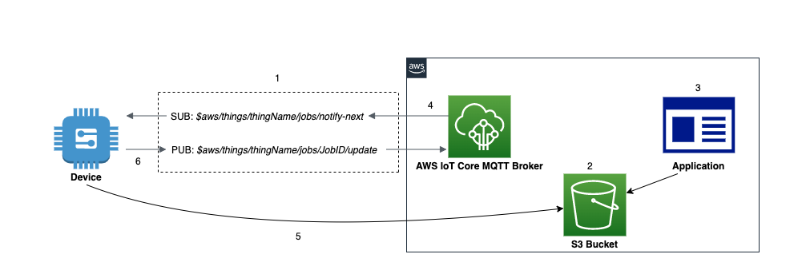

## Use Cases
- Performing remote operations on devices connected to IoT Core
    - _I want to download and install application or firmware updates for remote devices in a fleet_
    - _I want to apply a security patch or rotate certificates on a remote device_
    - _I want to reset a device in the field_
    - _I want to perform remote troubleshooting_

## Reference Architecture

- _AWS IoT Core_ is the MQTT message broker processing messages on behalf of clients
- _Device_ is the IoT thing to be controlled
- _Application_ is the remote logic that issues commands
- _Job_ is the execution of a task on a device


1. The _Device_ establishes communication with the _AWS IoT Core_ service and subscribes to the jobs notification topic `$aws/things/thingName/jobs/notify-next`.
2. A job document is created and stored in S3 bucket. This JSON document contain information that the _Device_ needs to perform a _Job_. It also contains one or more URLs where the _Device_ can download an update or other data.
3. An _Application_ or user creates a _Job_ in IoT Core to be executed on the device. Data needed for the _Job_ is stored in an S3 bucket.
4. The IoT Jobs service publishes a message to the jobs topic `$aws/things/thingName/jobs/notify-next` notifying the _Device_ of a pending _Job_.
5. The _Device_ receives the notification and retrieves the job details from the S3 bucket. 
6. The _Device_ can update the status of a job execution by publishing status messages to the job update topic `$aws/things/thingName/jobs/JobID/update`. These statuses can include _"IN_PROGRESS"_, _"FAILED"_, _"SUCCEEDED"_ or _"REJECTED"_.
7. (Optional) Management and monitoring applications can subscribe to certain topics to keep track of the status of jobs. 

## Assumptions
This implementation approach assumes devices are already provisioned within AWS IoT. Please refer to the [Getting started with AWS IoT Core](https://docs.aws.amazon.com/iot/latest/developerguide/iot-gs.html) for details on connecting your device to AWS IoT. 
This implementation also assumes that proper permissions have already been granted within IoT Core Policies and S3 resources. 

## Implementation

To create a job, you must first create a job document that is a description of the remote operations to be performed by the devices. A job document contains one or more URLs where the device can download an update or some other data. The job document can be stored in an Amazon S3 bucket, or be included inline with the command that creates the job.

__Sample Job Document__:

{}

```json
{ 
"operation": "download",
"version" : "1.0", 
"directory" : "/installs",
"files":{
    "fileName" : "sample_file",
    "url" : "S3_URL or S3_Presigned_URL"
        }
}
```
{}


{}
Your job document can contain a presigned Amazon S3 URL that points to your code file (or other file). Presigned Amazon S3 URLs are valid for a limited amount of time and so are not generated until a device requests a job document. Because the presigned URL has not been created when you are creating the job document, you put a placeholder URL in your job document instead. A placeholder URL looks like the following: **${aws:iot:s3-presigned-url:https://s3.region.amazonaws.com/<_bucket_>/<_codefile_>}** where bucket is the Amazon S3 bucket that contains the code file and code file is the Amazon S3 key of the code file
{}

{}
For more job document examples, see the [jobs-agent.js](https://www.npmjs.com/package/aws-iot-device-sdk) example in the AWS IoT SDK for JavaScript.
{}


{}

Please refer to this [jobs sample](https://github.com/aws/aws-iot-device-sdk-python-v2/blob/main/samples/jobs.py) for more details and examples.

- Install SDK from PyPI: `python3 -m pip install AWSIoTPythonSDK`
- Replace the global variables with valid endpoint, clientId, and credentials
- Start in a separate terminal session before running the application: `python3 device.py`

```python
#device.py - Demonstrates device perspective of a job agent on device waiting for a job and executing it

import AWSIoTPythonSDK
import json
from AWSIoTPythonSDK.MQTTLib import AWSIoTMQTTClient
import urllib.request

#initialize the MQTT client
myMQTTClient = AWSIoTMQTTClient("iot-jobs-thing")
myMQTTClient.configureEndpoint("YOUR_ENDPOINT", 8883)
myMQTTClient.configureCredentials("PATH_TO_ROOT_CA","PATH_TO_CLIENT_PRIVATE_KEY_FILE", "PATH_TO_CLIENT_CERTIFICATE_FILE")
myMQTTClient.connect()

print("Client Connected")

#function to handle jobs
def executeJob(client, userdata, message):
  
    jobfile = json.loads(message.payload.decode('utf-8;'))

    if 'execution' in jobfile:
        job_id = jobfile['execution']['jobId']
            
        job_update_topic = "$aws/things/iot-jobs-thing/jobs/"+ job_id + "/update"

        #publish status update to IoT Core jobs service 
        myMQTTClient.publish(job_update_topic, json.dumps({ "status" : "IN_PROGRESS"}),0)
        print ("Job Execution Started")
            
        #execute job based on parameters in job document
        try:
            url = jobfile['execution']['jobDocument']['files']['url']
            urllib.request.urlretrieve(url, jobfile['execution']['jobDocument']['directory'])
                
            #if successful, publish completion update to jobs service
            myMQTTClient.publish(job_update_topic, json.dumps({ "status" : "SUCCEEDED"}),0)

        except:
            #if failed, publish failure message to job service. Can optimize here.
            myMQTTClient.publish(job_update_topic, json.dumps({ "status" : "FAILED"}),0)

#listen for pending jobs
myMQTTClient.subscribe("$aws/things/iot-jobs-thing/jobs/notify-next", 1, executeJob)

print("Device waiting for job")

input("Please enter to close the connection")

myMQTTClient.disconnect()
print("Client Disconnected")

```
{}


{}
You can use the AWS IoT console, the Jobs HTTPS API, the AWS Command Line Interface, or the AWS SDKs to create and manage jobs. For more information, see [Job management and control API](https://docs.aws.amazon.com/iot/latest/developerguide/jobs-http-api.html), [AWS CLI Command Reference: iot](https://docs.aws.amazon.com/cli/latest/reference/iot/index.html) or [AWS SDKs and Tools](https://aws.amazon.com/tools).
{}
## Considerations

This implementation covers the basics of using IoT jobs and MQTT for applying updates. It doesn’t cover certain aspects that may arise in production or more complex use cases. It also doesn’t cover the application logic of deploying jobs to remote devices. 

### Code Signing
Code signing can be used to validate the integrity of code by validating against a digital signature. If the job document has a code file signature, you must verify the signature before proceeding with processing the job request. In order to sign code, you import a third-party code-signing certificate with ACM that is used to sign updates in FreeRTOS and AWS IoT Device Management. Please refer to the [AWS Signer documentation](https://docs.aws.amazon.com/signer/latest/developerguide/Welcome.html) for more information. 

### Limiting Access to Data in Job Document
To allow a device secure, time-limited access to data beyond that included in the job document itself, you can use presigned Amazon S3 URLs. You can place your data in an Amazon S3 bucket and add a placeholder link to the data in the job document. When the Jobs service receives a request for the job document, it parses the job document looking for placeholder links and it replaces them with presigned Amazon S3 URLs.

When a device requests the job document, AWS IoT generates the presigned URL and replaces the placeholder URL with the presigned URL. Your job document is then sent to the device.

When you create a job that uses presigned Amazon S3 URLs, you must provide an IAM role that grants permission to download files from the Amazon S3 bucket where the data or updates are stored. The role must also grant permission for AWS IoT to assume the role. Please refer to the [Managing Jobs documentation](https://docs.aws.amazon.com/iot/latest/developerguide/create-manage-jobs.html) for more info.

### Configuring Jobs
Jobs can be configured to run on a target of devices or device groups either once _(snapshot job)_ or continuously ran whenever new devices are added to a device group _(continuous job)_. 

You can specify how quickly targets are notified of a pending job execution. This allows you to create a staged rollout to better manage updates, reboots, and other operations.

You can also create a set of conditions to abort rollouts when criteria that you specify have been met. This includes job timeout options. Please refer to the IoT Core documentation [here](https://docs.aws.amazon.com/iot/latest/developerguide/iot-jobs.html) for more information. 

### Deploying Jobs to Multiple Sets of Targets
Job templates enable you to preconfigure jobs so that you can deploy them to multiple sets of target devices. They provide an efficient way to create standard configurations for remote actions that you need to deploy repeatedly to your devices.

You can create jobs from job templates by using the AWS CLI and the AWS IoT console. Operators can also create jobs from job templates by using Fleet Hub for AWS IoT Device Management web applications. For more information about working with job templates in Fleet Hub applications, see [Working with job templates in Fleet Hub for AWS IoT Device Management](https://docs.aws.amazon.com/iot/latest/fleethubuserguide/aws-iot-monitor-technician-job-templates.html).