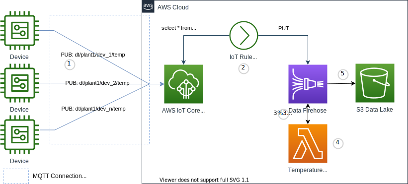

Fan-in is a many-to-one communication pattern for consuming telemetry data from many devices through a single data processing channel. 

{}
This implementation focuses on the use of an AWS IoT Rule Action to put telemetry data onto Amazon Kinesis Data Firehose stream. The stream is a consolidation of data for multiple devices in a single plant. The stream invokes a Lambda function to enrich and transform telemetry message payloads, then delivers that data to an S3 bucket for storage and future analysis. Please refer to the [MQTT Communication Patterns](https://docs.aws.amazon.com/whitepapers/latest/designing-mqtt-topics-aws-iot-core/mqtt-communication-patterns.html), specifically the _Fan-in_ section. This whitepaper provides alternative topic patterns that go beyond the scope of this implementation. <!--You can also refer to a customer case study for a real word example here: https://www.youtube.com/watch?v=BkinvmBRFHY  #commented out due to breaking link validation with captcha-->
{}


## Use Cases

- Filter data
  - _I want to remove all values that occur during a certain time frame_
- Transform data values into a ready to use format
  - _I want to convert all Celsius temperature readings to Fahrenheit_
  - _I want to reformat sensor data into a standard format_
- Aggregate data
  - _I want to calculate the sum, min, max, avg (e.g., aggregate function) from values from groupings of devices before storage_
- Enrich device data with data from other data stores
  - _I want to add device metadata from our device model stored in a database_


## Reference Architecture



- _Devices_ are the IoT things transmitting telemetry
- _AWS IoT Core_ is the MQTT message broker processing messages on behalf of the clients
- _IoT Rule_ performs the actions taken on the message
- _Kinesis_ is the Amazon Kinesis Data Firehose stream for processing and delivering messages to a storage sink
- _Lambda_ runs your code to act on the incoming messages and transform or enrich them prior to storage
- _S3_ is the Data Lake where data will land for storage and further analysis or ETL processing


1. _Devices_ establish an MQTT connection to the _AWS IoT Core_ endpoint, and then publish message to the `dt/plant1/dev_n/temp` (data telemetry) topic. This is a location and device specific topic to deliver telemetry messages for a given device or sensor.
1. The _IoT Rule_ queries a wildcard topic `dt/plant1/+/temp` from the _AWS IoT Core_ to consolidate messages across devices for plant1 and PUTs those messages onto a _Amazon Kinesis Data Firehose_ stream.
1. The _Amazon Kinesis Data Firehose_ stream buffers messages, by time or size, into arrays of events then and notifies a Lambda function passing the event array along for processing.
1. The _Lambda_ function performs the desired action on the events returning them to _Kinesis_ along with modifications to the data payload and a status of successful or failed processing of each event.
1. _Amazon Kinesis Data Firehose_ finally delivers messages to the S3 bucket for later analysis and processing. 

{}

```plantuml
@startuml
!define AWSPuml https://raw.githubusercontent.com/awslabs/aws-icons-for-plantuml/v7.0/dist
!includeurl AWSPuml/AWSCommon.puml
!includeurl AWSPuml/InternetOfThings/all.puml
!includeurl AWSPuml/Analytics/Kinesis.puml
!includeurl AWSPuml/Storage/SimpleStorageServiceS3.puml
!includeurl AWSPuml/Compute/Lambda.puml

'Comment out to use default PlantUML sequence formatting
skinparam participant {
    BackgroundColor AWS_BG_COLOR
    BorderColor AWS_BORDER_COLOR
}
'Hide the bottom boxes
hide footbox

participant "<$IoTGeneric>\nDevices" as devices
participant "<$IoTCore>\nMQTT Broker" as broker
participant "<$IoTRule>\nRule" as rule
participant "<$Kinesis>\nStream" as stream
participant "<$Lambda>\nLambda" as lambda
participant "<$SimpleStorageServiceS3>\nS3 Bucket" as bucket

== Publish, Transform, Enrich, and Store ==
devices -> broker : connect(iot_endpoint)
devices -> broker : publish("dt/plant1/dev_1/temp")
devices -> broker : publish("dt/plant1/dev_2/temp")
devices -> broker : publish("dt/plant1/dev_n/temp")
broker <- rule : select * from \n'dt/plant1/*/temp'
rule -> stream : put_records(events)
stream -> lambda: handle(events)
stream <- lambda: response
stream -> bucket: put_objects(enriched_events)


@enduml
```

{}

## Implementation

To experiment quickly, you can test this pattern out by publishing messages with the MQTT test client in the AWS IoT console or using the [IoT Device Simulator](https://aws.amazon.com/solutions/implementations/iot-device-simulator/). In a real world implementation you'll configure multiple devices as AWS IoT Things that each securely communicate with your _AWS IoT Core_ endpoint. 

{}
The configuration and code samples focus on the _fan-in_ design in general. Please refer to the [Getting started with AWS IoT Core](https://docs.aws.amazon.com/iot/latest/developerguide/iot-gs.html) for details on creating things, certificates, obtaining your endpoint, and publishing telemetry to your endpoint. The configuration and code samples below are used to demonstrate the basic capability of the _Fan-in_ pattern. Refer to the [AWS Lambda](https://docs.aws.amazon.com/lambda/latest/dg/welcome.html) and [Amazon Kinesis Data Firehose](https://docs.aws.amazon.com/firehose/latest/dev/what-is-this-service.html) Developer Guides for more in depth discussion of these services.
{}

### Assumptions

This implementation approach assumes all _Devices_ are not connected to the internet or _AWS Iot Core_ at all times. Each _Device_ publishes temperature telemetry to a single topic. The implementation also assumes that all temperature readings are emitted with a sensor name value of Temperature Celsius or Temperature Fahrenheit and follow the message payload formats outlined below. Alternative options are also called out within the sections below.

### Devices

Once connected to _AWS IoT Core_, devices will transmit telemetry data to plant and device specific MQTT topics. The below example demonstrates MQTT topics and payloads for device1 and device2 in plant1. Your implementation might support hundreds, thousands, or millions of devices. Copy and paste the below topic names and message payloads into the subscribe and publish inputs of the MQTT test client to simulate the device traffic we will fan-in. You can subscribe to each topic to view the messages device specific as you publish them or you can subscribe to the wildcard topic `dt/plant1/+/temp` to see messages in aggregate.


{}

MQTT Topic name for the temperature of device1 in plant1. 
```yaml
dt/plant1/dev_1/temp
```
Temperature in Celsius telemetry JSON payload for device1 in plant1. 
```json 
{
    "timestamp": 1601048303,
    "sensorId": 17,
    "deviceSerial": "sd89w7e82349",
    "sensorData": [
        {
        "sensorName": "Temperature Celsius",
        "sensorValue": 34.2211224
        }
    ]
}
```

{}
{}

MQTT Topic name for the temperature of device2 in plant1. 
```yaml
dt/plant1/dev_2/temp
```
Temperature in Fahrenheit telemetry JSON payload for device2 in plant1. 
```json
{
    "timestamp": 1601048303,
    "sensorId": 4,
    "deviceSerial": "324l5;k;a3",
    "sensorData": [
        {
        "sensorName": "Temperature Fahrenheit",
        "sensorValue": 120.3806
        }
    ]
}
```

{}


### AWS Lambda for Transforming Telemetry Data

In the AWS _Lambda_ console create a new _Lambda_ function. To use the code below, choose `Author from scratch` with a Python 3.8 runtime and paste the code below into the code editor. To create your own function, choose the `Use a blueprint` option and select the Blueprint `kinesis-firehose-process-record-python` which you'll then modify per your requirements.

1. Name your function `fan-in_device_temperature_converter`
1. For Execution role choose `Create a new role with basic Lambda permissions`
1. Click `Create Function`
1. Switch from the `Code` view to the `Configuration` view and click `Edit` on the General Configuration pane
1. Change the timeout to 3 minutes and 0 seconds the click `Save` (_Amazon Kinesis Data Firehose_ requires at least a 1 minute timeout for a _Lambda_ transformer) 


{}

```python
import base64
import json

print('Loading function')


def lambda_handler(event, context):
    output = []

    for record in event['records']:
        print(record['recordId'])
        payload = json.loads(base64.b64decode(record['data']).decode('utf-8'))

        transformedPayload = {}
        transformedPayload['deviceSerial'] = payload['deviceSerial']
        transformedPayload['timestamp'] = payload['timestamp']
        
        for data in payload['sensorData']:

            if data['sensorName'] == 'Temperature Celsius':
                transformedPayload['temperature'] = (data['sensorValue'] * 9/5) + 32  
            else:
                transformedPayload['temperature'] = data['sensorValue']

        output_record = {
            'recordId': record['recordId'],
            'result': 'Ok',
            'data': base64.b64encode(json.dumps(transformedPayload).encode('utf-8'))
        }
        
        output.append(output_record)

    print('Successfully processed {} records.'.format(len(event['records'])))

    return {'records': output}    
```

{}


The messages will be transformed by this function to the format below which is flattened out and has all temperature readings in Fahrenheit after converting from Celsius.

```json
{"deviceSerial": "sd89w7e82349", "timestamp": 1601048303, "temperature": 93.59802032}
```
```json
{"deviceSerial": "324l5;k;a3", "timestamp": 1601048303, "temperature": 120.3806}
```

In addition to using _Lambda_ from _Amazon Kinesis Data Firehose_, you can also leverage [AWS IoT Analytics](https://aws.amazon.com/iot-analytics/) to achieve _Fan-in_ processing of messages with transformations and enriching behaviors.

### Amazon S3 Destination Bucket

Use the AWS Console or the AWS CLI to create a new S3 bucket as a destination for the Kinesis Firehose Delivery Stream to land plant1 device data in. Replace `<AccountId`> with your AWS Account Id.

CLI Command
```yaml
aws s3 mb s3://fan-in-telemetry-<AccountId>
```

_Amazon Kinesis Data Firehose_ Destinations can also include [Amazon Redshift](https://aws.amazon.com/redshift/?whats-new-cards.sort-by=item.additionalFields.postDateTime&whats-new-cards.sort-order=desc), [Amazon ElasticSearch](https://aws.amazon.com/elasticsearch-service/), HTTP Endpoints and Third-party service providers.

### Amazon Kinesis Data Firehose

In the AWS Console for _Amazon Kinesis Data Firehose_

1. Click `Create Delivery Stream`
1. Name your stream `fan-in_device_temperature_stream`
1. Leave Source as `Direct PUT or other sources` and click `Next`
1. Choose `Enabled` for Transform source records with AWS Lambda and select the function created above `fan-in_device_temperature_converter`
1. Leave Lambda function version as `$LATEST`
1. Leave Record format conversion `Disabled` and click `Next`
1. Leave your Destination as `Amazon S3`
1. Under S3 Destination choose the bucket you created above `fan-in-telemetry-<AccountId>`
1. Scroll down and click `Next`
1. On the Configure settings screen scroll down and click `Next`
1. On the Review screen click `Create delivery screen`

Alternatively, your _AWS IoT Rule_ can achieve the Fan-in pattern with actions that send messages to [Amazon Kinesis Data Streams](https://aws.amazon.com/kinesis/data-streams/) where other applications can read and act on buffered telemetry data, [Amazon Kinesis Data Analytics](https://aws.amazon.com/kinesis/data-analytics/) to perform analytics processing of data real time with SQL or Apache Flink, SQS message queues where you can asynchronously process messages, or any other of of the supported [AWS IoT Rule Actions](https://docs.aws.amazon.com/iot/latest/developerguide/iot-rule-actions.html). 

### IoT Rule

From the AWS IoT Console under the Act menu choose Create a Rule. 
1. Enter a name for your rule `FanIn_Device_Temperature`
1. Provide a description like 'Processes temperature data from all devices in plant1.' 
1. For Rule query statement leave the default SQL version of 2016-03-23 and replace the default query with `select * from 'dt/plant1/+/temp'`
1. Add an action `Send a message to an Amazon Kinesis Firehose Stream`
1. Click `Configure Action` and continue with details
1. Select the Stream you created above `fan-in_device_temperature_stream`
1. Leave Separator as 'No separator'
1. Create a new role and provide a name `IoT_Rule_fan-in_Kinesis_Role`
1. Click `Add Action`
1. Scroll down and click `Create Rule`


### Considerations

This implementation covers the basics of a device telemetry fan-in pattern. It does not cover certain aspects that may arise in production use.

### Delayed Message Delivery

_Devices_ may hold messages for delivery retries if connectivity to the _MQTT Broker_ in _AWS IoT Core_ is lost temporarily. The _Amazon Kinesis Data Firehose_ stream marks events with timestamps on the approximate arrival of the event to the stream. _Devices_ publishing telemetry messages should include a timestamp in the message that represents the true time the event took place. Further processing of the telemetry data stored in S3 is needed to create a folder structure based on the device event timestamp rather than the _Amazon Kinesis Data Firehose_ event timestamp if you plan to create partitions for ETL and analysis with [AWS Glue](https://aws.amazon.com/glue/) and [Amazon Athena](https://aws.amazon.com/athena/). 


### Service Quotas

The primary consideration around service quotas for the _Fan-in_ is outlined in the MQTT Communication Patterns section of the [Designing MQTT Topics for AWS IoT Core](https://docs.aws.amazon.com/whitepapers/latest/designing-mqtt-topics-aws-iot-core/mqtt-communication-patterns.html) whitepaper. Instead of using the _Fan-in_ pattern over-subscribing multiple devices to a single device topic, use a topic per device and then use the AWS IoT Rules Engine with a wildcard subscription pattern to route to Amazon Kinesis Data Firehose as demonstrated in this implementation. In this implementation you should also be aware of the quotas applicable to each service used your implementation. Be sure to understand if any of these are a concern for your design and if they are adjustable.
1. The _AWS IoT Core Message Broker_ has [service quotas](https://docs.aws.amazon.com/general/latest/gr/iot-core.html#message-broker-limits) around number of connect requests per second per account (500 - adjustable), per client (1 - not adjustable) as well as maximum inbound concurrent client connections, publish requests, subscription per connection and more.  
1. _AWS IoT Rules Engine_ has [service quotas](https://docs.aws.amazon.com/general/latest/gr/iot-core.html#rules-limits) that govern rule invocations per second (20,000 - adjustable), max actions per rule (10 - not adjustable) and more.
1. Review the _Amazon Kinesis Data Firehose_ [service quotas](https://docs.aws.amazon.com/firehose/latest/dev/limits.html). Be aware that each delivery stream stores data records for up to 24 hours, the _Lambda_ buffer size is between 1 MiB and 3 MiB, and the buffer interval ranges from 60 seconds to 900 seconds.
1. _AWS Lambda_ has [service quotas](https://docs.aws.amazon.com/lambda/latest/dg/gettingstarted-limits.html) around concurrent executions (1,000 - adjustable), storage for function and layer size, memory allocation (128 MB to 10,240 MB, in 1-MB increments), timeout (15 minutes - not adjustable), and more. 
1. With _Amazon S3_ while there are no specific concerns with this implementation you can make yourself familiar with the _Amazon S3_ [service quotas](https://docs.aws.amazon.com/general/latest/gr/s3.html) to be aware of limits around bucket policies, replication rules, event notifications, object sizes, and more. 
