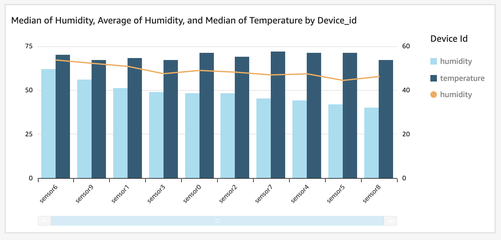

Extract, Transform and Load (ETL) of IoT telemetry data is the process that transforms and prepares telemetry data for analytics, reporting, and archival. An _AWS IoT Analytics Pipeline_ can filter, select attributes, remove attributes, apply math functions, enrich device data or state and apply custom AWS Lambda logic to data. 

## Use Cases

- Archive
    - _I need a near real time archive sensor transmitted to AWS IoT Core with SQL queries over the MQTT broker_
    - _I need to bulk archive sensor data from a Supervisory Control and Data Acquisition (SCADA) historian or other data store_
- Transform Data
    - _I need to transform sensor data, but I don't have specialized ETL developer skills or an ETL tool_ 
    - _I need to rapidly iterate on ETL transformations on sensor data_
    - _I need to experiment and compare different ETL transformation on the same sensor data_
    - _I need to reprocess data sets I've already ingested and processed with new or updated transformations_
- Analyze 
    - _I need to easily perform analysis on sensor data without setting up a Business Intelligence (BI) tool or a DataLake_
    - _I need to make transformed sensor data readily available for analysis in a BI tool or to an AI/ML notebook_


## Reference Architecture

- _Devices_ are the IoT things transmitting telemetry
- _AWS IoT Core_ is the MQTT message broker processing messages on behalf of the clients and uses a Rule Action to put messages onto a Channel. 
- _SCADA Historian_ is an on-premises data storage of device data.
- _Amazon Kinesis_ is a streaming target for historian data migration.
- _Amazon Lambda_ runs a serverless function to process stream data from Kinesis and batch put it onto a Channel.
- _AWS IoT Analytics_ comprises of 
  - _IoT Analytics Channel_ where raw messages are stored for a period of time. Devices can send data to multiple Channels.
  - _IoT Analytics Pipeline_ that performs ETL activities on messages consumed from a channel.
  - _IoT Analytics Datastore_ is where a Pipeline writes data.
  - _IoT Analytics Dataset_ is a materialized view over a Datastore that can optionally be delivered to S3.
- _Amazon QuickSight_ is the BI tool where you create and publish analytics dashboards.
- _Jupyter_ is the analytics workflow notebook you containerize to perform analysis over your SQL Dataset.
- _Amazon S3_ is the storage sink for IoT Analytics and allows data to be stored securely as well as accessed by other processes or consumed as part of your DataLake.



{}

1. _Devices_ establish an MQTT connection to the _AWS IoT Core_ endpoint, and then publish message to the `dt/plant1/device/aggregate` (data telemetry) topic. This is a location and device specific topic to deliver telemetry messages for a given device or sensor.
1. A Topic Rules publishes the results of a wildcard SQL `dt/plant1/+/aggregate` from the MQTT Broker then puts messages onto the _IoT Channel_ which stores that data in an S3 bucket for a set period of time.
1. The _IoT Analytics Pipeline_ executes a workflow of activities including reading from the Channel, performing filtering and transformations, and writing to the Datastore.
1. The _IoT Analytics Datastore_ makes transformed data available to source Datasets.
1. The _IoT Analytics Dataset_ is a materialized view defined in SQL over a Datastore, multiple Datasets can be created over a single Datastore. 
1. _Amazon QuickSight_ reads from a Dataset and displays visualizations and dashboards.
1. _Jupyter_ notebooks .
1. _S3 DataLake_ stores Channel, Datastore and optionally Dataset data.

```plantuml
@startuml
!define AWSPuml https://raw.githubusercontent.com/awslabs/aws-icons-for-plantuml/v7.0/dist
!includeurl AWSPuml/AWSCommon.puml
!includeurl AWSPuml/InternetOfThings/all.puml
!includeurl AWSPuml/Analytics/QuickSight.puml
!includeurl AWSPuml/Storage/SimpleStorageServiceS3.puml

'Comment out to use default PlantUML sequence formatting
skinparam participant {
    BackgroundColor AWS_BG_COLOR
    BorderColor AWS_BORDER_COLOR
}
'Hide the bottom boxes
hide footbox

participant "<$IoTGeneric>\nDevices" as devices
participant "<$IoTCore>\nMQTT Broker" as broker
participant "<$IoTRule>\nRule" as rule
participant "<$IoTAnalyticsChannel>\nChannel" as channel
participant "<$IoTAnalyticsPipeline>\nPipeline" as pipeline
participant "<$IoTAnalyticsDataStore>\nDataStore" as datastore
participant "<$QuickSight>\nQuickSight" as quicksight
participant "<$SimpleStorageServiceS3>\nS3 Bucket" as bucket

== Publish, Archive, Transform, and Store ==
devices -> broker : connect(iot_endpoint)
devices -> broker : publish("d1/topic")
devices -> broker : publish("d2/topic")
devices -> broker : publish("d3/topic")
broker <- rule : select * from \n'+/topic'
rule -> channel : batchPutMessage(\n\tmessages)'

channel <- pipeline : p1.read(raw_data)
pipeline -> datastore: p1.put(xformed_data)
channel <- pipeline : p2.read(raw_data)
pipeline -> datastore: p2.put(xformed_data)
channel <- pipeline : p3.read(raw_data)
pipeline -> datastore: p3.put(xformed_data)
datastore <- quicksight: read
channel -> bucket: put(raw_data)
pipeline -> bucket: put(xformed_data)

@enduml
```

{}
{}

1. _AWS Database Migration Service (DMS)_ reads data from a historian database and puts it onto an _Amazon Kinesis Data Stream_. A _Lambda_ function then reads data from Kinesis using the SDK and uses IoT Analytics Channel batchPutMessage to put data onto the _IoT Analytics Channel_. This pattern demonstrates how AWS IoT Analytics makes the same ETL and analysis flows available for near real time and batch. 
1. A Topic Rules publishes the results of a wildcard SQL `dt/plant1/+/aggregate` from the MQTT Broker then puts messages onto the _IoT Channel_ which stores that data in an S3 bucket for a set period of time.
1. The _IoT Analytics Pipeline_ executes a workflow of activities including reading from the Channel, performing filtering and transformations, and writing to the Datastore.
1. The _IoT Analytics Datastore_ makes transformed data available to source Datasets.
1. The _IoT Analytics Dataset_ is a materialized view defined in SQL over a Datastore, multiple Datasets can be created over a single Datastore. 
1. _Amazon QuickSight_ reads from a Dataset and displays visualizations and dashboards.
1. _Jupyter_ notebooks .
1. _Amazon S3 DataLake_ stores Channel, Datastore and optionally Dataset data.

```plantuml
@startuml
!define AWSPuml https://raw.githubusercontent.com/awslabs/aws-icons-for-plantuml/v7.0/dist
!includeurl AWSPuml/AWSCommon.puml
!includeurl AWSPuml/InternetOfThings/all.puml
!includeurl AWSPuml/Analytics/Kinesis.puml
!includeurl AWSPuml/Database/all.puml
!includeurl AWSPuml/Analytics/QuickSight.puml
!includeurl AWSPuml/Storage/SimpleStorageServiceS3.puml
!includeurl AWSPuml/Compute/Lambda.puml

'Comment out to use default PlantUML sequence formatting
skinparam participant {
    BackgroundColor AWS_BG_COLOR
    BorderColor AWS_BORDER_COLOR
}
'Hide the bottom boxes
hide footbox

participant "<$Database>\nSCADA" as historian
participant "<$DatabaseMigrationService>\nDMS" as dms
participant "<$Kinesis>\nKinesis" as stream
participant "<$Lambda>\nLambda" as lambda
participant "<$IoTAnalyticsChannel>\nChannel" as channel
participant "<$IoTAnalyticsPipeline>\nPipeline" as pipeline
participant "<$IoTAnalyticsDataStore>\nDataStore" as datastore
participant "<$QuickSight>\nQuickSight" as quicksight
participant "<$SimpleStorageServiceS3>\nS3 Bucket" as bucket

== Batch, Archive, Transform, and Store ==
historian <- dms : read(data)
dms -> stream : put(data)
stream <- lambda : read(data)
lambda -> channel : batchPutMessage(\n\tmessages)'

channel <- pipeline : p1.read(raw_data)
pipeline -> datastore: p1.put(xformed_data)
datastore <- quicksight: read
channel -> bucket: put(raw_data)
pipeline -> bucket: put(xformed_data)

@enduml
```

{}



## Implementation

In this implementation you'll setup an IoT Analytics archival and ETL processing flow and then use a python script to simulate devices publishing messages to your AWS IoT Core endpoint to test you setup. Upon deployment into production you’ll configure multiple devices as AWS IoT Things that each securely communicate with a Gateway and or your AWS IoT Core endpoint.

{}
The processing flow for path **1a** is covered in the implementation below. Flow **1b** has the same processing flow as **1a** for step 2 and beyond once data is put  onto the Channel. In flow **1b** bulk data is sourced from a SCADA historian database and is pushed into the _IoT Analytics Channel_ using [BatchPutMessage](https://docs.aws.amazon.com/iotanalytics/latest/APIReference/API_BatchPutMessage.html) by a Lambda function after DMS replicates data to Kinesis. Refer to the aws blog titled *Injecting data into AWS IoT Analytics from a Kinesis Data Stream* to consume Kinesis data with a Lambda. Refer to  [AWS DMS with a Kinesis target](https://docs.aws.amazon.com/dms/latest/userguide/CHAP_Target.Kinesis.html) to read data from a historian database and write to Kinesis. 
{}

<!--- Link update required: Refer to the aws blog titled Injecting data into [AWS IoT Analytics from a Kinesis Data Stream](https://aws.amazon.com/blogs/iot/injecting-data-into-aws-iot-analytics-from-amazon-kinesis-data-streams/) to consume Kinesis data with a Lambda.  --->

### Assumptions

This implementation assumes that you are comfortable using the AWS Command Line Interface (CLI). If you've not installed the AWS CLI, follow the  [installation of the AWS CLI](https://docs.aws.amazon.com/cli/latest/userguide/install-cliv2.html) instructions. The implementation also assumes you  using the default AWS CLI profile or you've set the corresponding session based shell variables [AWS_PROFILE](https://docs.aws.amazon.com/cli/latest/userguide/cli-configure-envvars.html) and [AWS_DEFAULT_REGION](https://docs.aws.amazon.com/cli/latest/userguide/cli-configure-envvars.html). Otherwise, if you are using a named profile be sure to either the `---profile <profile-name> and --region <aws-region>` arguments to your CLI commands.

## IoT Analytics Channel

First establish a Channel for Analytics Data. The Channel data can be stored in an AWS or customer managed S3 bucket; in this case we'll default to AWS managed. The storage retention can be indefinite or based on time in years and days; in this case we'll default to indefinite. 

```yaml
aws iotanalytics create-channel --channel-name etl_archive_telemetry
```

## Iot Core Topic Rule

An IoT Core Topic Rule will batch put messages into a channel as they are published to the MQTT Broker. You'll need to create an IAM role with a trust relationship for iot.amazon.com and permission to BatchPutMessage(s) to IoT Analytics and for convenience we'll also use this policy to allow IoT Analytics and IoT Core to write logs to CloudWatch. 

First create a policy allowing IoT Core to assume the EtlAnalyticsRole so that it can write to your Channel. 
```yaml
aws iam create-role --role-name EtlAnalyticsRole --assume-role-policy-document file://policy_assume_role.json
```
Save the below JSON to a file named policy_assume_role.json before executing the command above.
```json
{
    "Version": "2012-10-17",
    "Statement": [
        {
            "Effect": "Allow",
            "Principal": {
                "Service": [
                    "iot.amazonaws.com",
                    "iotanalytics.amazonaws.com"
                ]
            },
            "Action": "sts:AssumeRole"
        }
    ]
}
```

Next create and attach a policy to your EtlAnalyticsRole giving your Topic Rule the needed permissions.
```yaml
aws iam put-role-policy --role-name EtlAnalyticsRole --policy-name EtlAnalyticsPolicy --policy-document file://policy_etl_analytics.json
```
Save the below JSON to a file named policy_etl_analytics.json. Be sure to replace `<REGION>` with your region and `<ACCOUNT-ID>` with your account id before you execute the command above.
```json
{
    "Version": "2012-10-17",
    "Statement": [
        {
            "Effect": "Allow",
            "Action": "iotanalytics:BatchPutMessage",
            "Resource": [
               "arn:aws:iotanalytics:<REGION>:<ACCOUNT-ID>:channel/etl_archive_telemetry"
            ]
        },
        {
            "Effect": "Allow",
            "Action": [
                "logs:CreateLogStream",
                "logs:DescribeLogStreams",
                "logs:PutLogEvents"
            ],
            "Resource": [
                "arn:aws:logs:<REGION>:<ACCOUNT-ID>:log-group:/iotanalytics/pipeline:*"
            ]
        }
    ]
}
```

To enable logging for IoT Analytics and IoT core execute the following commands and be sure to replace `<ACCOUNT-ID>` with your account id. This step is optional.
```yaml
aws iotanalytics put-logging-options --logging-options roleArn=arn:aws:iam::<ACCOUNT-ID>:role/EtlAnalyticsRole,level=ERROR,enabled=true
aws iot set-v2-logging-options --role-arn arn:aws:iam::<ACCOUNT-ID>:role/EtlAnalyticsRole --default-log-level DEBUG
```

Now you can create the topic rule.  
```yaml
aws iot create-topic-rule --rule-name etl_archival --topic-rule-payload file://topic_rule.json
```
Save the JSON below to a file named topic_rule.json. Be sure to `<ACCOUNT-ID>` with your account id before executing the command above. 
```json
{
    "sql": "SELECT * FROM 'dt/plant1/+/aggregate'",
    "ruleDisabled": false,
    "awsIotSqlVersion": "2016-03-23",
    "actions": [
        {
            "iotAnalytics": {
                "channelName": "etl_archive_telemetry",
                "roleArn": "arn:aws:iam::<ACCOUNT-ID>:role/EtlAnalyticsRole"
            }
        }
    ],
    "errorAction": {
        "cloudwatchLogs": {
            "roleArn": "arn:aws:iam::<ACCOUNT-ID>:role/EtlAnalyticsRole",
            "logGroupName": "/aws/iot-rules/etl_data"
        }
    }
}
```

## IoT Analytics Datastore

The IoT Analytics Datastore is a storage location for output after an IoT Analytics Pipeline workflow performs ETL. The Datastore is backed by S3 either in an AWS or customer managed bucket, for simplicity this implementation uses an AWS managed bucket. Like a Channel storage is indefinite or time based in years and days, we will use the default of indefinite in this case. A Datastore also must choose a data format of JSON or Parquet with a schema definition, this cannot be changed after creation. In this case we'll use Parquet with a defined schema. Note that a new field 'temperature_fahrenheit' is defined which we'll populate later with our Pipeline, if you create new fields in a another activity later, you'll have to recreate your Datastore with an updated Parquet schema. You don't need to define a schema for JSON but Parquet provides compression and speed. Execute the command below to create a Datastore.

```yaml
aws iotanalytics create-datastore --cli-input-json file://datastore.json
```
Save the JSON below to a file name datastore.json before executing the command above.
```JSON
{
    "datastoreName": "etl_archival_store",
    "datastoreStorage": {
        "serviceManagedS3": {}
    },
    "retentionPeriod": {
        "unlimited": true
    },
    "fileFormatConfiguration": {
        "parquetConfiguration": {
            "schemaDefinition": {
                "columns": [
                    {
                        "name": "device_id",
                        "type": "string"
                    },
                    {
                        "name": "temperature",
                        "type": "int"
                    },
                    {
                        "name": "temperature_fahrenheit",
                        "type": "int"
                    },
                    {
                        "name": "humidity",
                        "type": "int"
                    },
                    {
                        "name": "timestamp",
                        "type": "string"
                    }
                ]
            }
        }
    },
    "datastorePartitions": {
        "partitions": [
            {
                "timestampPartition": {
                    "attributeName": "timestamp",
                    "timestampFormat": "yyyy-MM-dd HH:mm:ss"
                }
            }
        ]
    }
}
```

## IoT Analytics Pipeline

The IoT Analytics Pipeline can contain a number of activities in an ETL workflow. The first activity is required, reading from a Channel. The last activity is also required, writing to a Datastore. Between these you can add a number of activities needed for your data. We'll perform a simple math equation converting Celsius to Fahrenheit. Execute the command below to create the Pipeline. 

```yaml
aws iotanalytics create-pipeline --cli-input-json file://pipeline.json
```
Save the JSON below to a file named pipeline.json before executing the command above.
```JSON
{
    "pipelineName": "calculate_fahrenheit",
    "pipelineActivities": [
        {
            "channel": {
                "name": "read_channel",
                "channelName": "etl_archive_telemetry",
                "next": "calculate_fahrenheit"
            }
        },
        {
            "math": {
                "name": "calculate_fahrenheit",
                "attribute": "temperature_fahrenheit",
                "math": "(temperature * 9/5) + 32 ",
                "next": "write_datastore"
            }
        },
        {
            "datastore": {
                "name": "write_datastore",
                "datastoreName": "etl_archival_store"
            }
        }
    ]
}
```

## Device Simulation

Our IoT Analytics environment is setup and our Pipeline is ready to perform ETL on incoming data. For this implementation we'll run a few threads to simulate devices and generate data. Feel free to analyze the code and modify the device and publishing settings but be aware that you cannot use a sensor count greater than the number of threads the computer you run this on has available. Be sure to replace `<IOT-CORE-ENDPOINT>` with your IoT Core endpoint. You can see your endpoint on the IoT Core service page under Settings, Device Data Endpoint. You can also retrieve the endpoint via the CLI by running the command below. 

```yaml
aws iot describe-endpoint
```
Ensure you have python 3 installed on your machine. Then execute the command below. 
```yaml
python3 data_generator.py
```

Before running the command above, save the python code below to a file named data_generator.py
```python
#!/usr/bin/env python3

import random
import time
import boto3
import json
from multiprocessing import Pool
from datetime import datetime


iot_client = boto3.client(
    "iot-data", endpoint_url="https://<IOT-CORE-ENDPOINT>"
)


def read(sensor):
    message = {}
    message["device_id"] = f"sensor{sensor}"
    message["temperature"] = random.randrange(45, 92, 2)
    message["humidity"] = random.randrange(0, 99, 2)
    message["timestamp"] = datetime.now().strftime("%Y-%m-%d %H:%M:%S")
    print(message)

    topic = f"dt/plant1/{message['device_id']}/aggregate"
    iot_client.publish(topic=topic, payload=json.dumps(message))


if __name__ == "__main__":
    sensor_count = 10  # maps to physical threads on your machine
    seconds_between_publishing = 2
    publishes = 100

    with Pool(sensor_count) as p:
        for _ in range(publishes):
            p.map(read, range(sensor_count))
            time.sleep(seconds_between_publishing)

```

## IoT Analytics Datasets

An IoT Analytics Dataset is a materialized view of the data in a Datastore. You can create many Datasets from a single Datastore. When you perform analytics in QuickSight or with a Jupyter notebook you'll read in the Dataset as your data source. We will create two Datasets below, one with the raw data which we'll build a QuickSight visualization from later and another with some aggregate statistical values as an example of a second Dataset. If you'd like to preview the data you can take the SQL Queries from the JSON below and use the AWS Console for IoT Analytics Datastore and execute a test query in the create Dataset flow.

Execute the command below to create a Dataset. 

```yaml
aws iotanalytics create-dataset --cli-input-json file://dataset_raw.json
```

Copy the JSON below to a file name dataset_raw.json before executing the command above.

```JSON
{
    "datasetName": "raw_data",
    "actions": [
        {
            "actionName": "onetime_action",
            "queryAction": {
                "sqlQuery": "select * from etl_archival_store"
            }
        }
    ]
}
```

Execute the command below to create a Dataset. 

```yaml
aws iotanalytics create-dataset --cli-input-json file://dataset_group_by.json
```
Copy the JSON below to a file name dataset_group_by.json before executing the command above.

```JSON
{
    "datasetName": "group_by_data",
    "actions": [
        {
            "actionName": "onetime_action",
            "queryAction": {
                "sqlQuery": "SELECT device_id, avg(temperature) AVG_TEMP, max(temperature) MAX_TEMP, min(temperature) MIN_TEMP, avg(humidity) AVG_HUMIDTY FROM etl_archival_store group by (device_id) order by device_id"
            }
        }
    ]
}
```

## QuickSight Visualization

Your datasets have been created, but they are empty. To populate them we need to run them. We didn't set a schedule so we will run them manually now. Execute the command below, or choose to run your dataset from the console.

```yaml
aws iotanalytics create-dataset-content --dataset-name raw_data
```

Navigate to QuickSight from the AWS Console. Choose "Sign up for QuickSight" if you haven't already. Standard edition is adequate for this exercise. Choose Enterprise if you wish to use advanced features or Enterprise Q if you want advanced features and AI/ML Insights.

- For Standard setup, leave "Authentication Method" as the default value of "Use IAM federated identities & QuickSight-managed users"
- Leave your region set to the region you've built your IoT Analytics assets in.
- Provide a universally unique QuickSight Account Name
- Enter a Notification email address
- Under "QuickSight access to AWS services" make sure you check the box next to IoT Analytics

Once your account is created choose Datasets on the left menu, then click the New dataset button.
From the list of services find AWS IoT Analytics and choose it, then select raw_data and leave the dataset name as raw_data

- Choose Clustered Combo Bar Chart
- In Field Wells set X axis to device ID
- Add humidity to the bars and aggregate function of median
- Add temperature to the bars and aggregate function of median
- Add humidity average to lines



### Pipeline Reprocessing

An Engineer identified that the humidity sensors are reporting data in a range of 0-99 but your end users require to see these reports with values from 1-100. To correct this we will update pipeline to add 1 to each Humidity value. 

```yaml
aws iotanalytics update-pipeline --cli-input-json file://pipeline.json
```
Save the JSON below to your existing file named pipeline.json before executing the command above.
```JSON
{
    "pipelineName": "calculate_fahrenheit",
    "pipelineActivities": [
        {
            "channel": {
                "name": "read_channel",
                "channelName": "etl_archive_telemetry",
                "next": "calculate_fahrenheit"
            }
        },
        {
            "math": {
                "name": "calculate_fahrenheit",
                "attribute": "temperature_fahrenheit",
                "math": "(temperature * 9/5) + 32 ",
                "next": "update_humidity"
            }
        },
        {
            "math": {
                "name": "update_humidity",
                "attribute": "humidity",
                "math": "humidity + 1",
                "next": "write_datastore"
            }
        },
        {
            "datastore": {
                "name": "write_datastore",
                "datastoreName": "etl_archival_store"
            }
        }
    ]
}
```

Now that we've updated our pipeline, we'll need to reprocess it so that the corrected humidity values are available for analysis. After reprocessing is complete we'll need to update our Datasets as well. You can both view the updated rule and the reprocessing status in the AWS Console.

```yaml
aws iotanalytics start-pipeline-reprocessing --pipeline-name calculate_fahrenheit
```

After a moment you can create your updated Dataset content. 

```yaml
aws iotanalytics create-dataset-content --dataset-name raw_data
```

If you'd like to refresh SPICE in QuickSight navigate to QuickSight, choose Datasets, select raw_data and choose refresh now.  

### Considerations

Pipeline activities can be more robust than the sample we created, and can contain more steps than we included. Reference the [User Guide](https://docs.aws.amazon.com/iotanalytics/latest/userguide/pipeline-activities.html) for an overview of all the activities.

In Addition you might create another pipeline that reads in device settings from the device shadow or device attributes from the device registry such as software version to compare how the state of the device affects the device readings. Try adding another pipeline of your own to enhance data in your datastore.

We covered sourcing out data from the MQTT Broker and from a Historian. AWS SiteWise is also a viable source of data for IoT Analytics as well as is S3. 

In this implementation we covered using AWS managed buckets, you can also use your own buckets to store Channel, DataStore and DataSet data. A customer managed bucket is especially useful as the destination of a Dataset for inclusion with other data in a DataLake. You have the option to send Dataset output to an S3 bucket, AWS IoT Events, QuickSight, or a Jupyter Notebook.

The datasets we created were based on SQL. More complex Analyses can be created with an automated workflow using a Docker Container and this approach allows for containerizing a Jupyter Notebook. See the [User Guide](https://docs.aws.amazon.com/iotanalytics/latest/userguide/automate.html) for details on how this works. If you take this approach you can even embed visualizations from your container dataset in the IoT Analytics console. 

### Cleanup

The below CLI commands will clean up the IoT Core, IoT Analytics and IAM resources you created in this guide, in the correct order. Execute these to ensure you don't accrue AWS billing costs. Once the below commands are completed, you will also need to navigate to the CloudWatch console or use the CLI to set a retention period on the logs or delete them per your needs.

```yaml
aws iotanalytics put-logging-options --logging-options roleArn=arn:aws:iam::<ACCOUNT-ID>:role/EtlAnalyticsRole,level=ERROR,enabled=false
aws iot set-v2-logging-options --role-arn arn:aws:iam::<ACCOUNT-ID>:role/EtlAnalyticsRole --default-log-level DISABLED
aws iot delete-topic-rule --rule-name etl_archival
aws iam delete-role-policy --role-name EtlAnalyticsRole --policy-name EtlAnalyticsPolicy
aws iam delete-role --role-name EtlAnalyticsRole
aws iotanalytics delete-pipeline --pipeline-name calculate_fahrenheit
aws iotanalytics delete-channel --channel-name etl_archive_telemetry
aws iotanalytics delete-datastore --datastore-name etl_archival_store
aws iotanalytics delete-dataset --dataset-name raw_data
aws iotanalytics delete-dataset --dataset-name group_by_data
```
