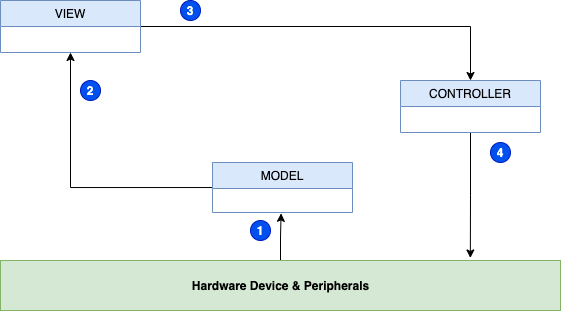
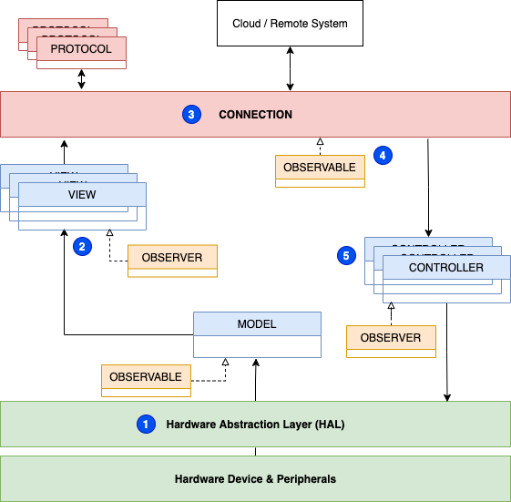

## Challenge

IoT devices have a common set of concerns:

* reporting the current state of the device, attached sensors, and actuators
* processing control messages (both remote and local)
* presenting status information

The device software should also be easy to test and reuse across multiple projects, hardware platforms, languages, and SDKs. Some devices are 'one-way' only reporting state or taking action, while others are 'two-way', performing both of these actions. The software design pattern should be generally composable to support all these uses as well as accommodate a flexible variety of peripherals, command sources, and interfaces. 

## Solution

An IoT device software design pattern based on the [Model-View-Controller](https://en.wikipedia.org/wiki/Model%E2%80%93view%E2%80%93controller) design pattern.

 

### Basic Model View Controller

The **model** component's concern is to represent the overall state of the device: signals, metrics, peripherals, display data, and current state of the control variable(s). The **view** component handles the presentation of the data from the **model**. The **controller** is responsible for taking actions to change the state or configuration of the device and peripherals.

1. The **model**, and only the **model** reads from the device.

2. The **view** only reads from the **model** and never the hardware directly. 

3. If the **view** needs to effect some local presentation (such as turning on an attached LED), the **view** should use the **controller** to make that change.

4. Only the **controller** is allowed to write to the hardware. 

### Basic Model View Controller Considerations

The concerns of reading and writing to the hardware are separated between the **model** (read-only) and the **controller** (write-only). This separation facilitates testing and mocking (See [Mocks aren't Stubs](https://martinfowler.com/articles/mocksArentStubs.html) for a brief intro to mock objects and how they can be used for testing software) and can also be used to limit access to mutating changes (writes) that may require privileged access or other security (including audit).

The **model** component's concern is to scan the inputs on a regular basis (such as a timer interrupt) or when changes occur (such as an edge trigger). For certain hardware platforms it may be necessary for the **model** to set up triggers or callbacks. While this set up often involves the writing of registers, that set up does not violate the **model**'s restriction to only read from the hardware. 

Note that there are no (exposed) setters as part of the model. That is because all activation of changes should be handled by the controller and the model would record these changes when measured directly from the hardware.

The **model** is best implemented by a [Singleton](https://en.wikipedia.org/wiki/Singleton_pattern) design pattern and is readily extensible with blocking and non-blocking calls.

### Practical Model View Controller

Many hardware platforms would seemingly require a violation of the **model**-**controller** read-write separation. For example, registers with bit masks for multiple GPIO lines or other registers with different read/write behavior. Multiple **views** may also be required, such as one for local LEDs or displays and another to handle formatting data into JSON or Protobuf for remote systems. Grouping actuations (like Display, LEDs, etc) also leads to using multiple **controller**s. 

 

1. A **Hardware Abstraction Layer (HAL)**, a [Facade](https://en.wikipedia.org/wiki/Facade_pattern) pattern, where the details of bit masks or GPIO numbers or other specifics can be abstracted and made semantic to the application at hand by creating API calls such as `#LED_On` which would wrap the functionality of setting a particular GPIO Pin high or low.

2. Multiple **views** now read the model data. 

3. The **connection** instantiates **protocol** as needed to communicate locally and remotely.

4. Communications received from the remote systems are held in an _Observable_ implementation by the **connection**.

5. Multiple **controllers** subscribe to the **connection** _Observable_ as *Observer*s. 

### Practical Model View Controller Considerations

The **HAL** uniquely contains the mapping of hardware specifics to the application representation. This facilitates testing as a mock HAL can be used when the hardware is not available. This _Facade_ aids portability in that the implementation of `#LED_On` can be modified to active-high or active-low logic, GPIO Pin numbers changed, etc.

Having multiple **views** read the _Singleton_ **model** could cause exhaustion of resources or other run-time problems. Use of the [Observer Pattern](https://en.wikipedia.org/wiki/Observer_pattern) as intermediary can break this deadlock as well as provide a convenient integration point to install additional views for debug/logging or other uses without impacting the **model**. The **model** implements the _Observable_ interface while the various **views** implement _Observer_. The **views** then register with the **model** at run-time avoiding the creation on any dependencies.

The **connection** implements the [Strategy](https://en.wikipedia.org/wiki/Strategy_pattern) Pattern as well as the _Observable_ interface. As a _Strategy_ the **connection** instantiates **protocol** objects as needed to varying transports (like MQTT and topic name). The **protocol** will also write to a **connection** managed _Observable_. The details of topic, transport, remote system, etc. are all separated from the reporting (**view**) and processing (**controller**) facilitating testing through mocks and composability for different applications (such as some devices only having some groups of signals, etc.).

## Considerations

### Safety

In many systems, particularly those that actuate physical systems like motors, solenoids, or relays, pathways for locking out or failing safe for those systems should be kept as short as possible. When at all possible, these lockout systems and sensors should be configured so that they disable actuation of potentially dangerous systems. For example, place a limit switch in series with a motor activation circuit. This ensures that no software failure, attack, or disintermediation can defeat the designed safety controls.

Because of this critical relationship of the safety controls to device operation, the status of the sensors and controls should be monitored and reported. Here too, care must be taken to ensure that the monitoring of the signal cannot in any way affect the function of the control. One common way to do this would be to use a [buffer](https://electronics.stackexchange.com/questions/150967/what-are-input-output-buffers-for-pads), [follower](https://www.thecoderscorner.com/electronics/microcontrollers/psu-control/64-buffering-an-arduino-output-pin-for-more-power/), or [open drain](https://embeddedartistry.com/blog/2018/06/04/demystifying-microcontroller-gpio-settings/) device to isolate the control signal from the measurement system. Consider if the signals were to be routed to GPIO pins, such a buffer would prevent a misconfiguration of the pinmux to output from defeating the safety control.

For any device and system, first review the components and subsystems as to how they affect the overall safety of the system and minimize the potential impact of software errors or attacks to the system. A similar discussion of security and attack surfaces should also be undertaken, but that is beyond the scope of this document.

### Local Buttons

When the user pushes the local button (on a GPIO input for example), how shall this be processed? We desire to have low-latency response and the sytem should function without cloud connection. But when we do have connectivity, the mobile app should show the status also with low latency.

* The button state (up/down/edge/etc) should be monitored and maintained by the **model**.
* Subscribed **views** can monitor these signals:

  * The first **view** would request a 'local' **protocol** from the **connection** and report state.

  * The second **view** would report to any remote systems.

* The 'local' **protocol** implementation would update the **connection** managed _Observable_
* A **controller** is subscribed to this *Observable* as an *Observer* and would take appropriate action.  

The full separation of concerns is maintained, while full local-only functionality is maintained and any remote systems kept up to date.
