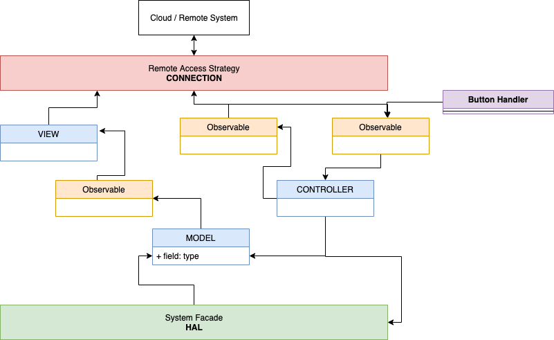

## Challenge

This design seeks to create a re-usable software architecture that can be adapted for a wide variety of applications and situations including bi-directional data flow, remote and local control. The design here is general in nature and should be portable across languages, SDKs, and operating systems. 

## Solution

This document makes a general recommendation for the design and structure  of device software. The reader should have some familiarity with AWS IoT Technology and the “Gang of Four” (GoF) [Design Patterns](https://www.google.com/aclk?sa=L&ai=DChcSEwjI75is57nsAhWHwMAKHVTyAeEYABADGgJpbQ&sig=AOD64_1cZ9wJNvnGPKJkMkTsNvM_mrrXqg&ctype=5&q=&ved=2ahUKEwj8646s57nsAhWHup4KHcInBoMQ9aACegQILRA8&adurl=).
As a general guideline the device software will follow a few, large, system patterns as well as general [SOLID](https://en.wikipedia.org/wiki/SOLID) design. The focus of this design is the device software itself and not the outer control systems nor the physical hardware implementation. 

### Separation of Concerns

The device has a few main responsibilities including 

* accurately and continuously reporting the current state of the system to a remote system (so that the mobile app can display status); 
* receiving, processing, and responding to remote control messages (from the mobile app via intermediate remote systems); 
* receiving and presenting status information (on the local display), and 
* performing control actions in response to local signals (start/stop when the button is pushed).

### MVC

The [Model-View-Controller](https://en.wikipedia.org/wiki/Model%E2%80%93view%E2%80%93controller) pattern can be applied to good effect to design the device software here. 

The MODEL component refers to the state of the overall system—the atomic signals, metrics, display data, AND the current state of the control variable (position). 

Processing in the model is pretty straightforward — scan the inputs on a regular basis (such as a timer interrupt), respond to state changes of other inputs, and ensure everything is up-to-date when the #update method is called. The MODEL is best implemented by a [Singleton](https://en.wikipedia.org/wiki/Singleton_pattern) design pattern and is readily extensible with blocking and non-blocking calls.

Internally, the model needs to implement logic to handle the computed metrics in response to changes in state. For example, the position estimate should be set to 0 or 100 upon closure of the respective limit switches and adjusted every time the shaft encoder delivers an edge. 

Note that there are no (exposed) setters as part of the model. That is because all activation of changes should be handled by the controller and no other object should be setting properties of the model.

The VIEW component handles the presentation of the model to the systems that will consume that data. Logic within the view can pull this data from the model and report it as needed — likely on changes and at regular intervals. The communications between MODEL and VIEW can be readily handled by semaphor, a queue of length 1, or other implementations of the [Observer Pattern](https://en.wikipedia.org/wiki/Observer_pattern) as intermediary. For example, if the MODEL maintained the state variables in an Observable object, the VIEW can subscribe as an Observer to handle change events. It is also a good idea to publish all data on a regular basis in case an incremental change is missed, has errors, or gets dropped by intermittent network connectivity or other causes. It would be straightforward to use a timer interrupt or other scheduling mechanism to get_all data and publish it. Internally, the VIEW can also be orchestrated with a system of Observables/Observers to isolate fetching data from the MODEL and distributing it to the various topics and shadows. 

The CONTROLLER is responsible for taking action on control inputs (e.g. the delta message from the shadow service) as well as the downstream data flow for display data. The specific logic to start/stop the motor when the requested state differs from current state is also part of the CONTROLLER. However, the CONTROLLER should not concern itself with the collection of signals or the computation of metrics. To the extent that feedback of current state is needed (such as running the motor until the 50% position is achieved), the CONTROLLER should call the model in a polling manner or subscribe to a state Observable. 

To process delta messages, the CONTROLLER can simply accept the update and let the VIEW report status. However, the CONTROLLER must keep track of any necessary info to complete the control cycle (turn the motor off when the position is achieved). Thus the controller need only be concerned with making the change and not the reporting of it (which may include a number of possible error conditions). 

#### Singleton

## Facade

Both the MODEL and the CONTROLLER will need to access the underlying hardware or system. To avoid duplicating functionality and to keep concerns strictly separated, a [Facade](https://en.wikipedia.org/wiki/Facade_pattern) pattern should be used to present a consistent interface to both the MODEL and CONTROLLER modules. This Facade can be simple such as a [HAL](https://embeddedartistry.com/fieldmanual-terms/hardware-abstraction-layer/) where the CONTROLLER will mostly call the “writing” methods and the MODEL the “reading” ones, or the Facade could be a complex system by itself  that calls other REST interfaces, uses databases, or performs other complex and persistent processing. The point is for the Facade to encapsulate all the specifics of enacting change on the target system. Some methods the Facade should provide include

## Connection

Likewise, the VIEW and the CONTROLLER both interact with the cloud system (MQTT), and under separation of concerns the details of topics, message formatting, etc should be removed from the VIEW and CONTROLLER modules. A Connection or Protocol Object (Facade or [Strategy](https://en.wikipedia.org/wiki/Strategy_pattern) Pattern) can be used to encapsulate these details so that if some other message broker or system was used, the only object that needs to change is the Connection. This could be implemented using the IoT SDKs or other building blocks. 

The Connection module should handle both directions of flow for the VIEW and CONTROLLER. This can be accomplished with Observables or with the POSIX IO model, but consider the Observable for a moment.

A protocol object is a helper for the connection to prepare and format messages for a specific format, such as MQTT or protobuf. Thus a factory pattern to instantiate a protocol

 

### Diagram Steps

## Considerations

### Safety

There are three main safety features of example system: light detectors, motor current sensor, and limit switches. As a general design, the pathway for these components to ‘lock out’ or disable the motor should be kept short and as failsafe as possible. For our garage door example, these sensors are typically placed in series with the control signal that activates the motor. This ensures that no software failure, attack, or disintermediation can defeat the designed safety controls. 

Because of this critical relationship of the safety controls to device operation, the status of the sensors and. controls should be monitored and reported. Here too, care must be taken to ensure that the monitoring of the signal cannot in any way affect the function of the control. One common way to do this would be to use a buffer, follower, or open drain device to isolate the control signal from the measurement system. Consider if the signals were to be routed to GPIO pins, such a buffer would prevent a misconfiguration of the pinmux to output from defeating the safety control. 

For any device and system, first review the components and subsystems as to how they affect the overall safety of the system and minimize the potential impact of software errors or attacks to the system. A similar discussion of security and attack surfaces should also be undertaken, but that is beyond the scope of this document.

### That Local Button...

When the user pushes the local button, how shall this be processed? We desire to have low-latency response and the sytem should function without cloud connection. But when we do have connectivity, the mobile app should show the status also with low latency. 

If the CONTROLLER exposes its input via an observer and further if the matched Observable is updated from BOTH the Connection AND a local button push handler, then the logic to handle button pushes is 100% contained in the CONTROLLER but isolated from the mechanism of control. In this way, the local button does not rely on the cloud for processing, but uses exactly the same control code and reporting code. 

To keep the system consistent, the button handler should ALSO dispatch a ‘desired’ state event via the Connection module. But that would be a bit inelegant, requiring the button handler to ‘know’ about a couple systems. Rather, let’s refactor the CONTROLLER and Connection modules.

When the controller receives (via some Observer mechanism) a command to make a change, it should ‘report’ that request to the Connection. The CONTROLLER is also responsible for determining if the local button has higher priority than the remote request (Pro Tip: it does). The Connection will then publish this desired state to the shadow. (The ‘double’ setting of desired state can be suppressed in the Controller by direct comparison of the last received delta message and the ‘new’ desired report.)

## Examples

