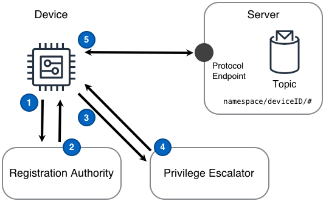

An unregistered device becomes registered and fully functional in an IoT solution.

<!--more-->

## Challenge

IoT solutions need devices to perform some sort of privilege escalation to go from zero privilege to a fully registered and operational device in that solution. While going from _no_ privilege to _full_ privilege there **should** be discrete and planned steps. Each step used to gain privilege must itself follow the approach of least privilege. Additionally, there may be existing identity and privilege systems which must be incorporated into the IoT solution.

## Solution

An IoT solution can manage the challenges of bootstrapping a device by deconstructing those challenges into a flow across two distinct concepts: a _registration authority_ and a _privilege escalator_.

A **registration authority** is the component that validates expected certificates, tokens, or shared credentials received from the device and then returns solution credentials for use by the device. A registration authority will at least be a collection of policies dictating the ability of un-registered devices to subscribe or publish to defined topics on the server.

A **privilege escalator** enables a device with short-lived, lower-privilege credentials to share more attributes about itself or to exhibit proper behavior before obtaining higher-privileges in the solution. A distinct privilege escalation step also enables the injection of human approval into the privilege escalation process, if the solution requires.

Although there are situations where an implementation might combine registration with the ability to obtain fully escalated privileges, by breaking down the challenges as this design does, each challenge can be addressed distinctly, using new or legacy systems.

The Device Bootstrap design shown in the following diagram can deliver this functionality.

### Diagram Steps

1. A device registers with the registration authority using shared credentials or token.
2. The registration authority validates the authenticity of the shared credentials or token, registers the device, and returns short-lived credentials to the device.
3. A device uses the short-lived credentials to contact the privilege escalator and to share more information about itself
4. The privilege escalator determines the device's type and determines if the device should be authorized in the IoT solution. If the device is authorized, the privilege escalator returns long-lived credentials such a device certificates associated with privileges corresponding to the device's purpose within the IoT solution.
5. A device uses the long-lived privileges to subscribe and publish to the device's [messaging topic]()s via the server's protocol endpoint.

## Considerations

When implementing this design, consider the following questions:

#### Does the device's manufacturing process create and place the initial token on the device?

If **no**, then the device must have a mechanism to receive a secure token or [certificate](https://en.wikipedia.org/wiki/Public_key_certificate) after the device is manufactured. Such a mechanism could involve configuring a device over a Bluetooth Low Energy ([BLE](https://en.wikipedia.org/wiki/Bluetooth_Low_Energy)) connection from a mobile application. This has the added advantage of being able to immediately associate a device to a customer while they are logged into a mobile application.

If **yes - with token/shared credentials**, In this case, it is important that the initial token or shared credentials are used to enable only the minimal privileges necessary to register with the solution. Once the registration authority validates the initial token or shared credentials, the rest of the steps of this design should be followed.

If **yes - with certificate**, the device can be manufactured in a secure manner and the need for a Registration Authority can be reduced if not removed altogether. This is easy to say and difficult to achieve as many manufacturing processes are purposefully disconnected from the cloud. Regardless, since the solution may have an entire step removed when keys are introduced by the manufacturer, the customer experience and overall system simplicity will benefit.

#### How are customers associated with their devices?

In almost all cases when devices are provisioned, we need to associate the device to either a customer or a device profile within an established system. This involves gathering additional information from the device to complete the device registration. Gathering this additional information can be accomplished with one or a combination of the following:

- Devices are provisioned during the manufacturing process with [certificates](https://en.wikipedia.org/wiki/Public_key_certificate) and those certificates can be pre-mapped to a device profile. This is common for solutions with large fleets of known devices.
- Devices report their model and serial numbers during their communication with the Registration Authority, that information can be pre-mapped to a device profile.
- Devices use BLE or another local form of communication to receive information about their identity, such as a customer profile. Handling this via a mobile application is the most common form of device provisioning. Using local communication can be coupled with the installation of certificates during manufacturing, enabling both the customer association and registration process to be completed in a single step.

#### Are you using device certificates?

Although the thought of trying to provision every single device in a solution with a certificate can be daunting, it is by far the most secure way to provision devices. It is important to establish mutual authentication to prevent threats like [man-in-the-middle](https://en.wikipedia.org/wiki/Man-in-the-middle_attack) attacks. When bootstrapping your devices, certificates should always be your first choice for device identity.

#### Does the registration authority need to support custom authorization integration with an existing customer solution?

If **yes**, the design's registration authority step can be implemented using an Application Programming Interface ([API](https://en.wikipedia.org/wiki/Application_programming_interface)) in front of an existing customer solution. This API can then perform the registration authority job while leveraging the customer's existing solution.

## Examples

    <tbd written scenario>
