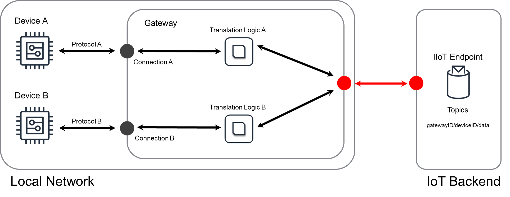


<!--more-->

## Challenge
At the edge of an IoT solution, devices are often interconnected and have to exchange data locally, i.e., without moving data over the internet.
As some local devices may use different protocols that are not compatible with each other, protocols have to be translated.
For instance in industrial IoT solutions, the interfaces of machines often use different protocols and extracting the information from these machines for monitoring requires the information be translated into a common format that is able to be sent to a protocol endpoint on the cloud or for use by another local device, or even local person.
Another example is in smart home deployments, where devices using different standards need to exchange data to control renewable power generation depending on the internal power consumption of the home.

Typically, moving all data in an untranslated form to software that performs translation on the cloud is not feasible for several reasons:

* The volume or velocity of the data generated by the local devices is too high.
* The devices use a communication stack that is not based on the [IP-Protocol](https://en.wikipedia.org/wiki/Internet_Protocol), or simply not usable for communication over the internet. For example for example [serial connections](https://en.wikipedia.org/wiki/Serial_communication) and [Bluetooth](https://en.wikipedia.org/wiki/Bluetooth).
* Connecting the devices directly to the internet would create a security risk. This often arises because the local protocol does not support encryption or authentication mechanisms.

## Solution
IoT solutions address these challenges by applying the [Gateway]() in combination with edge logic running on the gateway.
The edge logic on the gateway executes the translation of the industrial protocols into a common data format/protocol that can be processed by backend IT systems such as databases, data lakes or webservices.

The Protocol Translation design shown in the following diagram can be used to solve these challenges.

([PPTx](/patterns/iot-atlas-patterns.pptx))

- The left portion of this diagram represents the devices at the edge of the IoT solution that are connected with at least one [Gateway]().
- The gateway is the only component connected to the internet and the red arrow indicates that this connection should be encrypted/protected accordingly.
- The gateway runs local protocol translation logic to translate different protocols into a common protocol.
- If data generated by one of the connected devices has to be pushed to the cloud, the gateway will securely transmit the data in a common format after translation has occurred.
Since the Protocol Translation design extends the Gateway design, the solution may also allow a device **`B`** to act upon data generated by device **`A`** or vice versa. In this case, the gateway would have protocol translation logic to translate data emitted by device **`A`** into a format for use by the cloud and also protocol translation logic to translate data destined for the cloud into the format usable by device **`B`**.
 
The Protocol Translation design also fills a security purpose:
The connections inside the local network may be insecure (black) because some of the used protocols have no security features, while the cloud-facing connections (red) are secured by contemporary encryption and authentication mechanisms.
While encrypting all connections is desirable, in many cases this would prevent using well-established protocols for certain applications that do not support such security mechanisms. Furthermore, for certain devices and applications, replacing devices that do not support contemporary security mechanisms is not economically feasible. Often this means using insecure protocols locally in a solution is an acceptable tradeoff.

## Considerations

When implementing this design, consider the following questions:

#### Does the schema for the translation logic change if the connection is not IP-based?
In general, the schema does not change.
In the example [below](#example-industrial-iot-data-extraction), the IP connection was always defined using an IP address.
For instance, to use a serial connection with Modbus, the corresponding serial hardware path would be used instead of the IP address and a client specifically for Modbus over serial connections needs to be loaded instead of the TCP client, but the design still consistenly needs a device's address.

#### Is there a way to delay/batch/aggregate messages on the gateway?
Aggregation or batching of data is not a part of this design as it is discussed in the considerations of the Gateway design. 
The Gateway design contains [considerations]() about how protocol translation logic can be extended with mechanisms that batch results or compute aggregations over them.

#### How should protocol translation process translated data when the network to the server is unavailable?
The Gateway design contains some [considerations]() for this scenario. 
Simply put, the gateway will not be able to publish data for as long as the connection is lost. To prevent data loss, it is recommended to implement an upward message approach for any translated messages by using a local storage mechanism.

#### Why do insecure protocols used in IoT solutions exist in the first place?
The reason is because security is an evolving field and many of the protocols still in use were been designed decades ago. 
For instance, the first version of Modbus was published in 1979 at a time when encryption and cyber security were not a priority for the design of a protocol. There is a similar history for protocols used in other applications. 
While it would be preferable that all devices support modern, secure protocols, this is often not feasible as replacing devices that use older protocols can be costly. Furthermore, modern security mechanisms sometimes exceed the compute capacity of devices, particularly if they are battery-powered. 

#### What is the risk of devices using insecure protocols directly to the internet?
Exposing devices with an insecure protocols to the internet will likely result in data loss or even attacks that manipulate the local devices and device data.
Additionally, attackers can possibly control devices and use them for purposes that can be dangerous for humans around them, or to render the devices inoperable.
Hence, it is not recommended to connect devices using insecure protocols directly to the Internet. Instead use a secure gateway in between to serve as the "internet-facing" portion of the local network. 

#### What kind of hardware should be used for a gateway doing protocol translation?
This highly depends on the application and the surroundings of the application.
For instance, in the Industrial IoT example below, the gateway would commonly reside on an industrial PC or similarly ruggedized hardware. Other applications, may deploy protocol translation logic on mobile phones or other similar devices.

## Example - Industrial IoT Data Extraction
This is an example of implementing a protocol translation on a gateway in the context of Industrial IoT data extraction.

> Note these examples are not production ready code. They exist for the purpose of education.

Industrial machines are often equipped with, or consist of, sensors and other hardware such as programmable logic controllers ([PLC]()) that are used to monitor or control machine behavior.
As a prerequisite for a large set of [Industry 4.0]() use cases, it is required to access the data of industrial machines and their components.
The two main main reasons why simply connecting these machines to a network or the internet is not viable are in line with the challenges mentioned above:
* **Protocols:** There are many different communication standards for the aforementioned components of industrial machines, e.g., [OPC-UA](https://en.wikipedia.org/wiki/OPC_Unified_Architecture), [Modbus](https://en.wikipedia.org/wiki/Modbus), [CANBus](https://en.wikipedia.org/wiki/CAN_bus), [Profibus](https://en.wikipedia.org/wiki/Profibus).
Some of these standards have not been designed for use over the internet and some, e.g., serial Modbus, are not even based on the [IP-Protocol](https://en.wikipedia.org/wiki/Internet_Protocol).
* **Security:** Connecting an industrial asset directly to the internet is a security risk. For instance, Modbus in its basic version does not have any kind of security mechanism to authenticate a system that reads or writes to the underlying industrial equipment.

To overcome these challenges the application of the protocol translation design requires the deployment of a [Gateway]() to connect the machines as well as to provide a secure connection to the cloud.
The local network on the left-hand of the following diagram is commonly called the *shop floor* in the manufacturing, or *operational technology (OT)* domains.  


The gateway itself contains translation logic that translates between the machine protocol and the common protocol used by IT systems.
In the example above, there are two machines - **`A`** and **`B`**.
Suppose `Machine A` has an interface that follows the [OPC-UA standard](https://en.wikipedia.org/wiki/OPC_Unified_Architecture) and `Machine B` uses [Modbus](https://en.wikipedia.org/wiki/Modbus).
The following pseudo-code samples demonstrate the protocol translation logic that needs to run on the gateway.

#### Protocol Translation OPC-UA
OPC-UA is a modern, IP-based protocol that has security features like in-transit encryption and authentication using certificates or username/password combinations.
This pseudo-code shows how to access an OPC-UA target in Python syntax: 

```python
[... load some libraries, loggers ...]
# ######## STEP 1: load the library ######## 
from opcua import Client as OPCUAClient
POLLING_FREQUENCY = 5 # seconds

# definition of the data format to be retrieved
OPCUA_VARIABLES = {
	KEY_STATE				:	["Objects", "2:PLC1", "2:MAIN", "DrillState"],
	KEY_PRESSURE			:	["Objects", "2:PLC1", "2:MAIN", "Pressure"],
}

# generate a OPCUA url and create a client with it 
url = opc.tcp://192.168.2.2:4840 # assumes OPC-UA server at 192.168.2.2 on port 4840 on local network
client = OPCUAClient(url) # connect to the machine specified by the URL

# This function will run endlessly and poll the OPC-UA server
def poll_opcua_server():
	while True:
		try:
			# ######## STEP 2: Connect to the data source ######## 
			client.connect()
			rootNode = client.get_root_node()	# get the root node of the OPCUA tree
			# ######## STEP 3: Load the data from the source ######## 
			results = {}
			for name, path in OPCUA_VARIABLES.items():	# payload defines names -> path relations
				results[name] = rootNode.get_child(path).get_data_value()	# get the value from the node identified by path
			# ######## STEP 4: Publish the machine data ######## 
			# publish the result to the IoT endpoint as needed
			logger.info("Publishing the following extraction result: " + str(results))			
		except Exception as e:
			logger.error("Error while accessing OPCUA server: {0}".format(str(e)))
			logger.error("Error type: " + str(type(e)))
		finally:
			client.disconnect()
		time.sleep(POLLING_FREQUENCY)
# execute polling of opcua server
poll_opcua_server()
```

This pseudo-code uses an open-source library specifically for OPC-UA that is available for Python.
The first line loads this library, more specifically the client class of the library.
The remainder of the script is straightforward:
The client class is used to establish a connection, read the result from the data source (`Machine A`), and then publish the result to the IoT endpoint.
Note that the code required to publish to the specific IoT endpoint used by the gateway depends on the specific backend being used and is therefore omitted.
Additionally, this pseuod-code does not use any OPC-UA authentication mechanism in order to keep the example simple. Real code would authenticate the translation component. 

#### Protocol Translation Modbus
As with the OPC-UA translation, this pseudo-code assumes that data is accessible through a machine interface, but in this case the interface implements the Modbus protocol.
Similarly to OPC-UA translation, this pseudo-code tries to access a machine with the IP address `192.168.2.2` on the local network, i.e., this example uses the TCP/IP variant of the [Modbus](https://en.wikipedia.org/wiki/Modbus) protocol.
The code for a Modbus serial interface would require a different Modbus client, but the remainder of the logic would remain unchanged:

```python
[... load some libraries, loggers ...]
# ######## STEP 1: load the library ######## 
from pymodbus.client.sync import ModbusTcpClient as ModbusClient
POLLING_FREQUENCY = 1 	# second(s)
# Instantiate the client for your modbus slave device. 
mbClient = ModbusClient("192.168.2.2", port=5020)

def poll_measurements(frequency=POLLING_FREQUENCY):
	while True:
		# ######## STEP 2: Connect to the data source ########
		try:
			# connect to modbus slave device
			if not(mbClient.is_socket_open()):
				mbClient.connect()
		except Exception as e:
			time.sleep(1)
			continue
		# ######## STEP 3: Load the data from the source ########
		try:
			# read the holding registers (32 is chosen as a sufficient number of registers to hold the payload)
			readResult = mbClient.read_holding_registers(address=0x0, count=32, unit=1)
		except Exception as e:
			mbClient.close()
			time.sleep(1)
			continue
		# ######## STEP 4: Publish the machine data ######## 
		# publish the result to the IoT endpoint as needed
		logger.info("Publishing the following extraction result: " + str(results))			
		time.sleep(frequency)

poll_measurements()
```
The structure of this pseduo-code is the same as before:
The first line loads an open-source library that will provide easy access to Modbus assets.
Afterwards, the pseudo-code connects to the Modbus master and then gets data from the master.

It is important to note that the result from a Modbus master will be more "unstructured" compared to the OPC-UA example above:
The variable `readResult` will contain unstructured binary data that has to be reformatted depending on how the data was written to the bus.
This is a fundamental difference between a modern protocol like OPC-UA and Modbus when it comes to data extraction. This is also a source of complexity that any protocol translation must consider. 

#### Industrial IoT Data Extraction Summary
As shown in the above sections, the translation logic on the gateway has a common structure of four steps:

1. Loading of a protocol specific library
2. Establishing the connection to the asset from which data needs to be extracted.
3. Retrieving the desired data from the machine.
4. Optionally processing the data from the machine and then forwarding the data to the IT systems (over the internet).

Depending on the protocol, establishing the connection may require credentials or other authentication secrets that need to be stored securely on the gateway.
In the examples above, open-source libraries for Modbus and OPC-UA have been used, but commercial alternatives exist and can be used as well.
