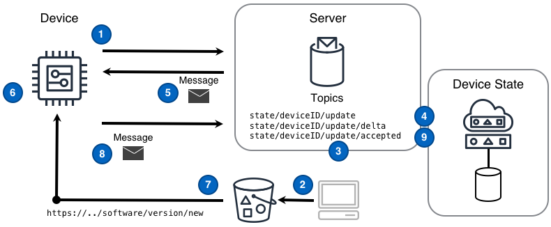



<!--more-->

## Challenge

IoT solutions are required to provide a mechanism for devices to update their own software. Supporting software updates without human intervention is both critical for scaling solutions to millions of devices and for delivering a great customer experience. However, achieving a full update of large sets of devices in a secure, scalable, and reliable fashion requires a solution that can scale to meet device load, a resilient command mechanism, and a way of tracking the state of the the entire fleet of devices.

## Solution

IoT solutions that leverage the [Command]() and [Device State Replica]() patterns alongside a globally available and scalable storage solution are able to meet all the challenges inherent in updating the software of devices in a large fleet.

The Software Update pattern shown in the following diagram can deliver this functionality.

 ([PPTx](/iot-atlas-patterns.pptx))

### Diagram Steps

1. A device subscribes to the delta [message topic]() `state/deviceID/update/delta` upon which device-related state change messages will arrive from the device state replica.
2. An application obtains the new software distribution and places that into a storage solution accessible to production devices.
3. An application identifies a device that should receive the new software and publishes a desired state message to the device's topic `state/deviceID/update`. The desired state message contains a software update URL different form the device's current software version URL.
4. The device state replica tracking this device records the desired device state in a persistent data store and publishes a delta message to the topic `state/deviceID/update/delta` that is sent to the device.
5. The device receives a delta message that acts as the 'software update' command message. Specifically, this message conveys the change between the current software version URL and the new URL
6. The device obtains the new software update URL from the delta message.
7. The device downloads the new software and applies the software locally.
8. The device publishes an acknowledgement message reflecting the software version the device is now using to the update topic `state/deviceID/update` and a device state replica tracking this device records the new state in a persistent data store.
9. The device state replica publishes a message to the `state/deviceID/update/accepted` topic. The software update is now considered complete.

## Considerations

When implementing this pattern, consider the following questions:

#### How does the targeted device and only that device obtain the software update from the given URL?

The solution can ensure that only the device targeted for a software update can obtain the update by using a **pre-signed URL** or a **temporary credential**. Each approach has different considerations.

**Pre-signed URL** - the benefit of a pre-signed URL is that it constrains the ability for a device to download a software update within a period of time and by devices with specific public IP addresses. The negative of this approach arises when the device downloading the the update does not have a publicly resolvable IP address. Without a publicly resolvable IP address the solution can only place a time boundary on the interaction with the software update. The practitioner of a solution may or may not find this acceptable.

**Temporary Credential** - a device interacts with the solution to obtain a temporary credential associated with only the privilege of accessing the storage solution to download the update. The benefit of using a temporary credential is that only the device with that credential can access the update, even when the device does not have a publicly resolvable IP address. The slight negative of this approach is that it requires the device and solution to be more complex because the device must go through a separate process to obtain temporary credentials.

## Example

### Device perspective of a software upgrade

An example of the logic involved for a device in an IoT solution to receive and execute an "update" command received through a [Device State Replica](). Specifically, the device will obtain new software, perform an update using that software, and acknowledge completion.

#### Device prepares for update command messages

A device subscribes a message listener function to process [command message]()s coming from the `state/deviceID/update/delta` topic

```python
def message_listener(message):
    # ..do something with 'message'..

def main():
    # subscribe the message listener function to the topic
    sub = topic_subscribe('state/deviceID/update/delta', message_listener)
    # now wait until the program should end
    wait_until_exit()
```

#### Device reads download URL from message and downloads software

After some time passes the device receives a delta message that acts as the 'software update' command message.

```python
def message_listener(message):
    # parse the message from raw format into something the program can use
    msg = parse_message(message)
    # determine if the message is an update command type
    if msg is UPDATE_COMMAND:
        # get the globally unique job ID from the command message
        job_id = msg.get_job_id()
        # read the software update URL from the command message
        url = msg.read_value('softwareURL')
        # download the software from the given URL
        software = download_software(url)
        # ..and apply the software update triggered by the specific job ID
        apply_software(software, job_id)
```

#### Device applies software and publishes acknowledgement message

A device will apply the downloaded software and acknowledge the command completion with a message to `state/deviceID/update/accepted` topic

```python
def apply_software(software, job_id):
    # do the local, device-specific work to apply the software
    # and produce a result value of SUCCESS or FAILURE

    if result is SUCCESS:
        # make a success message
        message = 'jobID:' + job_id + " SUCCESS"
    else:
        #make a failure message
        message = 'jobID:' + job_id + " FAILURE"

    # the topic used to publish the acknowledge message
    topic = 'state/deviceID/update/accepted'
    # ...and finally, publish the acknowledge message
    message_publish(topic, message, quality_of_service)
```
