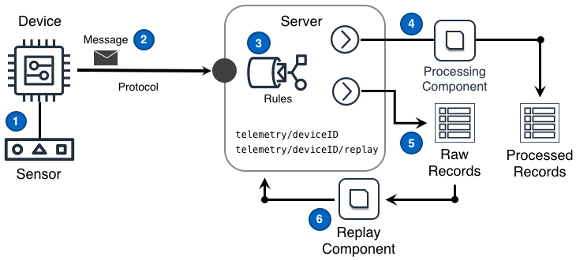



<!--more-->

## Challenge

In order to deliver insights, IoT solutions need to support real-time, batch-mode, and predictive analysis of the information generated by the solution. Since each mode of analysis is better informed when leveraging historic data _and_ future approaches to analysis might not yet be understood, IoT solutions must archive data in a manner as flexible as possible to meet future requirements.

## Solution

IoT solutions ensure that the business can obtain the most current and evolving collection of insights by storing raw unprocessed sensor data in a manner supporting the in-order replay of those raw samples. The store-and-replay ability should make historic raw samples appear almost as if the samples were arriving in the normal time-ordered sequence of non-historic samples.

The Telemetry Archiving design shown in the following diagram can deliver this functionality.

### Diagram Steps

1. The device obtains a measurement from a sensor operating in an environment remote from the IoT solution.
2. The device publishes a message to the topic `telemetry/deviceID` containing the measurement. This message is sent via a transport protocol to a protocol endpoint made available by the Server.
3. The Server may then apply one or more [rules]() to messages in order to perform fine-grained routing upon some or all of the [message's]() measurement data. These rules fan out the messages to at least a processing path **`(4)`** and a raw storage path **`(5)`**
4. The message processing path performs fundamental calculations necessary by other components of the solution and stores the processed results.
5. The raw message storage path saves the original raw message in a manner supporting the in-order replay of the original messages.
6. At some point in the future, a component can read raw messages from a point in time and replay those messages into a `telemetry/deviceID/replay` topic. The solution processes the replayed messages as necessary.

## Considerations

When implementing this design, consider the following questions:

#### Is the replay of records required for downstream processing?

Simply put **yes**. Most solutions should assume the answer to this question is "**yes**" since the replay of raw unprocessed sensor data enables the IoT solution to support the evolution of an IoT solutions' insights through:

- updates to fundamental calculations that support well-performing analysis of historic data,
- the creation of new types of processed records,
- implementation of new unexpected features, and
- the creation of fundamentally new customer perspectives of data.

An example of this consideration is [below](#replay-data-consideration-example).

#### Is it important to ensure the order of saved messages?

If **yes**: `needs detail`

If **no**: `needs detail`

## Examples

#### Replay Data Consideration Example

A physical site is being monitored for electrical energy ([kWh](https://en.wikipedia.org/wiki/Kilowatt_hour)) used. Energy sensors are sampled every 30 seconds and the samples are reported into the solution once a minute. As the raw, unprocessed messages arrive they are stored and a "15-minute average" process automatically calculates the 15-minute average of the monitored energy used. The calculated results are stored as records in the solution's processed record repository. These new processed records are then used by additional analytic processes and the IoT solution's user interface.

At a later date it is clear that the solution's users also want processed records that display the maximum energy used every 5 minutes. To deliver this benefit, a new "5-minute maximum" process is implemented. This new process replays the historic raw unprocessed records and calculates the 5 minute maximum over every historic interval. Once complete each calculated result is is stored as a new type of processed record.

Without the retention of the raw samples, the solution would be limited to only performing calculations on data that arrives after the "5-minute maximum" feature is implemented in the solution. Most importantly, without the original raw samples, users would be unable to analyze the physical site using the 5-minute feature, prior to the time the feature was implemented.
