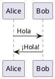

Esta sección proporciona orientación y recursos sobre cómo contribuir al IoT Atlas. Cubre:

- Creación y prueba de nuevo contenido
- Directrices para la creación de contenido usando Hugo
- Plantillas para diferentes tipos de contenido

Seguir estas directrices ayuda a garantizar la consistencia del Atlas de una página a otra.

## Creación de nuevo contenido

Al crear nuevo contenido, utilice la siguiente orientación:

1. Un tema personalizado de Hugo (derivado de [hugo-theme-learn](https://github.com/matcornic/hugo-theme-learn)) es la base de este sitio. Las características adicionales se enumeran a continuación y se muestran en la carpeta de [plantillas](), o en el ejemplo de [kitchen sink]() que demuestra todas las características.
1. Si está creando contenido similar al que ya existe, use una página existente como base para los encabezados, estilo y enfoque. También puede revisar las plantillas de estilo de ejemplo en esta sección.
1. Pruebe los cambios de contenido localmente y solo envíe un [pull request](https://docs.github.com/en/github/collaborating-with-issues-and-pull-requests/about-pull-requests) una vez que la validación pase exitosamente. Los pull requests no se fusionarán con enlaces rotos o referencias/código Hugo inválidos.

Si tiene alguna pregunta, por favor revise y haga preguntas en la sección de [discusiones](https://github.com/aws/iot-atlas/discussions) del repositorio de GitHub.

### Fork y Pruebas Locales

Puede desarrollar localmente con **Docker** o una **instalación local de Hugo**:

#### Opción A: Docker (paridad con CI)

1. Haga un [Fork](https://github.com/aws/iot-atlas/fork) del repositorio en su cuenta de GitHub.
1. Opcionalmente cree una rama para sus cambios.
1. Desde el directorio `iot-atlas/src`, ejecute `./make_hugo.sh -d` para iniciar en modo de desarrollo local.

{}
La primera vez construirá el contenedor Docker, lo cual toma aproximadamente 30 segundos. Después de eso, se reutilizará la imagen local `temporary/hugo-ubuntu`.
{}

4. Verifique que puede abrir localmente desde la URL [http://localhost:1313/](http://localhost:1313/)

#### Opción B: Instalación local de Hugo (iteración más rápida)

1. Instale [Hugo Extended](https://gohugo.io/installation/) (v0.163.0 o posterior).
1. Desde el directorio `iot-atlas/src/hugo`, ejecute `hugo server`.
1. Abra [http://localhost:1313/](http://localhost:1313/)

Ambas opciones inician un servidor local en el puerto 1313. Cada vez que haga y guarde un cambio, el servidor local volverá a renderizar y activará la recarga en su navegador.

### Validar Contenido

Una vez que esté satisfecho con el nuevo contenido, ejecute `./make_hugo.sh -v` (desde `src/`), que _validará_ que todo el contenido esté correctamente formateado, y que si incluyó hipervínculos, estos sean válidos.

Cuando aparezca el mensaje _\*\*\*\*\*\*\*\*\*\* Validation completed successfully,_ la validación está completa.

### Crear un Pull Request

Desde GitHub, use el [proceso de pull request](https://docs.github.com/en/github/collaborating-with-issues-and-pull-requests/about-pull-requests) para crear un pull request (PR) al repositorio `aws/iot-atlas`. Esto iniciará un proceso de validación. Si hay errores (❌ rojo junto a su PR), revise el error, corrija en _su_ repositorio fork, luego confirme los cambios.

Una vez que la validación se haya completado, un mantenedor del IoT Atlas revisará y fusionará el contenido, o solicitará cambios.

## Directrices para la Creación de Contenido

### Ejemplos de Código

Los ejemplos de código deben almacenarse en `static/code/` e incluirse mediante el shortcode `code-include`. Esto mantiene el código en una ubicación única compartida entre todas las traducciones:

```

```

Parámetros:
- **file**: ruta relativa a `static/code/`
- **language**: (opcional) se detecta automáticamente de la extensión del archivo
- **title**: (opcional) título sobre el bloque de código
- **lines**: (opcional) rango de líneas, ej. `"10-25"`

### Diagramas PlantUML

Los diagramas de arquitectura se pueden escribir como bloques de código PlantUML:

````markdown

````

Los diagramas se renderizan del lado del cliente a través del servidor público de PlantUML. No se requiere instalación local de Java. Los iconos de arquitectura AWS están disponibles a través de la librería [aws-icons-for-plantuml](https://github.com/awslabs/aws-icons-for-plantuml).

### Recursos en Paquete

Si hay diagramas u otras imágenes relacionadas con su contenido, inclúyalas y refiéralas desde el mismo directorio como un [Page Bundle](https://gohugo.io/content-management/page-bundles/).

### Contenido Multilingüe

El sitio soporta Inglés, Español, Chino y Francés. El contenido para cada idioma está en:

- `content/en-us/` - Inglés
- `content/es-es/` - Español
- `content/zh-cn/` - Chino
- `content/fr-fr/` - Francés

Los ejemplos de código en `static/code/` se comparten entre todos los idiomas. Solo la prosa (markdown) necesita ser traducida.
