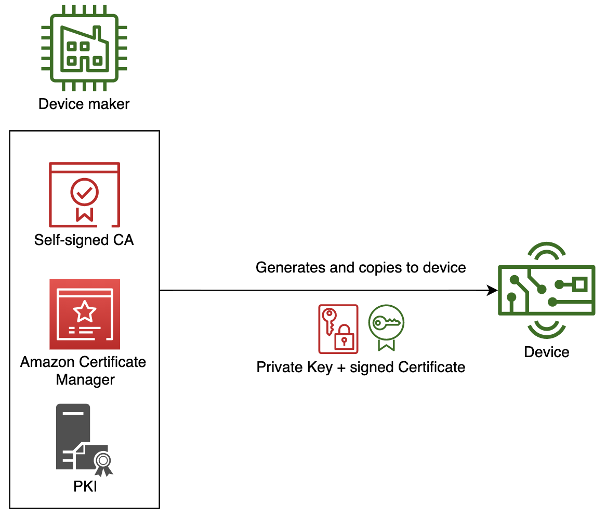

Just-In-Time Provisioning (JITP) permite que los dispositivos IoT se registren y aprovisionen automáticamente en su primera conexión a AWS IoT Core. Los dispositivos vienen precargados con un certificado X.509 único firmado por una Autoridad Certificadora (CA) que ha sido registrada en AWS IoT Core. Cuando un dispositivo se conecta por primera vez, AWS IoT Core verifica el certificado del dispositivo contra la CA registrada y activa una plantilla de aprovisionamiento para crear el Thing, activar el certificado y adjuntar una política.

{}
Esta implementación se enfoca en el uso de una CA autogestionada con la capacidad JITP de AWS IoT Core. Los dispositivos que usan JITP deben tener certificados y claves privadas presentes en el dispositivo antes del registro. Los certificados deben estar firmados con la CA designada por el cliente, y esa CA debe estar registrada en AWS IoT Core. Hay muchas opciones de aprovisionamiento y registro de dispositivos disponibles para diferentes tipos de circunstancias de fabricación y distribución. Consulta la [sección de arranque de dispositivos del IoT Atlas](..) para explorar otros métodos.
{}

{}
Si tu cadena de fabricación no puede aprovisionar credenciales únicas en el momento de fabricación, considera [Aprovisionamiento de Flota por Usuario de Confianza](../fleet_provisioning_trusted_user/) o [Máquina Expendedora de Certificados](../aws-iot-certificate-vending-machine/) como alternativas.
{}

## Casos de Uso

JITP es un método preferido bajo las siguientes condiciones:

- La cadena de fabricación puede aprovisionar credenciales únicas (certificado y clave privada) en cada dispositivo durante la fabricación.
- Tienes una PKI existente (autogestionada o usando un servicio como AWS Private CA) y quieres aprovecharla para la identidad de dispositivos IoT.
- Quieres aprovisionamiento sin intervención donde los dispositivos se registran solos en su primera conexión sin requerir una aplicación móvil o un instalador.
- Necesitas escalar el registro de dispositivos sin pre-registrar cada certificado de dispositivo individualmente en AWS IoT Core.
- Conoces a qué cuenta y región de AWS se conectará el dispositivo antes de la fabricación.

## Arquitectura de Referencia



Los detalles de este flujo son los siguientes:
1. Se crea un par de clave privada y certificado firmado usando PKI. La PKI puede ser autogestionada o usar un servicio administrado como AWS Private CA.
2. La clave privada y el certificado firmado se copian y almacenan de forma segura en el almacenamiento persistente del dispositivo durante la fabricación o distribución.
3. Un certificado CA se registra en AWS IoT Core con una plantilla de aprovisionamiento adjunta. Esta es una configuración única por CA.
4. El dispositivo se conecta a AWS IoT Core por primera vez. Durante el handshake TLS, se presentan tanto el certificado del dispositivo como el certificado de la CA firmante.
5. AWS IoT Core verifica la firma del certificado del dispositivo contra la CA registrada. La plantilla de aprovisionamiento se activa de forma asíncrona.
6. La primera conexión TLS es rechazada (el certificado aún no estaba activo cuando comenzó el handshake).
7. El dispositivo se reconecta después de una breve espera. La plantilla de aprovisionamiento ha creado el Thing, activado el certificado y adjuntado la política. La segunda conexión tiene éxito.

```plantuml
@startuml
!define AWSPuml https://raw.githubusercontent.com/awslabs/aws-icons-for-plantuml/v7.0/dist
!includeurl AWSPuml/AWSCommon.puml
!includeurl AWSPuml/InternetOfThings/all.puml
!includeurl AWSPuml/SecurityIdentityCompliance/CertificateManager.puml

skinparam participant {
    BackgroundColor AWS_BG_COLOR
    BorderColor AWS_BORDER_COLOR
}
hide footbox

participant "<$IoTGeneric>\nDispositivo" as device
participant "<$IoTCore>\nAWS IoT Core" as iotcore
participant "<$CertificateManager>\nPlantilla de\nAprovisionamiento" as template

== Configuración Inicial (Fabricante) ==
iotcore <- iotcore : Registrar certificado CA\n+ adjuntar plantilla de aprovisionamiento

== Fabricación del Dispositivo ==
device <- device : Almacenar certificado único\n(firmado por CA registrada)\n+ clave privada

== Primera Conexión (Activación JITP) ==
device -> iotcore : Handshake TLS\n(cert dispositivo + cert CA)
iotcore -> iotcore : Verificar firma del cert\ncontra CA registrada
iotcore -> template : Activar aprovisionamiento\n(asíncrono)
iotcore --> device : Conexión RECHAZADA\n(cert aún no activo)
template -> iotcore : Crear Thing\nActivar certificado\nAdjuntar política

== Reconexión (Éxito) ==
device -> device : Esperar 3-5 segundos\n(backoff)
device -> iotcore : Handshake TLS\n(mismo cert + cert CA)
iotcore -> iotcore : Certificado encontrado\ny ACTIVO
iotcore --> device : Conexión ACEPTADA
device -> iotcore : SUBSCRIBE / PUBLISH

@enduml
```

{}
La primera conexión siempre fallará y se desconectará. El firmware del dispositivo debe implementar lógica de reconexión con backoff exponencial (típicamente 3-5 segundos es suficiente para que el aprovisionamiento JITP se complete).
{}

## Implementación

Esta sección proporciona guía de implementación paso a paso. Necesitas OpenSSL y el AWS CLI instalados en tu estación de trabajo.

### 1. Crear un Rol IAM para JITP

Crea un rol IAM que AWS IoT Core pueda asumir durante el proceso de aprovisionamiento. Adjunta la política administrada `AWSIoTThingsRegistration`.

```bash
# Crear la política de confianza
cat > jitp-trust-policy.json << 'EOF'
{
  "Version": "2012-10-17",
  "Statement": [
    {
      "Effect": "Allow",
      "Principal": {
        "Service": "iot.amazonaws.com"
      },
      "Action": "sts:AssumeRole"
    }
  ]
}
EOF

# Crear el rol
aws iam create-role \
  --role-name JITPRole \
  --assume-role-policy-document file://jitp-trust-policy.json

# Adjuntar la política de registro de things IoT
aws iam attach-role-policy \
  --role-name JITPRole \
  --policy-arn arn:aws:iam::aws:policy/service-role/AWSIoTThingsRegistration
```

### 2. Crear un Certificado CA Raíz

Genera un certificado CA raíz autofirmado que firmará todos los certificados de dispositivos.

```bash
# Generar clave privada de la CA raíz
openssl genrsa -out deviceRootCA.key 2048

# Crear configuración OpenSSL para extensiones de CA
cat > deviceRootCA_openssl.conf << 'EOF'
[ req ]
distinguished_name = req_distinguished_name
extensions = v3_ca
req_extensions = v3_ca

[ v3_ca ]
basicConstraints = CA:TRUE

[ req_distinguished_name ]
countryName = Country Name (2 letter code)
countryName_default = US
organizationName = Organization Name (eg, company)
organizationName_default = MyOrg
EOF

# Crear CSR de la CA raíz
openssl req -new -sha256 -key deviceRootCA.key -nodes \
  -out deviceRootCA.csr -config deviceRootCA_openssl.conf

# Autofirmar el certificado de la CA raíz (válido por 10 años)
openssl x509 -req -days 3650 \
  -extfile deviceRootCA_openssl.conf -extensions v3_ca \
  -in deviceRootCA.csr -signkey deviceRootCA.key \
  -out deviceRootCA.pem
```

### 3. Registrar la CA en AWS IoT Core

AWS IoT Core requiere prueba de propiedad de la CA mediante un certificado de verificación.

```bash
# Obtener el código de registro para tu región
aws iot get-registration-code --region <tu-region>
```

Usa el `registrationCode` retornado como el Common Name para un certificado de verificación:

```bash
# Generar clave de verificación
openssl genrsa -out verificationCert.key 2048

# Crear CSR de verificación con el código de registro como CN
openssl req -new -key verificationCert.key -out verificationCert.csr \
  -subj "/CN=PEGAR_CODIGO_DE_REGISTRO_AQUI"

# Firmar certificado de verificación con tu CA raíz
openssl x509 -req -in verificationCert.csr \
  -CA deviceRootCA.pem -CAkey deviceRootCA.key -CAcreateserial \
  -out verificationCert.crt -days 500 -sha256
```

### 4. Crear la Plantilla de Aprovisionamiento

La plantilla de aprovisionamiento define qué recursos de AWS se crean cuando un dispositivo se conecta vía JITP. Guarda lo siguiente como `jitp_template.json`:


```

{}
Reemplaza `REGION`, `ACCOUNT_ID` y el valor de `roleArn` con tu Región de AWS, ID de Cuenta y el ARN del JITPRole creado en el Paso 1. La plantilla usa `AWS::IoT::Certificate::CommonName` como nombre del Thing, así que asegúrate de que cada certificado de dispositivo tenga un Common Name único.
{}

### 5. Registrar el Certificado CA con la Plantilla

```bash
aws iot register-ca-certificate \
  --ca-certificate file://deviceRootCA.pem \
  --verification-cert file://verificationCert.crt \
  --set-as-active \
  --allow-auto-registration \
  --registration-config file://jitp_template.json \
  --region <tu-region>
```

El flag `--allow-auto-registration` habilita JITP. El flag `--registration-config` adjunta la plantilla de aprovisionamiento a la CA. La respuesta retorna el ARN del certificado CA.

### 6. Crear un Certificado de Dispositivo

Para cada dispositivo, genera un certificado único firmado por la CA registrada:

```bash
# Generar clave privada del dispositivo
openssl genrsa -out deviceCert.key 2048

# Crear CSR del dispositivo
# IMPORTANTE: CommonName se convierte en el nombre del Thing, Country debe coincidir con el certificado CA
openssl req -new -key deviceCert.key -out deviceCert.csr \
  -subj "/CN=MyJITPDevice001/C=US/O=MyOrg"

# Firmar certificado del dispositivo con la CA raíz
openssl x509 -req -in deviceCert.csr \
  -CA deviceRootCA.pem -CAkey deviceRootCA.key -CAcreateserial \
  -out deviceCert.crt -days 365 -sha256

# Combinar cert del dispositivo y cert de la CA (requerido para JITP - la CA debe estar en la cadena)
cat deviceCert.crt deviceRootCA.pem > deviceCertAndCACert.crt
```

### 7. Conexión del Dispositivo con Lógica de Reintento JITP

Descarga el Amazon Root CA para verificación TLS del lado del servidor:

```bash
curl -o AmazonRootCA1.pem https://www.amazontrust.com/repository/AmazonRootCA1.pem
```

El siguiente script Python demuestra el flujo completo del lado del dispositivo para JITP, incluyendo el patrón de conectar-fallar-reconectar usando el AWS IoT Device SDK v2:

- Instalar SDK: `pip install awsiotsdk`
- Ejecutar: `python3 jitp_device.py --endpoint <TU_ENDPOINT> --cert deviceCertAndCACert.crt --key deviceCert.key --root-ca AmazonRootCA1.pem --thing-name MyJITPDevice001`


```

### Verificación

Después de ejecutar el script del dispositivo, verifica en la Consola de AWS IoT:
1. Navega a **Administrar > Todos los dispositivos > Things** y confirma que existe un Thing llamado `MyJITPDevice001`.
2. Navega a **Seguridad > Certificados** y confirma que el certificado del dispositivo está en estado `ACTIVE`.
3. Verifica que la política IoT está adjunta al certificado.

```bash
# Verificar vía CLI
aws iot describe-thing --thing-name MyJITPDevice001 --region <tu-region>
aws iot list-thing-principals --thing-name MyJITPDevice001 --region <tu-region>
```

## Consideraciones

Esta implementación cubre los aspectos básicos de JITP. No cubre ciertos aspectos que pueden surgir en uso de producción.

### Unicidad del Common Name del Certificado

Cada dispositivo debe tener un Common Name único en su certificado, ya que este se convierte en el nombre del Thing a través del parámetro de la plantilla de aprovisionamiento `AWS::IoT::Certificate::CommonName`. Common Names duplicados causarán fallos de aprovisionamiento. Considera usar números de serie del dispositivo, direcciones MAC o UUIDs como Common Names.

### Fallo de Primera Conexión y Estrategia de Reintento

El firmware del dispositivo debe manejar el rechazo inicial de conexión de forma elegante. El proceso de aprovisionamiento JITP es asíncrono y típicamente se completa en 1-3 segundos. Implementa backoff exponencial comenzando en 3 segundos con un máximo de 5 reintentos. Si todos los reintentos fallan, el dispositivo debería entrar en un modo de diagnóstico o reportar la falla a través de un canal fuera de banda.

### Certificado CA por Región

Los certificados CA se registran por Región de AWS. Si los dispositivos necesitan conectarse a múltiples regiones (para failover o geo-routing), registra la misma CA en cada región destino con la plantilla de aprovisionamiento apropiada. El firmware del dispositivo puede configurarse con una lista priorizada de endpoints.

### Rotación de Certificados CA

Planifica la rotación del certificado CA antes de que expire. Puedes tener múltiples CAs activas registradas simultáneamente en AWS IoT Core. La estrategia de rotación es:
1. Registrar la nueva CA junto con la existente.
2. Comenzar a firmar nuevos certificados de dispositivos con la nueva CA.
3. Los dispositivos existentes con certificados firmados por la CA antigua continúan funcionando.
4. Después de que todos los certificados firmados por la CA antigua hayan expirado o sido reemplazados, desactivar la CA antigua.

### Alcance de la Política en la Plantilla

La plantilla de aprovisionamiento de ejemplo usa recursos con comodín (`/*`) por simplicidad. En producción, delimita las políticas usando parámetros de la plantilla:

```json
"Resource": ["arn:aws:iot:REGION:ACCOUNT_ID:client/${iot:Connection.Thing.ThingName}"]
```

Esto restringe a cada dispositivo a solo conectarse con un client ID que coincida con su nombre de Thing, y publicar/suscribirse solo a sus propios temas.

### Hooks de Plantilla de Aprovisionamiento

Para validación adicional durante el aprovisionamiento, puedes adjuntar una función Lambda de [Pre Provisioning Hook](https://docs.aws.amazon.com/iot/latest/developerguide/pre-provisioning-hook.html) a la plantilla. Esto te permite:
- Validar atributos del certificado contra una lista permitida
- Verificar una base de datos de dispositivos para confirmar que el dispositivo es esperado
- Aplicar lógica condicional para asignación de Thing Groups
- Rechazar aprovisionamiento para certificados revocados o inesperados

### Cuotas de Servicio

Ten en cuenta las [cuotas de servicio](https://docs.aws.amazon.com/iot/latest/developerguide/iot-quotas.html) de AWS IoT Core relacionadas con JITP:
- Tasa de transacciones `RegisterThing`: considera throttling si registras grandes lotes simultáneamente.
- Número máximo de certificados CA por cuenta por región.
- Si registras miles de dispositivos simultáneamente (por ejemplo, activación por lotes en fábrica), considera escalonar las conexiones con jitter para evitar alcanzar los límites de tasa de aprovisionamiento.

### Monitoreo y Solución de Problemas

Habilita el registro de AWS IoT Core en CloudWatch para monitorear eventos JITP:
- Las entradas de log `JITP` muestran éxitos y fallos de aprovisionamiento
- Razones comunes de fallo: nombre de Thing duplicado, discrepancia en el campo Country, CA no activa
- Configura alarmas de CloudWatch en métricas de fallo JITP para monitoreo proactivo

```bash
# Habilitar registro de IoT (configuración única)
aws iot set-v2-logging-options \
  --role-arn arn:aws:iam::ACCOUNT_ID:role/IoTLoggingRole \
  --default-log-level INFO \
  --region <tu-region>
```

### Registro Multi-Cuenta

Si tu despliegue abarca múltiples cuentas de AWS (por ejemplo, cuentas por cliente), puedes usar [Multi-Account Registration](https://docs.aws.amazon.com/iot/latest/developerguide/x509-client-certs.html#multiple-account-cert) donde la misma CA se registra en múltiples cuentas. Cada cuenta tiene su propia plantilla de aprovisionamiento, permitiendo que el mismo formato de certificado de dispositivo se aprovisione en diferentes cuentas basándose en el endpoint al que se conecta el dispositivo.
