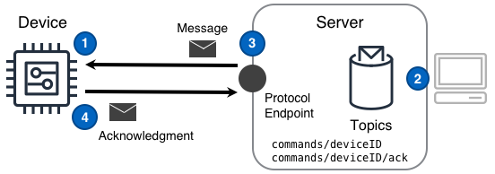

Une entité demande de manière fiable à un appareil d'effectuer une seule action, avec accusé de réception de l'état.

<!--more-->

## Défi

Les solutions IoT sont censées interagir avec les appareils de manière à ce que la solution, ou les personnes qui l'utilisent, puissent de manière fiable demander aux appareils d'effectuer une action. De plus, cette interaction doit se produire avec une connectivité intermittente, utilisant souvent des appareils avec des ressources limitées.

## Solution

Les solutions IoT utilisent le design Commande pour demander aux appareils d'effectuer une action et d'assurer des interactions fiables en s'appuyant sur un concept simple: aucune action demandée n'est considérée comme réussie à moins qu'elle ne soit reconnue comme réussie.

Le design de commande illustrée dans le diagramme suivant peut fournir cette fonctionnalité.

 ([PPTx](/iot-atlas-patterns.pptx))

### Numéros du diagramme

1. L'[appareil]() se configure pour communiquer avec un point de terminaison de protocole afin que les messages de commande puissent être envoyés et reçus.
2. Le composant de la solution publie un [Message de commande]() destiné à un ou plusieurs appareils.
3. Le serveur utilise le point de terminaison du protocole pour envoyer le message de commande à chaque appareil précédemment configuré.
4. Une fois l'action demandée par la commande terminée, l'appareil publie un message de fin de commande sur le serveur via le point de terminaison du protocole.

## Considérations

Il est important de noter que le design de Commande n'est pas une "télémétrie inversée". Au lieu de cela, le design de Commande relève le défi inhérent à une solution qui doit déclencher de manière fiable des actions sur un appareil fonctionnant dans un emplacement distant.

Lors de la mise en œuvre de ce design, tenez compte des questions suivantes:

#### Avez-vous d'abord envisagé la réplique de l'état de l'appareil?

Étant donné que l'exécution de commandes entraîne en fait un changement d'état dans un appareil, le design [Réplique de l'état de l'appareil](/fr/designs/device_state_replica/) (REA) est la méthode préférée pour exécuter des commandes dans une solution IoT. Dans les situations où REA ne convient pas ou dépasse certaines limites d'implémentation, envisagez cette conception de commande et une implémentation personnalisée de contrôle.

#### Comment la solution peut-elle suivre la progression des commandes de chaque appareil?

Chaque commande doit avoir un type unique de solution et chaque message de commande doit contenir un ID de message globalement unique. L'ID du message de commande permet à la solution de suivre l'état de commandes distinctes et le type de commande permet de diagnostiquer les problèmes potentiels entre les catégories de commandes au fil du temps. Les messages doivent être idempotents et ne doivent pas pouvoir être non-traités ou dupliqués à l'insu de l'appareil _et_ du demandeur.

#### Certaines commandes de la solution s'exécutent-elles pendant plus de temps que la norme?

Lorsque certaines commandes s'exécutent plus longtemps que la norme, un simple message d'achèvement de commande `SUCCESS` ou `FAILURE` ne suffit pas. Au lieu de cela, la solution doit exploiter au moins trois états de commande: SUCCESS, «FAILURE» et «RUNNING». `RUNNING` doit être retourné par l'appareil dans un intervalle prévu jusqu'à la fin de la commande. En utilisant un état `RUNNING` signalé sur un intervalle prévu, une solution peut déterminer quand une commande à exécution longue échoue en silence.

#### Un type de commande spécifique nécessite-t-il une autorisation humaine?

Lorsqu'une commande dans une solution nécessite l'approbation humaine avant qu'un appareil ne prenne des mesures, un composant d'approbation humain doit être ajouté à la solution. Ce composant intercepterait les commandes de types particuliers et les mettrait en file d'attente pour approbation humaine avant de les envoyer vers un appareil.

#### Un type de commande doit-il annulé pour revenir à un état précédent?

Si une solution possède certaines commandes qui peuvent avoir besoin d'être annulées, il est presque toujours plus facile de gérer cette annulation à partir de la solution elle-même au lieu d'attendre de chaque appareil qu'il comprenne et se souvienne des considérations relatives à l'annulation. Par exemple, un dispositif reçoit une commande pour déplacer un actionneur d'une position actuelle signalée de `0`&#176; à une position de `45`&#176;. L'appareil exécute cette commande avec succès. À un moment ultérieur, la solution nécessite que l'appareil revienne à l'état précédent, l'état précédent est souvent plus facile à suivre dans la solution elle-même que de s'attendre à ce que chaque appareil suive son ou ses anciens états. L'annulation de cette situation serait effectuée par la solution envoyant une commande pour que l'appareil change de position de nouveau vers `0`&#176;.
Dans le cas où des annulations sont nécessaires même en l'absence de connectivité au serveur, la solution peut exploiter une [passerelle]() pour enregistrer les anciens états des périphériques et pour effectuer les annulations basées sur ces valeurs.

## Exemples

### Demande / réponse simple sur un transport fiable

Un composant envoie une demande à un appareil pour actionner un moteur, en utilisant une qualité de service pour garantir la livraison

#### Le composant envoie une commande à un équipement cible

Le composant envoie le message de demande de commande au sujet `command/deviceID` à laquelle l'appareil est abonné:

```json
{
  "cmd": "MOTOR_1_ON",
  "tid": "CAFED00D",
  "status": "REQUEST"
}
```

Le composant suit également l'ID de transaction du message `CAFED00D`, tel qu'émis et en attente pour l'appareil.

#### L'appareil traite le message

L'appareil reçoit le message du sujet `commands/deviceID`, active le «moteur 1» et répond par un accusé de réception sur le sujet `commands/deviceID/ack` auquel le composant est abonné. Le composant reçoit l'accusé de réception suivant après un certain temps:

```json
{
  "tid": "CAFED00D",
  "status": "SUCCESS"
}
```

#### L'appreil et le composant complètent le processus de commande

L'appareil ne suit plus la requête de commande. Le composant associe la valeur `SUCCESS` à l'ID de transaction `CAFED00D` et supprime la transaction de la liste des demandes en suspens, signifiant que la commande est terminée. Un résultat «FAILURE» peut indiquer un problème physique de l'appareil à étudier.

### Transaction vers un appareil hors ligne ou indisponible

Un composant envoie une demande à un appareil pour actionner un moteur, mais l'appareil est hors ligne.

#### Le composant envoie une commande à un appareil indisponible

Le composant envoie le message de demande de commande au sujet `command/deviceID` auquel l'appareil' est abonné:

```json
{
  "cmd": "MOTOR_1_ON",
  "tid": "CAFED00D",
  "status": "REQUEST"
}
```

Le composant suit également l'ID de transaction du message «CAFED00D», tel qu'il est émis et en attente pour l'appareil'. **L'appareil est hors ligne et ne reçoit pas le message.**

#### Délai d'expiration et commande de réémission

Après une période de temps définie, le composant renverra le message de demande de commande sur une période de temps linéaire ou d'interruption _avec le même ID de transaction_, et suit l'état de la nouvelle tentative. Après un nombre défini de tentatives, le composant déterminera que l'appareil n'a pas reçu la commande ou n'a pas pu répondre et prendra les mesures appropriées.
