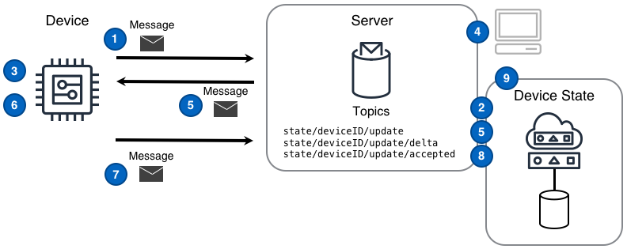
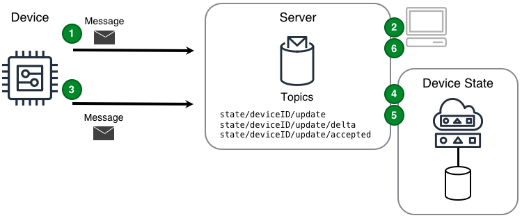

<!--  -->

Représentation logique de l'état signalé d'un appareil physique ou de l'état futur souhaité.

<!--more-->

## Défi

Les solutions IoT sont attendues d'interagir avec les appareils pour effectuer et suivre les changements d'état des appareils. Il y a deux façons dont ce défi se manifeste. Premièrement, même en cas de connectivité réseau intermittente, la solution a besoin que l'appareil exécute une action qui change l'état d'un appareil, et deuxièmement, l'appareil a besoin de la solution pour refléter un changement d'état qui s'est produit sur l'appareil.

La vérification des changements d'état est une capacité pivot nécessaire pour tous les scénarios de commande et de contrôle.

## Solution

Les solutions IoT qui s'appuient sur le design de Réplique de l'état de l'appareil sont capables de gérer les changements d'état des appareils de manière fiable, évolutive et simple.

Le design de Réplique de l'état de l'appareil décrit comment répliquer l'état actuel d'un appareil, l'état futur souhaité et la différence entre les états actuel et souhaité. Le design de Réplique de l'état de l'appareil est similaire à celui de la [Commande]() dans la mesure où les deux utilisent des [messages]() comme déclencheurs d'actions et des messages d'accusé de réception lorsque les actions sont terminées. Cependant, le design de Réplique de l'état de l'appareil va plus loin que celui de la commande, en adoptant une approche normative à la fois pour la gestion de l'état lié à l'appareil et de la façon dont l'état ainsi que les modifications sont communiqués. L'utilisation du design de la Réplique d'état de l'appareil permet aux solutions de connaître et de vérifier les états de l'appareil et les changements d'état.

### Réplique d'état du composant vers l'appareil

Une solution IoT doit tirer parti du design suivant lorsqu'un _composant_ de la solution IoT est la source du changement d'état souhaité et que ce changement doit être répliqué dans un appareil.

 ([PPTx](/iot-atlas-patterns.pptx))

### Numéros du diagramme composant-vers-appareil

1. L'appareil signale **son état initial** en publiant cet état sous la forme d'un [message]() dans le [sujet du message]() `state/deviceID/update`.
2. La réplique de l'état de l'appareil associée à cet appareil lit le message provenant du sujet `state / deviceID / update` et enregistre l'état de l'appareil dans une base de de données persistante.
3. L'appareil s'abonne au sujet delta `state/deviceID/update/delta` sur lequel uniquement les messages de changement d'état liés à l'appareil arriveront.
4. Le composant de la solution publie un message d'état souhaité sur le sujet `state/deviceID/update` et la réplique d'état de l'appareil associée à cet appareil enregistre l'état de l'appareil souhaité dans une base de données persistante.
5. La réplique d'état de l'appareil publie un message delta sur le sujet `state/deviceID/update/delta` et le serveur envoie le message à l'appareil.
6. L'appareil reçoit le message delta et effectue les changements d'état souhaités.
7. L'appareil publie un message reflétant le nouvel état sur le sujet de mise à jour `state/deviceID/update` et la réplique d'état de l'appareil associée à cet appareil enregistre le nouvel état dans une base de données persistante.
8. La réplique de l'état de l'appareil publie un message sur le sujet `state/deviceID/update/accepted`.
9. Le composant de la solution peut désormais demander l'état mis à jour et actuel de la réplique d'état de l'appareil.

### Réplique d'état appreil-vers-composant

Une solution IoT doit tirer parti du design suivant lorsque _l'appareil_ est la source du changement d'état qui doit être communiqué aux composants de la solution IoT.

 ([PPTx](/iot-atlas-patterns.pptx))

### Numéros du diagramme appareil-vers-composant

1. L'appareil signale **son état initial** en publiant cet état sous forme de message sur le sujet de mise à jour `state/deviceID/update`.
2. Le composant s'abonne au sujet de messagerie delta `state/deviceID/update/delta` sur lequel les messages de changement d'état liés à l'appareil arriveront.
3. L'appareil détecte que son propre état a changé et signale une nouvelle valeur d'état sur le sujet de mise à jour `state/deviceID/update`.
4. La réplique de l'état de l'appareil associée à cet appareil enregistre l'état de l'appareil souhaité dans une base de données persistante.
5. La réplique d'état de l'appareil publie un message delta sur le sujet `state/deviceID/update/delta` et le serveur envoie le message au composant abonné.
6. Le composant reçoit le message delta et utilise la valeur modifiée si nécessaire.

## Considérations

Lors de la mise en œuvre de ce design, tenez compte des questions suivantes:

#### Comment un composant peut-il simplement obtenir l'état actuel d'une réplique d'état d'appareil'?

En utilisant un style d'interaction pub/sub (publication/souscription), un composant peut écouter les sujets `state/deviceID/get/accepted` et `state/deviceID/get/rejected`, puis publier un message sur le sujet `state/deviceID/get`. La réplique d'état de l'appareil répondrait alors avec l'état sur le sujet `state/deviceID/get/accepted`. Si la réplique d'état de l'appareil expose une API REST, un composant peut exécuter un GET sur le sujet `state/deviceID/get` et s'attendre à une réponse directe.

#### Comment un appareil sait-il ce qui a changé s'il est hors ligne?

La première action qu'un appareil doit entreprendre lors de la connexion ou du rétablissement d'une connexion est d'obtenir l'état actuel souhaité et de le comparer à son dernier état connu. Idéalement, le serveur qui gère la réplique de l'état de cet appareil peut calculer automatiquement le delta et donc l'appareil connecté devrait s'abonner à `state/deviceID/update/delta` et peut ensuite agir sur toutes les modifications qui se sont produites alors qu'il était hors ligne.

## Exemple

    <scenario à remplir>
