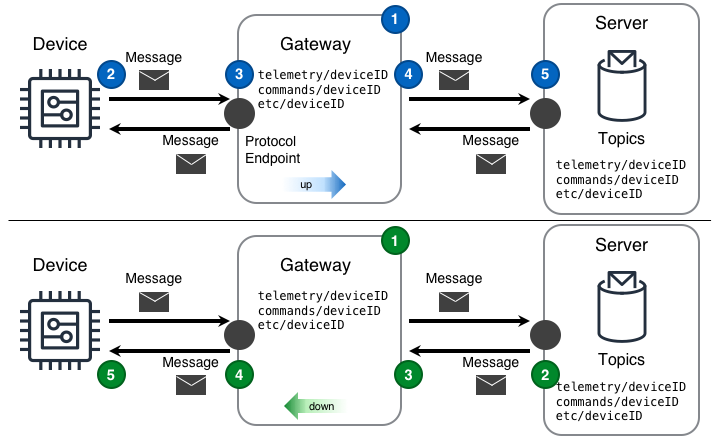
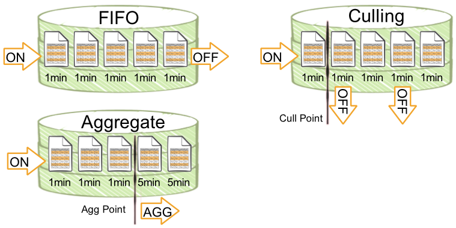

<!--  -->

Modèle de conception utilisé pour les appareils IoT existants sur des réseaux locaux afin de convertir différents protocoles.

<!--more-->

## Défis

[Les points de terminaison]() dans une solution IoT ne sont souvent pas assez capables de se connecter directement à Internet ni d'opérer sur des réseaux avec accès direct à Internet. Même avec ces contraintes, l'obtention de données à partir de points de terminaison et l'interaction avec eux nécessitent un mécanisme de connectivité.

## Solution

Les solutions IoT utilisent le design de passerelle pour surmonter les contraintes communes rencontrées par les points de terminaison. Ce faisant, une passerelle permet une communication fiable et sécurisée avec des points de terminaison autrement inaccessibles. De plus, une passerelle permet une isolation continue entre les points de terminaison locaux et la connectivité cloud.

Le design de passerelle illustrée dans le diagramme suivant peut fournir cette fonctionnalité. Dans le diagramme, le serveur réside sur un cloud. La passerelle réside sur un réseau auquel l'appareil peut accéder.

 ([PPTx](/iot-atlas-patterns.pptx))

Les deux designs du diagramme ci-dessus un seul type de protocole est utilisé entre les points de terminaison et la passerelle ainsi que depuis la passerelle vers le Cloud. Dans les diagrammes de passerelle _haut_ et _bas_, la passerelle est connectée au serveur.

#### Passerelle vers le haut (Aussi appelé "Nord")

1. Le design de passerelle "up" est configurée pour refléter les messages "vers le haut"; dans le diagramme, les messages arrivant de l'appareil avec le [sujet]() `telemetry/deviceID` seront transmis sur le serveur en utilisant le même sujet.
2. L'appareil publie un message contenant un point de mesure via un protocole de transport vers la passerelle en utilisant le protocal local.
3. La passerelle reçoit le message
4. La passerelle publie le message sur le serveur sur le même sujet que le message reçu.
       - si la passerelle ne parvient pas à envoyer le message au serveur, le message est traité en utilisant [l'approche de livraison retardée](#quelle-approche-devrait-être-utilisée-lors-du-stockage-des-messages-pour-une-distribution-ultérieure)
5. Le serveur reçoit le message

#### Passerelle vers le bas (Aussi appelé "Sud")

1. la passerelle "down" est configurée pour écouter le serveur et transmettres les messages "vers le bas"; dans le diagramme, les messages arrivant du serveur avec e sujet `commands/deviceID` seront transmis vers l'appareil en utilisant le même sujet.
2. Le serveur publie un message sur la passerelle en utilisant le protocole de transport.
3. La passerelle reçoit le message.
4. La passerelle publie le message sur l'appareil écoutant sur le même sujet en utilisant le protocol local de la passerelle.
       - si la passerelle ne parvient pas à envoyer le message au périphérique, le message est traité en utilisant [l'approche de livraison retardée](#quelle-approche-devrait-être-utilisée-lors-du-stockage-des-messages-pour-une-distribution-ultérieure)
5. L'appareil reçoit le message

## Considérations

Lors de la mise en œuvre de ce design, tenez compte des questions suivantes:

#### Pourquoi la passerelle devrait-elle explicitement refléter/router uniquement certains sujets dans une certaine direction?

Étant donné que les sujets de message sont l'interface à travers laquelle les composants d'une solution IoT interagissent les uns avec les autres, en configurant une passerelle pour prendre des mesures explicites pour refléter certains sujets dans certaines directions, les appareils de la solution auront uniquement la possibilité d'interagir avec les sujets qui sont essentiels pour exécuter la fonction prévue d'un appareil. Cela correspond bien à la meilleure pratique de sécurité consistant à suivre le [principe du moindre privilège](https://en.wikipedia.org/wiki/Principle_of_least_privilege) pour les communications appareils-vers-cloud ainsi que cloud-vers-appareils.

#### Comment la passerelle doit-elle traiter les données lorsque le réseau vers l'appareil n'est pas disponible?

La réponse est simple: la passerelle a besoin d'une _approche de message descendante_ utilisée pour enregistrer les messages sur la passerelle jusqu'à ce qu'ils puissent être transmis à l'appareil.
Malheureusement, la réponse simple ne représente pas la réalité, qui est plus complexe. Un élément clé à déterminer est la bonne [approche de livraison retardée](#quelle-approche-devrait-être-utilisée-lors-du-stockage-des-messages-pour-une-distribution-ultérieure) à prendre avec les messages descendants lorsque le réseau est absent.

#### Comment la passerelle doit-elle traiter les données lorsque le réseau vers le serveur n'est pas disponible?

La réponse est simple: la passerelle a besoin d'une _approche de message ascendante_ utilisée pour enregistrer les messages sur la passerelle jusqu'à ce qu'ils puissent être transmis au serveur.
Malheureusement, la réponse simple ne représente pas la réalité, qui est plus complexe. Un élément clé à déterminer est la bonne [approche de livraison retardée](#quelle-approche-devrait-être-utilisée-lors-du-stockage-des-messages-pour-une-distribution-ultérieure) à prendre avec les messages ascendants lorsque le réseau est absent.

#### Quelle approche devrait être utilisée lors du stockage des messages pour une distribution ultérieure?

Généralement, le stockage local et le traitement des messages sur la passerelle suivront une approche premier entré, premier sorti (alias. **FIFO**). Cela étant dit, la réponse _peut_ être différente selon les données réellement contenues dans le message. Dans ce cas, déterminer comment l'approche de journalisation de la passerelle influence les données réelles transmise peut aider à éviter de futurs problèmes avec la solution.

Les catégories générales d'approches à considérer sont: **Premier entré, premier sorti (FIFO)**, **Abattage (Culling)** et **Aggrégation (Aggregate)**, comme indiqué dans le diagramme suivant.

**Premier entré, premier sorti (FIFO)** - Cette [approche](https://en.wikipedia.org/wiki/FIFO_ "computing_and_electronics") est généralement simple à mettre en œuvre et utile dans une grande variété de situations. Dans le diagramme de traitement des messages, les données de cette approche arrivent de la gauche et sortent à droite lorsque le stockage local alloué est plein. Exemples de données: mesures des opérations et télémétrie à usage général.

**Abattage (Culling)** - Cette approche est utile pour conserver les valeurs de points absolus au prix d'une perte de détail sur la courbe. Dans le diagramme de traitement des messages, les données de cette approche arrivent par la gauche. Une fois que le stockage local a été rempli au-delà d'un _point d'abattage_, une logique de balayage supprime ensuite tous les autres (ou tous les échantillons `N` ème). Exemples de données: [kW](https://en.wikipedia.org/wiki/Watt#Kilowatt), [Ampérage](https://en.wikipedia.org/wiki/Amperage), [Tension](https://en.wikipedia.org/wiki/Voltage), etc.

**Aggrégation (Aggregate)** - Cette [approche](https://en.wikipedia.org/wiki/Aggregate_function) est utile lorsque la forme détaillée de la courbe n'est pas aussi importante que les valeurs minimum, maximum, moyenne et somme sur une période de temps. Dans le diagramme de traitement des messages, les données de cette approche arrivent par la gauche. Une fois que le stockage local s'est rempli au-delà d'un _point d'agrégation_, une logique de balayage effectue une agrégation sur les valeurs stockées. Exemples de données: [kWh](https://en.wikipedia.org/wiki/Kilowatt_hour), [insolation](https://en.wikipedia.org/wiki/insolation), [flux](https://en.wikipedia.org/wiki/Flow_measurement), [temps CPU](https://en.wikipedia.org/wiki/CPU_time), [température](https://en.wikipedia.org/wiki/Temperature) , [vitesse du vent](https://en.wikipedia.org/wiki/Wind_speed), etc.

#### Quelle topologie de réseau local est utilisée par les appareils connectés à une passerelle?

Il existe deux topologies que les appareils utilisent le plus souvent: un [réseau maillé](https://en.wikipedia.org/wiki/Mesh_networking) et un réseau concentrateur et à rayons (alias. [Réseau étoile](https://en.wikipedia.org/wiki/Network_topology#Star)).

**Réseau étoile** - Une passerelle dans un réseau étoile fournit toute la connectivité des appareils vers et depuis le cloud, la communication d'appareil à appareil et des capacités locales supplémentaires telles que le stockage de données de séries chronologiques, les données l'analyse et l'inférence d'apprentissage automatique. Étant donné que la passerelle dans cette topologie fournit une communication d'appareil à appareil, _les messages ascendants_ peuvent provenir _d'un_ appareil qui parle à la passerelle, puis immédiatement allé _vers le bas_ vers un autre appareil qui écoute, **ou** _les messages ascendants_ peuvent venir _d'un_ appareil à destination du serveur. Le sujet du message doit pouvoir être routée par la passerelle vers l'un ou l'autre type de destination.

**Réseau maillé** - Une passerelle dans un réseau maillé fournit des capacités de routage cloud à certains ou à tous les appareils du maillage. Étant donné que les appareils sont physiquement proches les uns des autres ils peuvent communiquer directement entre eux. La passerelle n'est généralement pas responsable pour les communication appareils vers appareils; cependant, la passerelle peut fournir des capacités locales supplémentaires telles que le stockage de données de séries chronologiques, l'analyse de données et l'inférence d'apprentissage automatique.

Dans une topologie de réseau étoile ou à mailles, pour permettre le routage explicite de tous les messages, chaque appareil et la passerelle elle-même doivent être adressables par un sujet de message unique.

## Exemple

<scénario écrit à déterminer>
