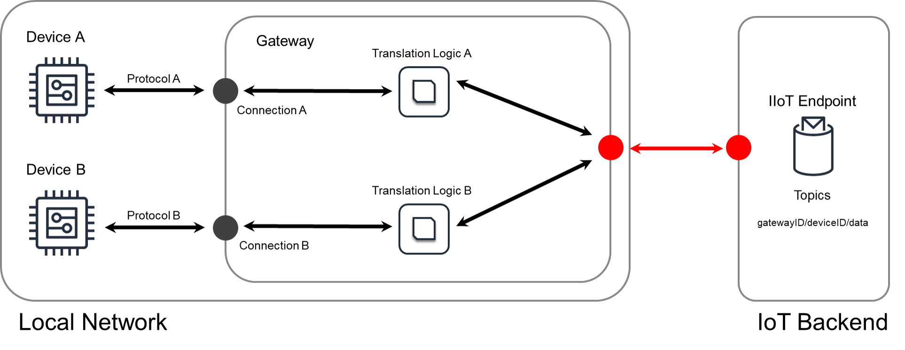

<!---->

Un appareil qui sert d'intermédiaire entre les appareils locaux ainsi qu'entre les appareils et le cloud.

<!--more-->

## Défi

Sur le réseau local d'une solution IoT, les appareils sont souvent interconnectés et doivent échanger des données localement, c'est-à-dire sans déplacer de données sur Internet.
Comme certains appareils locaux peuvent utiliser des protocoles différents qui ne sont pas compatibles entre eux, les protocoles doivent être traduits et convertis.
Par exemple, dans les solutions IoT industrielles, les interfaces des machines utilisent souvent des protocoles différents et l'extraction des informations de ces machines pour la surveillance nécessite que les informations soient converties dans un format commun pouvant être envoyées à un point de terminaison de protocole sur le cloud ou utilisées par un autre appareil local, ou même une personne locale.
Un autre exemple est dans les déploiements de maisons intelligentes, où les appareils utilisant des normes différentes doivent échanger des données pour contrôler la production d'énergie renouvelable en fonction de la consommation électrique interne de la maison.

En règle générale, le déplacement de toutes les données sous une forme non traduite vers un logiciel qui effectue la traduction sur le cloud n'est pas possible pour plusieurs raisons:

- Le volume ou la vitesse des données générées par les appareils locaux est trop élevé.
- Les appareils utilisent un protocole de communication qui n'est pas basée sur le [protocole IP](https://en.wikipedia.org/wiki/Internet_Protocol), ou tout simplement non utilisable pour la communication sur Internet. Par exemple [les connexions série](https://en.wikipedia.org/wiki/Serial_communication) et [le Bluetooth](https://en.wikipedia.org/wiki/Bluetooth).
- La connexion directe des appareils à Internet créerait un risque pour la sécurité. Cela se produit souvent car le protocole local ne prend pas en charge les mécanismes de chiffrement ou d'authentification.

## Solution

Les solutions IoT relèvent ces défis en utilisant une [Passerelle]() en combinaison avec la logique locale exécutée sur la passerelle.
La logique se trouvant sur la passerelle exécute la traduction des protocoles industriels dans un format/protocole de données commun qui peut être traité par des systèmes informatiques tels que des bases de données, des lacs de données ou des services Web.

Le design de Conversion de protocole illustrée dans le diagramme suivant peut être utilisée pour résoudre ces problèmes.

 ([PPTx](/iot-atlas-patterns.pptx))

- La partie gauche de ce diagramme représente les appareils locaux de la solution IoT qui sont connectés à au moins une [passerelle]().
- La passerelle est le seul composant connecté à Internet et la flèche rouge indique que cette connexion doit être cryptée / protégée en conséquence.
- La passerelle exécute une logique de traduction de protocole locale pour traduire différents protocoles en un protocole commun.
- Si les données générées par l'un des appareils connectés doivent être transférées vers le cloud, la passerelle transmettra en toute sécurité les données dans un format commun après la traduction.
  Étant donné que le design de Conversion de protocole étend le design de Passerelle, la solution peut également permettre à un appareil **`B`** d'agir sur les données générées par l'appareil **`A`** ou vice versa. Dans ce cas, la passerelle aurait une logique de conversion de protocole pour traduire les données émises par l'appareil **`A`** dans un format utilisable par le cloud et également une logique de conversion de protocole pour traduire les données destinées au cloud dans le format utilisable par l'appareil **`B`**.

Le design de Conversion de protocole répond également un objectif de sécurité:
Les connexions à l'intérieur du réseau local peuvent être non sécurisées (noir) car certains des protocoles utilisés n'ont pas de fonctionnalités de sécurité, tandis que les connexions orientées cloud (rouges) sont sécurisées par des mécanismes de chiffrement et d'authentification contemporains.
Bien que le chiffrement de toutes les connexions soit souhaitable, dans de nombreux cas, cela empêcherait d'utiliser des protocoles bien établis pour certaines applications qui ne prennent pas en charge de tels mécanismes de sécurité. En outre, pour certains appareils et applications, le remplacement d'appareils qui ne prennent pas en charge les mécanismes de sécurité contemporains n'est pas économiquement réalisable. Cela signifie souvent que l'utilisation locale de protocoles non sécurisés dans une solution est un compromis acceptable.

## Considérations

Lors de la mise en œuvre de ce design, tenez compte des questions suivantes:

#### Le schéma de la logique de conversion change-t-il si la connexion n'est pas basée sur IP?

En général, le schéma ne change pas.
Dans l'exemple [ci-dessous](#exemple---extraction-industrielle-de-données-iot), la connexion IP a toujours été définie à l'aide d'une adresse IP.
Par exemple, pour utiliser une connexion série avec Modbus, le chemin d'accès matériel série correspondant serait utilisé à la place de l'adresse IP. Un client Modbus via des connexions série doit être utilisé à la place du client TCP, mais le design a toujours besoin de l'adresse de l'appareil.

#### Existe-t-il un moyen de retarder / grouper / agréger les messages sur la passerelle?

L'agrégation ou la mise en lots de données ne fait pas partie de ce design car elle est discutée dans les considérations du design de la passerelle.
Le design de la passerelle contient des [considérations]() sur la façon dont la logique de conversion de protocole peut être étendu avec des mécanismes qui regroupent les résultats ou calculent des agrégations sur eux-mêmes.

#### Comment le processus de conversion de protocole doit-il traduire les données lorsque le réseau vers le serveur n'est pas disponible?

Le design passerelle contient certaines [considérations]( ) pour ce scénario.
Autrement dit, la passerelle ne sera pas en mesure de publier des données tant que la connexion sera perdue. Pour éviter la perte de données, il est recommandé d'implémenter une approche de message ascendante pour tous les messages traduits en utilisant un mécanisme de stockage local.

#### Pourquoi les protocoles non sécurisés utilisés dans les solutions IoT existent-ils en premier lieu?

La raison est que la sécurité est un domaine en évolution et que de nombreux protocoles encore utilisés ont été conçus il y a des décennies.
Par exemple, la première version de Modbus a été publiée en 1979 à une époque où le chiffrement et la cybersécurité n'étaient pas une priorité pour la conception d'un protocole. Il existe un historique similaire pour les protocoles utilisés dans d'autres applications.
Bien qu'il soit préférable que tous les appareils prennent en charge des protocoles modernes et sécurisés, cela n'est souvent pas possible car le remplacement d'appareils utilisant des protocoles plus anciens peut être coûteux. De plus, les mécanismes de sécurité modernes dépassent parfois la capacité de calcul des appareils, en particulier s'ils sont alimentés par batterie.

#### Quel est le risque que des appareils utilisent des protocoles non sécurisés directement sur Internet?

L'exposition d'appareils à un protocole non sécurisé sur Internet entraînera probablement une perte de données ou même des attaques qui manipulent les appareils locaux et les données de l'appareil.
De plus, les attaquants peuvent éventuellement contrôler les appareils et les utiliser à des fins qui peuvent être dangereuses pour les humains qui les entourent, ou pour rendre les appareils inutilisables.
Par conséquent, il n'est pas recommandé de connecter des appareils utilisant des protocoles non sécurisés directement à Internet. Utilisez plutôt une passerelle sécurisée entre les deux pour exposer une interface "Internet" au réseau local.

#### Quel type de matériel utiliser pour une passerelle effectuant la conversion de protocole?

Cela dépend fortement de l'application et de l'environnement de l'application.
Par exemple, dans l'exemple d'IoT industriel ci-dessous, la passerelle résiderait généralement sur un PC industriel ou un matériel possédants des exigences industrielles similaire. D'autres applications peuvent déployer une logique de conversion de protocole sur des téléphones mobiles ou d'autres appareils similaires.

## Exemple - Extraction industrielle de données IoT

Il s'agit d'un exemple de mise en œuvre d'une conversion de protocole sur une passerelle dans un contexte d'extraction de données Industriel IoT.

> Notez que ces exemples ne sont pas du code prêt pour la production. Ils existent à des fins éducatives.

Les machines industrielles sont souvent équipées ou constituées de capteurs et d'autres matériels tels que des automates programmables industriels ([API]()) qui sont utilisés pour surveiller ou contrôler le comportement d'une machine.
Comme condition préalable à un large éventail de cas d'utilisation de l'[industry 4.0](), il est nécessaire d'accéder aux données des machines industrielles et de leurs composants.
Les deux principales raisons pour lesquelles la simple connexion de ces machines à un réseau ou à Internet n'est pas viable proviennent des défis mentionnés ci-dessus:

- **Protocoles:** Il existe de nombreuses normes de communication différentes pour les composants associés aux machines industrielles, par exemple, [OPC-UA](https://en.wikipedia.org/wiki/OPC_Unified_Architecture), [Modbus](https://en.wikipedia.org/wiki/Modbus), [CANBus](https://en.wikipedia.org/wiki/CAN_bus), [Profibus](https://en.wikipedia.org/wiki/Profibus).
  Certaines de ces normes n'ont pas été conçues pour être utilisées sur Internet et d'autres, par exemple, Modbus série, ne sont même pas basées sur le [protocole IP](https://en.wikipedia.org/wiki/Internet_Protocol).
- **Sécurité:** La connexion directe d'un actif industriel à Internet est un risque pour la sécurité. Par exemple, Modbus dans sa version de base ne dispose d'aucun type de mécanisme de sécurité pour authentifier un système qui lit ou écrit sur l'équipement industriel sous-jacent.

Pour surmonter ces défis, le designe de conversion de protocole nécessite le déploiement d'une [passerelle]() pour connecter les machines ainsi que pour fournir une connexion sécurisée au cloud.
Le réseau local à gauche du diagramme suivant est communément appelé _l'atelier_ dans les domaines de la fabrication ou _de la technologie opérationnelle (OT)_.


La passerelle elle-même contient une logique de conversion qui effectue la traduction entre le protocole machine et le protocole commun utilisé par les systèmes informatiques.
Dans l'exemple ci-dessus, il y a deux machines - **`A`** et **`B`**.
Supposons que `Machine A` possède une interface qui suit la [norme OPC-UA](https://en.wikipedia.org/wiki/OPC_Unified_Architecture) et que la `Machine B` utilise [Modbus](https://en.wikipedia.org/wiki/Modbus).
Les exemples de pseudo-code suivants illustrent la logique de traduction de protocole qui doit s'exécuter sur la passerelle.

#### Conversion du protocole OPC-UA

OPC-UA est un protocole IP moderne doté de fonctions de sécurité telles que le chiffrement et l'authentification en transit à l'aide de certificats ou de combinaisons nom d'utilisateur / mot de passe.
Ce pseudo-code montre comment accéder à une cible OPC-UA dans la syntaxe Python:

```python
[... load some libraries, loggers ...]
# ######## STEP 1: load the library ########
from opcua import Client as OPCUAClient
POLLING_FREQUENCY = 5 # seconds

# definition of the data format to be retrieved
OPCUA_VARIABLES = {
	KEY_STATE				:	["Objects", "2:PLC1", "2:MAIN", "DrillState"],
	KEY_PRESSURE			:	["Objects", "2:PLC1", "2:MAIN", "Pressure"],
}

# generate a OPCUA url and create a client with it
url = opc.tcp://192.168.2.2:4840 # assumes OPC-UA server at 192.168.2.2 on port 4840 on local network
client = OPCUAClient(url) # connect to the machine specified by the URL

# This function will run endlessly and poll the OPC-UA server
def poll_opcua_server():
	while True:
		try:
			# ######## STEP 2: Connect to the data source ########
			client.connect()
			rootNode = client.get_root_node()	# get the root node of the OPCUA tree
			# ######## STEP 3: Load the data from the source ########
			results = {}
			for name, path in OPCUA_VARIABLES.items():	# payload defines names -> path relations
				results[name] = rootNode.get_child(path).get_data_value()	# get the value from the node identified by path
			# ######## STEP 4: Publish the machine data ########
			# publish the result to the IoT endpoint as needed
			logger.info("Publishing the following extraction result: " + str(results))
		except Exception as e:
			logger.error("Error while accessing OPCUA server: {0}".format(str(e)))
			logger.error("Error type: " + str(type(e)))
		finally:
			client.disconnect()
		time.sleep(POLLING_FREQUENCY)
# execute polling of opcua server
poll_opcua_server()
```

Ce pseudo-code utilise une librairie OPC-UA open source disponible en Python.
La première ligne charge cette librairie, plus précisément la classe client de la librairie.
Le reste du script est simple:
La classe client est utilisée pour établir une connexion, lire le résultat à partir de la source de données (`Machine A`), puis publier le résultat sur le point de terminaison IoT.
Notez que le code requis pour publier sur le point de terminaison IoT spécifique utilisé par la passerelle dépend du backend spécifique utilisé et est donc omis.
De plus, ce pseudo-code n'utilise aucun mécanisme d'authentification OPC-UA afin de garder l'exemple simple. Le vrai code authentifierait le composant de conversion.

#### Conversion de protocole Modbus

Comme pour la conversion OPC-UA, ce pseudo-code suppose que les données sont accessibles via une interface machine, mais dans ce cas, l'interface implémente le protocole Modbus.
De manière similaire à la conversion OPC-UA, ce pseudo-code essaie d'accéder à une machine avec l'adresse IP `192.168.2.2` sur le réseau local, c'est-à-dire que cet exemple utilise la variante TCP / IP de [Modbus](https://en.wikipedia.org/wiki/Modbus).
Le code d'une interface série Modbus nécessiterait un autre client Modbus, mais le reste de la logique resterait inchangé:

```python
[... load some libraries, loggers ...]
# ######## STEP 1: load the library ########
from pymodbus.client.sync import ModbusTcpClient as ModbusClient
POLLING_FREQUENCY = 1 	# second(s)
# Instantiate the client for your modbus slave device.
mbClient = ModbusClient("192.168.2.2", port=5020)

def poll_measurements(frequency=POLLING_FREQUENCY):
	while True:
		# ######## STEP 2: Connect to the data source ########
		try:
			# connect to modbus slave device
			if not(mbClient.is_socket_open()):
				mbClient.connect()
		except Exception as e:
			time.sleep(1)
			continue
		# ######## STEP 3: Load the data from the source ########
		try:
			# read the holding registers (32 is chosen as a sufficient number of registers to hold the payload)
			readResult = mbClient.read_holding_registers(address=0x0, count=32, unit=1)
		except Exception as e:
			mbClient.close()
			time.sleep(1)
			continue
		# ######## STEP 4: Publish the machine data ########
		# publish the result to the IoT endpoint as needed
		logger.info("Publishing the following extraction result: " + str(results))
		time.sleep(frequency)

poll_measurements()
```

La structure de ce pseudo-code est la même qu'avant:
La première ligne charge une librairie open source qui fournira un accès facile aux actifs Modbus.
Ensuite, le pseudo-code se connecte au maître Modbus et obtient les données du maître.

Il est important de noter que le résultat d'un maître Modbus sera plus "non structuré" par rapport à l'exemple OPC-UA ci-dessus:
La variable `readResult` contiendra des données binaires non structurées qui doivent être reformatées en fonction de la façon dont les données ont été écrites sur le bus.
Il s'agit d'une différence fondamentale entre un protocole moderne comme OPC-UA et Modbus en matière d'extraction de données. C'est également une source de complexité que toute traduction de protocole doit prendre en compte.

#### Résumé de l'extraction des données de l'IoT industriel

Comme indiqué dans les sections ci-dessus, la logique de conversion exécutée sur la passerelle possède une structure commune de quatre étapes:

1. Chargement d'une librairie spécifique au protocole
2. Etablissement de la connexion à l'actif dont les données doivent être extraites.
3. Récupération des données souhaitées de la machine.
4. En option, traitement des données de la machine, puis transmission des données aux systèmes informatiques (via Internet).

Selon le protocole, l'établissement de la connexion peut nécessiter des informations d'identification ou d'autres secrets d'authentification qui doivent être stockés en toute sécurité sur la passerelle.
Dans les exemples ci-dessus, des librairies open source pour Modbus et OPC-UA ont été utilisées, mais des alternatives commerciales existent et peuvent également être utilisées.
