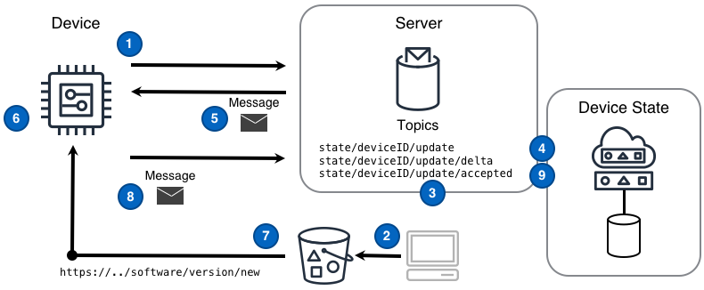

<!--  -->

Demandez à un appareil d'obtenir un nouveau logiciel, effectuez une mise à jour sur lui-même et confirmez l'achèvement.

<!--more-->

## Défi

Les solutions IoT doivent fournir un mécanisme permettant aux appareils de mettre à jour leur propre logiciel. La prise en charge des mises à jour logicielles sans intervention humaine est à la fois essentielle pour faire évoluer les solutions vers des millions d'appareils et pour offrir une expérience client exceptionnelle. Cependant, la mise à jour complète de grands ensembles d'appareils d'une manière sécurisée, évolutive et fiable nécessite une solution qui peut évoluer pour répondre aux nombres d'appareils, un mécanisme de commande résilient et un moyen de suivre l'état de l'ensemble du parc d'appareils .

## Solution

Les solutions IoT qui exploitent les designs de [Commande]() et de [Réplication de l'état de l'appareil]() combinés à une solution de stockage évolutive et globalement disponible sont en mesure de relever tous les défis inhérents à la mise à jour du logiciel des appareils dans une grande flotte.

Le design de Mise à jour logicielle illustré dans le diagramme suivant peut fournir cette fonctionnalité.

 ([PPTx](/iot-atlas-patterns.pptx))

### Numéros du diagramme

1. L'appareil s'abonne au [sujet]() delta `state/deviceID/update/delta` sur lequel les messages de changement d'état liés à l'appareil arriveront depuis la réplique de l'état de l'appareil.
2. L'application obtient la nouvelle distribution logicielle et la place dans une solution de stockage accessible aux appareils de production.
3. L'application identifie un appareil qui devrait recevoir le nouveau logiciel et publie un message d'état souhaité sur le sujet `state/deviceID/update` de l'appareil. Le message d'état souhaité contient une URL de mise à jour logicielle différente de l'URL actuelle de la version logicielle de l'appareil.
4. La réplique de l'état de l'appareil associée à cet appareil enregistre l'état de l'appareil souhaité dans une base de données persistante et publie un message delta sur le sujet `state/deviceID/update/delta` qui est envoyée à l'appareil.
5. L'appareil reçoit un message delta qui sert de message de commande de «mise à jour logicielle». Plus précisément, ce message transmet le changement entre l'URL de la version actuelle du logiciel et la nouvelle URL
6. L'appareil obtient la nouvelle URL de mise à jour logicielle à partir du message delta.
7. L'appareil télécharge le nouveau logiciel et effectue la mise à jour localement.
8. L'appareil publie un message d'accusé de réception reflétant la version logicielle que l'appareil utilise maintenant sur le sujet de mise à jour `state/deviceID/update` et une réplique de l'état de l'appareil associée à cet appareil enregistre le nouvel état dans une base de données persistante.
9. La réplique de l'état de l'appareil publie un message sur le sujet `state/deviceID/update/accepted`. La mise à jour logicielle est désormais considérée comme terminée.

## Considérations

Lors de la mise en œuvre de ce design, tenez compte des questions suivantes:

#### Comment l'appareil ciblé et uniquement cet appareil obtiennent-ils la mise à jour logicielle à partir de l'URL donnée?

La solution peut garantir que seul l'appareil ciblé pour une mise à jour logicielle peut obtenir la mise à jour en utilisant une **URL pré-signée** ou une **information d'identification temporaire**. Chaque approche a des considérations différentes.

**URL pré-signée** - l'avantage d'une URL pré-signée est qu'elle limite la capacité d'un appareil à télécharger une mise à jour logicielle dans un délai et par des appareils avec des adresses IP publiques spécifiques. Le négatif de cette approche survient lorsque l'appareil téléchargeant la mise à jour n'a pas d'adresse IP résolvable publiquement. Sans adresse IP pouvant être résolue publiquement, la solution ne peut que limiter l'interaction avec la mise à jour logicielle. Le praticien d'une solution peut ou non trouver cela acceptable.

**Informations d'identification temporaires** - un appareil interagit avec la solution pour obtenir des informations d'identification temporaires associées uniquement au privilège d'accéder à la solution de stockage pour télécharger la mise à jour. L'avantage d'utiliser une information d'identification temporaire est que seul le périphérique avec cette information d'identification peut accéder à la mise à jour, même lorsque le périphérique n'a pas d'adresse IP résolvable publiquement. Le léger inconvénient de cette approche est qu'elle nécessite que l'appareil et la solution soient plus complexes car l'appareil doit passer par un processus distinct pour obtenir des informations d'identification temporaires.

## Exemple

### Perspective d'une mise à niveau logicielle depuis l'appareil

Un exemple de la logique impliquée pour qu'un appareil reçoive et exécute une commande de «mise à jour» reçue peut se faire via l'implémentation d'une [Réplique d'état de l'appareil](). Plus précisément, l'appareil obtiendra un nouveau logiciel, effectuera une mise à jour à l'aide de ce logiciel et en accusera réception.

#### L'appareil se prépare pour les messages de commande de mise à jour

Un appareil souscrit une fonction d'écoute de messages pour traiter le [message de commande]() provenant du sujet `state/deviceID/update/delta`

```python
def message_listener(message):
    # ..do something with 'message'..

def main():
    # subscribe the message listener function to the topic
    sub = topic_subscribe('state/deviceID/update/delta', message_listener)
    # now wait until the program should end
    wait_until_exit()
```

#### L'appareil lit l'URL de téléchargement du message et télécharge le logiciel

Après un certain temps, l'appareil reçoit un message delta qui sert de message de commande de «mise à jour logicielle».

```python
def message_listener(message):
    # parse the message from raw format into something the program can use
    msg = parse_message(message)
    # determine if the message is an update command type
    if msg is UPDATE_COMMAND:
        # get the globally unique job ID from the command message
        job_id = msg.get_job_id()
        # read the software update URL from the command message
        url = msg.read_value('softwareURL')
        # download the software from the given URL
        software = download_software(url)
        # ..and apply the software update triggered by the specific job ID
        apply_software(software, job_id)
```

#### L'appareil effectue une mmise à jour logicielle et publie un message d'accusé de réception

Un appareil effectuera la mise à jour logicielle téléchargée et accusera réception de la commande avec un message sur le sujet `state/deviceID/update/accepted`

```python
def apply_software(software, job_id):
    # do the local, device-specific work to apply the software
    # and produce a result value of SUCCESS or FAILURE

    if result is SUCCESS:
        # make a success message
        message = 'jobID:' + job_id + " SUCCESS"
    else:
        #make a failure message
        message = 'jobID:' + job_id + " FAILURE"

    # the topic used to publish the acknowledge message
    topic = 'state/deviceID/update/accepted'
    # ...and finally, publish the acknowledge message
    message_publish(topic, message, quality_of_service)
```
