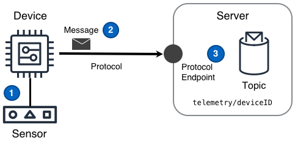

<!--  -->

Collectez des données provenant de capteurs dans un environnement distant et rendez les points de mesures collectés disponibles pour une utilisation par d'autres composants d'une solution IoT.

<!--more-->

## Défi

Les solutions IoT doivent recevoir de manière fiable et sécurisée des données mesurées dans un environnement distant par différents appareils, en utilisant potentiellement différents protocoles. De plus, une fois les données mesurées reçues, la solution doit traiter et acheminer les données collectées pour les rendre utilisable par les composants de la solution.

## Solution

Les solutions IoT utilisent le design de télémétrie pour assurer la livraison de données détectées sur des réseaux intermittents en prenant en charge des protocoles de communication adaptés, pour fournir une réception évolutive des données à différentes fréquences et volumes, ainsi que pour acheminer les données à utiliser par d'autres composants.

Le design de télémétrie illustrée dans le diagramme suivant peut fournir cette fonctionnalité.

 (([PPTx](/iot-atlas-patterns.pptx))

### Numéros du schéma

1. L'appareil obtient un point de mesure à partir d'un capteur fonctionnant dans un environnement éloigné de la solution IoT.
2. L'appareil publie un message dans sur [le sujet]() `telemetry/deviceID` contenant le point de mesure. Ce message est envoyé via un protocole de transport à un point de terminaison de protocole mis à disposition par le serveur.
3. Le serveur peut ensuite appliquer une ou plusieurs [règles]() aux messages afin d'effectuer un routage à granularité fine sur tout ou partie des données des points de mesure du message . Le routage peut envoyer un message à un autre composant de la solution.

## Considérations

Le design **Télémétrie** est généralement utilisée lorsqu'un projet a l'obligation de «diffuser des données à partir d'un appareil». En outre, lors de la mise en œuvre d'une solution IoT, le mot _télémétrie_ est souvent utilisé à la fois pour décrire le diagramme du design ci-dessus _et_ une description abrégée de l'ensemble des défis inhérents à la détection et à l'envoi de données d'un emplacement distant vers un solution plus large. Ces considérations se concentrent sur des sujets qui concernent généralement la mise en œuvre du diagramme ci-dessus.

Lors de la mise en œuvre de ce design, tenez compte des questions suivantes:

#### Quelle est la latence de traitement _mesure-à-information_ ou _mesure-à-action_ souhaitée des messages de télémétrie dans la solution IoT?

Les solutions IoT avec des exigences de latence de traitement de l'ordre de **&micro;-secondes ou millisecondes** devraient effectuer ce traitement sur l'appareil lui-même ou éventuellement sur une [passerelle]( ) connecté à l'appareil.
Les solutions IoT avec des exigences de latence de traitement de l'ordre de **secondes**, **minutes**, voire **heures** devraient effectuer ce traitement sur le cloud par défaut.
En général, le traitement des messages en "secondes" ou "quelques minutes" doit être effectué par des composants connectés directement au point de terminaison du protocole. Généralement, le traitement d'un composant sera déclenché par l'arrivée de messages correspondant à certains critères.
Le traitement de la télémétrie de "quelques minutes" à "quelques heures" doit être effectué de manière asynchrone. Lorsque des messages qui correspondent aux critères souhaités arrivent, les événements sont le plus souvent placés dans une file d'attente de traitement et un composant effectue le travail nécessaire. Une fois terminé, le composant émet souvent un message vers un [sujet]() "de travail terminée".

#### Y a-t-il des enseignements tirés qui facilitent le traitement des données de télémétrie dans la solution IoT?

**Appareils avec un ID unique à la solution** - Chaque appareil d'une solution doit avoir un ID _unique à la solution_. Bien que cet ID n'ait pas besoin d'être vraiment unique au niveau mondial, chaque appareil doit avoir un ID qui est et restera à jamais unique dans la solution IoT. En adoptant des ID d'appareil uniques à la solution, la solution IoT sera mieux en mesure de traiter et d'acheminer les données détectées à utiliser par les composants de la solution.
**Horodatage précoce** - Le plus tôt les données détectées obtiennent un horodatage discret dans une solution IoT, le plus tôt le traitement et l'analyse de ces données peuvent se produire.
**Calculs de fenêtres fermées** - Le suivi de l'horodatage `last_reported` d'un appareil pourrait déterminer si/quand une fenêtre d'agrégation peut être considérée comme _fermée_. Tous les calculs de fenêtres fermées peuvent ensuite être mis en cache facilement et en toute confiance dans une solution IoT. Ces calculs mis en cache augmentent souvent considérablement les performances de la latence de traitement _mesure-à-information_ ou _mesure-à-action_ de la solution IoT.

#### Comment traiter les messages volumineux?

Les messages volumineux sont définis dans ce desgin comme n'importe quel message plus volumineux que ce que le protocole de transport prend en charge nativement. Les messages volumineux nécessitent une réponse à une question supplémentaire, **"Un protocole secondaire peut-il être utilisé?"**

Si **oui**, HTTPS est recommandé.
Si **non**, le message volumineux doit être divisé en parties, chaque partie doit avoir un identifiant de partie unique et chaque partie doit être suffisamment petite pour être envoyée à l'aide du protocole de transport.

#### Comment envoyer des messages volumineux lors de l'utilisation d'un protocole secondaire?

Si des messages volumineux doivent être **livrés dès que possible**, le message volumineux peut être téléchargé directement vers un service de stockage d'objets hautement durable et disponible à l'échelle mondiale.

Si des messages volumineux **peuvent être envoyés par lots**, chaque message doit être enregistré en tant que partie d'un lot jusqu'à ce que le lot puisse être envoyé. Étant donné que le stockage sur un appareil est souvent une ressource limitée, le traitement par lots des messages doit tenir compte des mêmes [compromis algorithmiques]() comme un appareil faisant office de [passerelle]().

#### Quelles sont les fréquences d'échantillonnage et de rapport d'un appareil?

**La fréquence d'échantillonnage** est la fréquence à laquelle les données détectées sont récupérées ou _échantillonnées_ à partir d'un [capteur]() connecté.

**La fréquence de rapport** est la fréquence à laquelle les données d'échantillon stockées sur l'appareil sont envoyées dans la solution IoT.

Le code basé sur l'appareil obtiendra les données détectées et les mettra en file d'attente pour la livraison ou livrera les données détectées immédiatement. Ces deux comportements différents sont souvent considérés comme la _différence entre la fréquence d'échantillonnage et la fréquence de rapport_. Lorsque les fréquences d'échantillonage et de rapport sont égales et alignées, toutes les données détectées devraient être transmises immédiatement. Lorsque les deux fréquences sont différentes, choisir un algorithme de journalisation pour les données mises en file d'attente doit être envisagé.

Les valeurs attendues pour ces deux fréquences sont importantes pour déterminer l'échelle et le coût d'une solution IoT.

#### L'ordre des messages entrants doit-il être maintenu?

Premièrement, les solutions ne devraient dépendre de l'ordre que lorsque cela est absolument nécessaire.

Si l'ordonancement des messages n'est **pas requis**, la solution peut traiter les messages immédiatement dès l'arrivée sur le sujet.
Si l'ordonancement des messages est **requis**, cette question de suivi a besoin d'une réponse, "Sur quel horizon de temps un composant de la solution nécessite-t-il des messages ordonnés?"

Si la réponse est «moins d'une seconde sur un seul sujet», la solution peut rassembler les messages d'un sujet «foo» dans un tampon, puis après chaque tick de l'horloge, le tampon est trié et les messages sont émis pour un autre sujet `foo/ordered`.
Si la réponse est "supérieure à une seconde", la solution IoT doit écrire chaque enregistrement dans une [base de données chronologique](). Tout composant de la solution qui **nécessite** que les messages soient toujours ordonné, peut désormais lire et obtenir des mises à jour à partir de la base de données chronologique.

#### Quels sont certains des inducteurs de coûts de la télémétrie dans une solution IoT?

Habituellement, les facteurs de coût les plus courants dans une solution IoT sont le nombre d'appareils, les fréquences d'échantillonnage et de rapport, la latence de traitement de la télémétrie _mesure-à-information_ ou _mesure-à-action_, la [densité de données de l'appareil]() et enfin la durée de rétention de [l'archivage de télémétrie]()

#### Est-ce que chaque appareil doit "désaligner activement" son intervalle de rapport avec les autres appareils?

Une erreur courante qui a un impact important se produit lorsque tous les appareils d'une solution ou d'un parc IoT sont configurés avec les mêmes fréquences de rapport. Pour éviter les [interférences constructives](http://en.wikipedia.org/w/index.php?title=Constructive_interference) cachées dans ce comportement simple, un appareil ne doit commencer son intervalle de rapport qu'après s'être réveillé et qu'une durée aléatoire s'est écoulée. passé. Ce caractère aléatoire à l'heure de début produit un flux plus fluide de données détectées qui circulent dans la solution en évitant les interférences constructives qui se produisent lorsque les périphériques récupèrent d'un réseau régional inévitable ou d'autres pannes impactant la solution.

#### Que doit faire un appareil lorsqu'il ne peut pas se connecter à son point de terminaison de solution IoT par défaut?

**Durée prévue** - Lorsqu'un appareil ne peut pas se connecter avec le point de terminaison de la solution IoT par défaut pendant une durée prévue, l'appareil doit avoir un comportement configuré pour _la mise en file d'attente des messages de l'appareil_. Cette mise en file d'attente peut être la même réponse fournie lors de la détermination de la différence entre les fréquences de détection et de rapport des appareils. De plus, tout appareil ayant la capacité d'effectuer une mise en file d'attente de messages doit considérer les mêmes compromis algorithmiques qu'un appareil agissant comme un appareil [passerelle](). Ces compromis surviennent lorsque le stockage local n'est pas suffisant pour stocker tous les messages pendant la durée prévue et auront un impact sur les données détectées. Les catégories communes d'algorithmes à considérer sont: **Premier rentré, premier sorti [(FIFO)](https://en.wikipedia.org/wiki/FIFO_ "computing_and_electronics")**, **Abbatage(Culling)** et **Aggrégation (Aggregate)**.

**Durée lors d'un sinistre** - Lorsqu'un appareil ne peut pas se connecter avec le point de terminaison de la solution IoT par défaut pour une durée dûe à un sinistre, un _basculement régional_ est requis. Pour ce faire, un appareil doit d'abord avoir un point de terminaison de basculement préconfiguré. Ensuite, lorsqu'un appareil se réoriente vers le point de terminaison de basculement, l'appareil est **déjà enregistré** avec la nouvelle région et il possède déjà les informations d'identification appropriées, le périphérique commence simplement à envoyer des messages comme si le nouveau point de terminaison était la valeur par défaut. Sinon, lorsque l'appareil **n'est pas enregistré** auprès de la nouvelle région, l'appareil devra effectuer une [configuration initiale d'appareil]() avec le nouveau point de terminaison régional avant d'envoyer messages.

#### Comment les messages peuvent-ils être stockés et disponibles pour un prochain renvoi dans la solution IoT?

Cela peut être accompli avec le design d'[archivage de télémétrie]().

## Exemples

### Création, livraison et routage de messages de télémétrie.

Un exemple détaillé de la logique impliquée pour collecter les données des capteurs et les envoyer via une solution IoT.

#### Un appareil échantillonne un capteur et crée un message

Soit avec du code sur l'appareil ou du code fonctionnant dans un appareil [passerelle](), un appareil échantillonne un capteur d'une manière similaire au pseudocode suivant:

```python3
device_id = get_device_id()
while should_poll():  # loop until we should no longer poll sensors
    for sensor in list_of_sensors:
        # get timestamp of this 'sensor' reading
        ts = get_timestamp()
        # read the current sensor's value
        value = sensor.read_value()
        # add sensed data to message
        msq = create_message(device_id, sensor.get_id(), ts, value)
        send_sensor_message(msg)  # send or enqueue message
    # sleep according to the sample frequency before next reading
    sleep(<duration>)
```

La fonction pseudocode `create_message` ci-dessus crée un message basé sur le `device_id`, le `sensor_id`, l'horodatage `ts` et la `value` lue sur le capteur.

#### L'appareil formate un message

De nombreuses solutions existantes auront un format de message déjà implémenté. Cependant, si le format du message est ouvert à la discussion, JSON est recommandé. Voici un exemple de format de message JSON:

```json
{
  "version": "2016-04-01",
  "deviceId": "<solution_unique_device_id>",
  "data": [
    {
      "sensorId": "<device_sensor_id>",
      "ts": "<utc_timestamp>",
      "value": "<actual_value>"
    }
  ]
}
```

#### L'appareil délivre un message

Une fois les données détectées placées dans un message, l'appareil publie le message sur le point de terminaison du protocole distant sur une fréquence de rapport.

Lorsque vous signalez des messages à l'aide du protocole MQTT, les messages sont envoyés avec des sujets. Les messages envoyés par un appareil avec le sujet `telemetry/deviceID/example` seraient similaires au pseudocode suivant.

```python
# get device ID of the device sending message
device_id = get_device_id()
# get the collection of unsent sensor messages
sensor_data = get_sensor_messages()
# the device's specific topic
topic = 'telemetry/' + device_id + '/example'
# loop through and publish all sensed data
while record in sensor_data:
    mqtt_client.publish(topic, record, quality_of_service)
```

#### Messages envoyés aux abonnés

Chaque message publié traverse le réseau jusqu'au point de terminaison du protocole. Une fois reçu, le logiciel serveur met chaque message à la disposition des parties intéressées. Les parties enregistrent souvent leur intérêt en s'abonnant à des sujets de message spécifiques.

Outre les composants de la solution IoT qui s'abonnent directement à un sujet de messagerie, certaines solutions IoT disposent d'un moteur de règles qui permet de s'abonner aux messages entrants. Ensuite, message par message, les règles d'un moteur de règles peuvent traiter des messages ou diriger des messages vers d'autres composants de la solution IoT.
